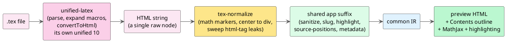
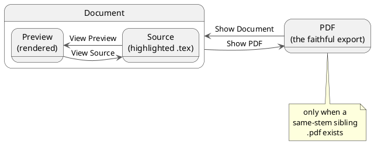

# 27 — LaTeX (.tex) documents

vinary-viewer renders **LaTeX** files as formatted documents — sections, styling, lists, tables, figures, math,
and syntax-highlighted code — reusing the very same rendering spine as Markdown and Org. The goal is
**comprehensible rendering, not a LaTeX compiler**: most documents read cleanly, and when you need the faithful
typeset output, a one-click **Document↔PDF** switch shows a collocated exported PDF.

## What you get

| Capability | Behaviour |
|---|---|
| **Preview** | `.tex` opens rendered — `\section`…`\subparagraph` headings, paragraphs, `\textbf`/`\emph`/`\texttt`, `itemize`/`enumerate`/`description` lists, `tabular` tables, `\href` links, `\begin{center}` blocks, block quotes, and verbatim. |
| **Math** | Inline `$…$` / `\(…\)` and display `\[…\]` / `\begin{equation|align|gather|…}` typeset through the **same MathJax engine** as Markdown — the TeX is preserved verbatim, so amsmath environments render intact. |
| **Macros (the preprocessor)** | `\newcommand` / `\renewcommand` / `\NewDocumentCommand` definitions are expanded at their use sites — including **argument-bearing** macros (`\newcommand{\tri}[3]{#1-#2-#3}`) and optional arguments. The spent definitions are not rendered. |
| **Figures** | `\includegraphics{…}` renders as an image, pre-sized like everywhere else ([feature 12](12-diagram-rendering.md) / [ADR-0022](../design-decisions/0022-pre-dom-figure-sizing.md)) — no post-insert re-scale. Relative paths resolve against the document's directory. |
| **Code** | `verbatim` / `lstlisting` render as preformatted code blocks (highlighted by the shared tree-sitter / highlight.js pass). |
| **Contents outline** | The sidebar Contents panel lists the section headings (slugged, with scroll-spy) — click to jump. |
| **Document↔PDF** | When a same-name `.pdf` sits beside the `.tex` (e.g. `paper.tex` + `paper.pdf`), switch between the rendered preview and the faithful exported PDF. Defaults to the PDF (configurable). |
| **View Source** | Toggle to the raw `.tex`, syntax-highlighted by the bundled tree-sitter-latex grammar. |
| **Streaming** | `.tex` documents at or above 256 KiB render as a bounded, progressive paint on the same engine Markdown and Org use ([ADR-0018](../design-decisions/0018-document-streaming-pipeline.md)) — byte-identical to the batch render. |
| **Terminal** | `vv --cli x.tex` and `vv --tui x.tex` render LaTeX through the same frontend, lowered to ANSI. |
| **Live refresh** | Editing the `.tex` on disk re-renders it in place, preserving the Contents outline and scroll position. |

`.tex`, `.latex`, and `.ltx` are treated as documents. LaTeX **support** files — `.sty`, `.cls`, `.bib` — stay
as highlighted source, since they are not documents to preview.

## How it works

LaTeX is an **input frontend** over the [common document IR](../theory/08-common-document-ir.md), not a separate
engine. A `.tex` file is converted to an HTML string by the [`@unified-latex/*`](https://github.com/siefkenj/unified-latex)
toolchain (parse → expand macros → `convertToHtml`), then run through the **exact same** post-parse pipeline as
Markdown and Org (sanitize → slug → highlight → URL-rewrite → image-wrap → source positions → metadata) and the
**same** post-passes (MathJax, Mermaid, figure pre-sizing, tree-sitter highlighting). Everything downstream — the
heading TOC, scroll-spy, figures, math, ANSI lowering — is inherited unchanged. See
[ADR-0025](../design-decisions/0025-latex-rendering-via-unified-latex.md) for the full design.

Because unified-latex parses inside its **own** bundled `unified@10` and hands back a plain HTML string, nothing
touches the app's `unified@11` — the string is wrapped as a `raw` node and parsed by the same `rehype-raw` the
office frontend already uses. Math is preserved as TeX, so `\begin{align}…` reaches MathJax exactly as it would
from Markdown.

## LaTeX inside Org (invoices)

An Org `#+BEGIN_EXPORT latex` block, or a bare `\begin{tabular}` / `\textbf{…}`, that is **document layout rather
than math** now **renders** through this same LaTeX frontend instead of showing as a code block. Genuine math
(`\begin{align}`, `$…$`) stays on the proven MathJax path — the split is decided by the same `tex-block-math?`
screen ADR-0024 introduced, so inline math never regresses. A `#+LATEX_HEADER: \newcommand{…}` is harvested for
its macro definition (and expanded in the body) without rendering the rest of the preamble. This is what makes an
Org **invoice** — `center`, `flushleft`, a booktabs `tabular`, `\textbf`, `\\` — render as a real table.

## Document↔PDF and Preview↔Source switching

A document collocated with a same-stem exported PDF offers up to three views:

- **Where the controls are.** A segmented `[Document | PDF]` control appears in the toolbar whenever a sibling
  PDF exists, and `[Preview | Source]` whenever a rendered document (not the PDF) is showing. Both are also in
  the content-pane right-click menu and the command palette (`View ▸ Toggle document / PDF`, `View ▸ Toggle
  preview / source`), with default shortcuts **`Ctrl+Shift+D`** and **`Ctrl+Shift+S`**.
- **Default view.** A document with a sibling PDF opens showing the **PDF** by default (the faithful, compiler-
  produced rendering). Change this with the `collocated-default` preference to open the rendered document first
  instead.
- **Kind-agnostic.** This applies to LaTeX papers, Org invoices, and Markdown alike — any previewable document
  with an exported `.pdf` beside it.

## Known limitations

- **Comprehensible, not faithful.** TikZ/PGF pictures, exact page geometry, custom fonts, and non-raster
  `\includegraphics` (a `.pdf`/`.eps` figure or watermark) are **not** reproduced. When you need the exact
  output, use the Document↔PDF switch. Unknown macros from a custom document class with no HTML mapping render
  as plain text rather than their intended styling.
- **No source⇄preview line jump.** Like Org, `.tex` offers the whole-pane Preview↔Source **toggle** but not the
  fine-grained "Go to source / Go to preview" line jump ([feature 13](13-source-preview-tree-sitter.md), which
  is Markdown-only): unified-latex's HTML carries positions of the *generated* HTML, not the original `.tex`
  source, so a line jump would land in the wrong place. `.tex` navigates by **heading** through the Contents
  outline instead.

The collocated PDF renders through the same in-renderer pdf.js viewer as any PDF tab: its fit / dark-invert /
reflow are global user preferences (set once, applied to every PDF), and zoom is shared across PDF tabs — the
standard PDF-viewer behavior, not specific to the switch.
