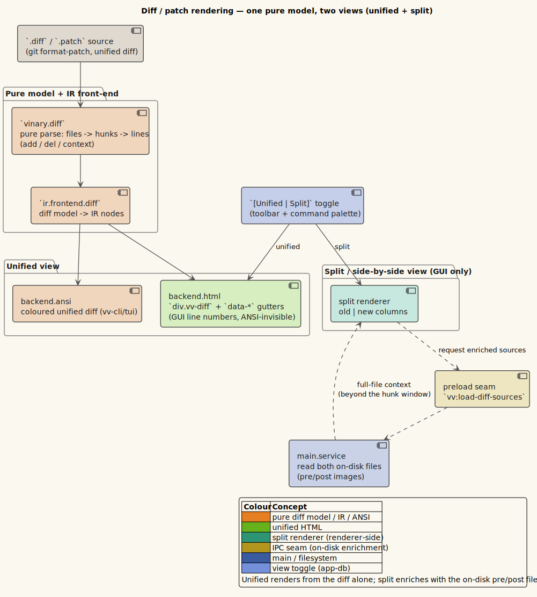
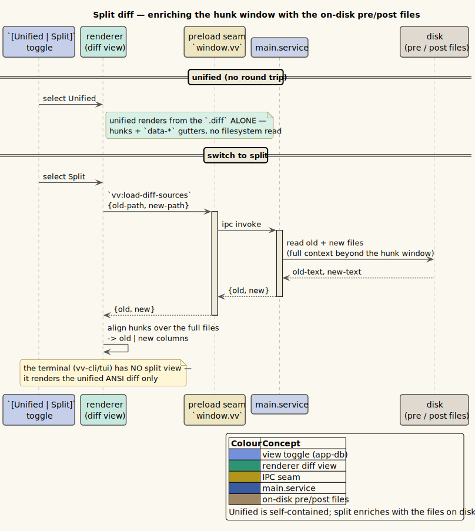

# 28 — Diff (`.diff` / `.patch`) rendering

vinary-viewer renders **unified and git diffs** the way a modern code-review tool does: a colored **unified**
view (added / removed / hunk / file banners) and, on demand, a **side-by-side (split)** view, with full
**multi-file** support. A diff is not a bespoke widget — it is an *input frontend* over the
[common document IR](../theory/08-common-document-ir.md), so it inherits find, scroll-spy, the themed context
menu, a Contents outline, and — for free — a colored **terminal** rendering in `vv --cli` / `vv --tui`. See
[ADR-0026](../design-decisions/0026-diff-rendering-side-by-side-and-repo-filetypes.md) for the full design.



*Diagram source: [`../diagrams/component-diff-model.puml`](../diagrams/component-diff-model.puml).*

## What you get

| Capability | Behaviour |
|---|---|
| **Unified view** | `.diff` / `.patch` opens as a colored single-column diff: green insertions, red deletions, bold-cyan `@@` hunk headers, dim notes, and an `<h2>` **banner per file** (`added` / `deleted` / `renamed` / `binary` / `modified`). |
| **Split (side-by-side)** | A two-column old-vs-new layout, toggled on demand. Changed lines pair delete-left / insert-right; context lines show on both sides. |
| **On-disk enrichment** | When Split is chosen *and* the diff's referenced files are found on disk, the real file's unchanged regions are spliced around the hunks so the **whole file** shows side-by-side; long unchanged runs collapse into native `<details>` gaps (no JavaScript). |
| **Multi-file** | Every `diff --git` / `--- /+++` section becomes its own banner and feeds a multi-file **Contents outline** — click a file to jump. |
| **git-format-patch** | The email header + commit message + diffstat preamble of a `git format-patch` output renders as a leading `<pre>` block; the `-- ` signature trailer is correctly excluded from the last hunk. |
| **Line numbers** | Old / new line numbers render in the gutter of the unified view — as CSS pseudo-content, so they are **visible in the GUI yet invisible to a copy/paste or the terminal** (see *The `data-*` gutter trick*). |
| **View Source** | Toggle to the raw `.diff`, syntax-highlighted like any source file. |
| **Terminal** | `vv --cli x.diff` prints the same colored unified diff (green/red/cyan SGR) and `--toc` lists the changed files; `vv --tui x.diff` pages it with find + Contents. |
| **Live refresh** | Editing the `.diff` on disk re-renders it in place, preserving the outline and scroll position ([feature 01](01-live-refresh.md)). |

`.diff` and `.patch` are classified as the `diff` kind. Ordinary repository files that a diff sits next to —
`Makefile`, `LICENSE`, `.gitignore`, git config — now classify correctly too (see
*Standard repository filetypes* below), a defect the diff work surfaced.

## How it works

A diff travels through **one pure parser** and then diverges into exactly the two renderers it needs, adding no
bespoke rendering code:

1. `vinary.diff/parse` turns the text into a DOM-free, fs-free **model** (`{:preamble :files}`).
2. `vinary.ir.frontend.diff/diff->ir` lowers that model to the common IR for the **unified** view, which the
   existing **HTML back-end** (`ir.backend.html`) serializes for the GUI and the existing **ANSI back-end**
   (`ir.backend.ansi`) serializes for the terminal — the same two back-ends Markdown, Org, and LaTeX use.
3. `vinary.diff/split-html` renders the **split** view directly to an HTML string (GUI-only; a wide two-column
   layout has no terminal analog).

Both GUI views render through the **existing `markdown-body`** component, so find, scroll-spy, the themed
context menu, and the Contents outline all work with zero extra code.

### The pure diff model

`vinary.diff/parse` recognizes `diff --git`, plain `diff -u` (`--- /+++` with trailing-timestamp stripping),
`@@ -a,b +c,d @@` (counts default to `1`), renames, new / deleted files, `Binary files … differ`,
`\ No newline at end of file`, combined / merge `@@@` headers (degraded to a heading), and the
`git format-patch` preamble. Its shape:

```clojure
;; parse : text → {:preamble string
;;                 :files [ {:old-path :new-path :rename? :new-file? :deleted? :binary? :mode
;;                           :hunks [ {:old-start :old-count :new-start :new-count :heading
;;                                     :lines [ {:kind :context|:insert|:delete
;;                                               :text :old-n :new-n :no-newline?} … ]} … ]} … ]}
```

The one subtlety worth recording is the **hunk budget**. A hunk header `@@ -a,C +c,D @@` promises exactly
`$`C`$` old-side and `$`D`$` new-side lines; the parser consumes precisely that many and then closes the
hunk. Maintaining a per-side remaining-budget lets a `git format-patch` trailer fall *outside* the hunk instead
of being misread — its leading `-- ` would otherwise be swallowed as a deletion:

```
The parser keeps two counters, rem_old and rem_new, seeded from C and D.
For each body line while (rem_old > 0 ∨ rem_new > 0):
    " " context → emit {:context}; rem_old−−, rem_new−−
    "+" insert  → emit {:insert};           rem_new−−
    "-" delete  → emit {:delete}; rem_old−−
    "\" no-newline → annotate the PREVIOUS line; consume no budget
Once rem_old = 0 ∧ rem_new = 0 the hunk is closed; any further "-…" / "2.39.0"
signature lines fall through to the ignore arm and never enter a hunk.
```

Equivalently, a hunk is closed as soon as both per-side budgets are exhausted:

```math
\text{rem}_{\text{old}} = 0 \;\wedge\; \text{rem}_{\text{new}} = 0
```

The `\ No newline at end of file` marker is the one line that may legitimately arrive *after* the budget is
spent (it annotates the hunk's last line), so it is handled by a dedicated arm ahead of the budget gate.

### One model → two back-ends (the unified view)

`diff->ir` builds a `:document` whose children are, per file, an `<h2>` banner node followed by the hunk and
body-line nodes. Each body line carries the `±`/space marker *inside* its text so the terminal reads it
naturally, and its old / new line numbers as **`data-*` attributes**:

```clojure
;; a class-tagged div; the marker is in the (span-wrapped) text, the numbers are data-* gutters
(node/node :diff-line [(code-span (str marker text))]
           {:tag "div"
            :attrs (cond-> {"className" ["vv-diff-line" (str "vv-diff-" (name kind))]}
                     old-n (assoc "dataOld" (str old-n))
                     new-n (assoc "dataNew" (str new-n)))})
```

- The **HTML back-end** is unchanged: it already serializes each node's `:tag` / `:attrs` verbatim, so the
  frontend's own classes (`vv-diff-insert`, `vv-diff-delete`, `vv-diff-hunk`, `vv-diff-note`) and the
  camelCase `dataOld` / `dataNew` (emitted by the hast serializer as `data-old` / `data-new`) fall straight
  out as fixed-structure HTML with escaped text nodes.
- The **ANSI back-end** gained one small function, `diff-line-style`, which reads a node's existing classes and
  maps `vv-diff-insert → green`, `vv-diff-delete → red`, `vv-diff-hunk → bold cyan`, `vv-diff-note → dim` —
  the terminal analog of the GUI's CSS line colouring. That is the whole cost of a **colored terminal diff**.

**Why a hand-written parser rather than a tree-sitter-diff grammar?** The unified format is small and fully
specified, and the split view needs the structured model anyway (hunks, per-side numbers, delete/insert
pairing). A grammar would highlight the unified view but give split nothing, and would add a WASM to the
network-flaky grammar-sync treadmill. One pure parser serves both views and both back-ends and is exhaustively
node-testable.

### The `data-*` gutter trick

The line's text lives in an inner `<span class="vv-diff-code">`, and the two line-number gutters are CSS
pseudo-elements (`::before` / `::after`) drawn from the `data-old` / `data-new` attributes and ordered around
the code span by a grid (`.vv-diff-code { order: 2 }`). The consequence is precisely what the terminal needs:

> The gutters appear in the GUI, yet — being pseudo-content rather than text nodes — stay **invisible to the
> terminal's text-reading ANSI back-end** and to a GUI text selection / copy. One IR is correct in both media.

The colouring rules and gutters live in `resources/public/css/app.css`.

### Side-by-side (split) — always from the hunks, enriched by the real files

Split is produced by `vinary.diff/split-html` in two tiers:

- **Baseline — always available.** `split-rows` aligns a file's hunks with no external input: a context line
  becomes a both-sides row; a run of deletes paired with the following run of inserts becomes *changed* rows
  (delete left / insert right); leftovers become one-sided rows. A unified diff fully determines both sides
  *within* its hunks, so this needs no source files and renders instantly.
- **Enriched — when the source files are accessible.** When the referenced file is found on disk, the real
  file's unchanged regions are spliced around the hunks so the **whole file** shows, with long unchanged runs
  collapsed into native `<details>` gaps. Resolution is main-side (the sandboxed renderer has no `fs`):
  `vv:load-diff-sources` walks the diff's directory and its ancestors for each referenced path. The fetch is
  **lazy** (only when Split is first selected) and **asynchronous**: the baseline renders immediately, then the
  enriched HTML replaces it when the sources arrive — the same pattern PDF reflow uses.



*Diagram source: [`../diagrams/seq-diff-split-enrich.puml`](../diagrams/seq-diff-split-enrich.puml).*

The split HTML lands on the document as `:doc/diff-split-html` (built by the `:diff/build-split` effect in
`vinary.app.fx`, committed by the `:diff/split-ready` event); `content-view` shows it when the tab's diff view
is `:split` and the enriched HTML is ready, otherwise it falls back to the unified HTML while the split builds.

### The `[Unified | Split]` toggle

A per-tab `:diff-view` (`:unified` | `:split`, default `:unified` — split is opt-in so opening a diff never
triggers a disk fetch) mirrors LaTeX's per-tab `:representation` ([ADR-0025](../design-decisions/0025-latex-rendering-via-unified-latex.md)).
It surfaces the same three ways every view switch does:

- a segmented `[Unified | Split]` control in the toolbar's `view-switch-toolbar` (beside `[Preview | Source]`),
- a command palette entry — **View ▸ Toggle unified / split diff** (`:view/toggle-diff-split`), and
- a default keybinding, **`Ctrl+Shift+B`**, which self-gates (a no-op on a non-diff document).

Because a diff is `:sourceable?`, it *also* offers **View Source** — the raw `.diff`, syntax-highlighted — so a
diff tab has up to three surfaces: **Unified** (default), **Split**, and **Source**.

### Standard repository filetypes

The diff work surfaced a classification gap: a GNU **Makefile** (no extension) fell through to the parser's
content sniffer, and its `target:` lines + tab-indented recipes tripped the CSV/TSV heuristic, so it opened as
a *delimited table*. The fix decouples **classification** from **highlighting** so a file is classified
correctly even when no grammar is bundled for it:

- **Deterministic classification** (`file-kind/well-known-kind`, mirrored in `content_service.js`
  `wellKnownKind`): a basename/path table maps `Makefile` / `GNUmakefile` / `*.mk` / `Dockerfile` /
  `CMakeLists.txt` / `Gemfile` / `.gitignore` / git config / `.bashrc` / … → `"source"`, and `LICENSE` /
  `COPYING` / `AUTHORS` / `README` / … → `"text"`. It is consulted **before** the grammar-driven `source?`
  arm, so a Makefile is `"source"` regardless of grammar availability. On the parser side, `openLocal`
  short-circuits `source` / `diff` / known-text before the delimited/log sniff — the same guard `org` / `latex`
  already use. **This is the Makefile-as-table fix.**
- **Highlighting** (`grammar-catalog/built-in-filetypes`): the filename/pattern → grammar map is extended so
  repo files light up — `Gemfile` / `Rakefile` → the bundled **ruby** grammar, `CMakeLists.txt` → **cmake**,
  `Jenkinsfile` → **groovy**, git config → **ini**, `.bashrc` → **bash**. Only **make** and **gitignore**
  needed bundling; if either fails to sync (the grammar sync is network-flaky), classification still holds and
  only colour degrades.

## Key namespaces

| Piece | Where |
|---|---|
| Pure diff model (`parse`) + the GUI-only split layout (`split-rows` / `split-html`, enrichment, `<details>` gaps) | `vinary.diff` |
| Unified-diff IR frontend (file `<h2>` banners, `@@`/±/context line nodes, `data-*` gutters, Contents `outline`) | `vinary.ir.frontend.diff` |
| HTML back-end (serializes tags / classes / `data-*` verbatim) | `vinary.ir.backend.html` |
| ANSI back-end + `diff-line-style` (green / red / cyan / dim SGR) | `vinary.ir.backend.ansi` |
| Split-build effect (`:diff/build-split`), completion event (`:diff/split-ready`), per-tab `:diff-view` | `vinary.app.fx` · `vinary.app.events` · `vinary.app.nav` |
| Toolbar segmented control + `markdown-body` render of unified / split | `vinary.ui.views` (`view-switch-toolbar`, `content-view`) |
| `[Unified | Split]` command + default keybinding | `vinary.app.commands` (`:view/toggle-diff-split`) · `resources/keymaps/default.edn` |
| On-disk source resolution (`vv:load-diff-sources` handler, ancestor walk) | `vinary.main.service` · `vinary.main.content_service.js` |
| Deterministic classification (`well-known-kind`, `diff-exts`) + built-in highlighting map | `vinary.main.file-kind` · `vinary.grammar-catalog` |
| Diff colouring, gutters, split grid | `resources/public/css/app.css` |

## Configuration

- **Diff view toggle** — `Ctrl+Shift+B`, rebindable in the [keybinding editor](15-custom-keybindings.md); the
  default lives in `resources/keymaps/default.edn` bound to `:view/toggle-diff-split`.
- **Terminal colour / TOC** — `vv --cli x.diff` honours `--no-color` (and auto-disables colour when piped /
  under `NO_COLOR`); `-t` / `--toc` prints the changed-file list first ([feature 30](30-terminal-preview.md)).
- **Dev hook** — `window.__vvopen("/path/to.diff")` opens a file in the active tab from the renderer console
  (development/test convenience).

## Edge cases & limitations

- **Split is GUI-only.** The terminal renders the unified (colored) diff; there is no side-by-side layout in a
  character grid.
- **Enrichment needs the working tree.** When the diff's referenced files are absent (a patch reviewed away
  from its checkout, a deletion, or a renamed-with-no-content-change file), Split falls back to the hunk
  windows rather than full-file context. It prefers the **new** side (the post-image, matching the working
  tree).
- **Combined / merge diffs.** A `@@@ … @@@` header is degraded to a heading-only hunk so the file still lists;
  its body lines have no budget and are not colourized per side.
- **Binary payloads.** `Binary files … differ` / `GIT binary patch` render as a `Binary file — no textual
  diff` note, not a hex dump.

## Security

The diff HTML never passes through `rehype-sanitize`, unlike Markdown — and this is safe **by construction**,
not by omission. The unified HTML is produced by `ir.backend.html` (whose serializer escapes every text node)
and the split HTML by `vinary.diff/split-html` (which escapes every interpolated value). All tags, classes, and
`data-*` attributes are fixed literals under the app's control; the only untrusted data — the diff's own bytes
and the referenced files' bytes — becomes **text-node content only**, which cannot open an injection vector.
Markdown needs the sanitizer because it renders untrusted *markup*; a diff has no such surface. See the
[threat model](../security/threat-model.md).

## References / see also

- [ADR-0026 — Diff rendering, side-by-side, and repo filetypes](../design-decisions/0026-diff-rendering-side-by-side-and-repo-filetypes.md)
- [ADR-0017 — The common document IR](../design-decisions/0017-common-document-ir.md) ·
  [Theory 08 — Common document IR](../theory/08-common-document-ir.md)
- [Theory 10 — Terminal rendering: a second renderer](../theory/10-terminal-rendering-second-renderer.md) ·
  [feature 30 — Terminal preview](30-terminal-preview.md)
- [ADR-0025 — LaTeX rendering and the representation switch](../design-decisions/0025-latex-rendering-via-unified-latex.md) ·
  [feature 27 — LaTeX](27-latex-rendering.md)
- [feature 09 — Markdown rendering](09-markdown-rendering.md) ·
  [feature 13 — Source preview](13-source-preview-tree-sitter.md) ·
  [feature 14 — Grammar registry](14-grammar-registry.md)
- [feature 05 — In-page find](05-in-page-find.md) · [feature 10 — Scroll-spy Contents](10-scroll-spy-toc.md)
