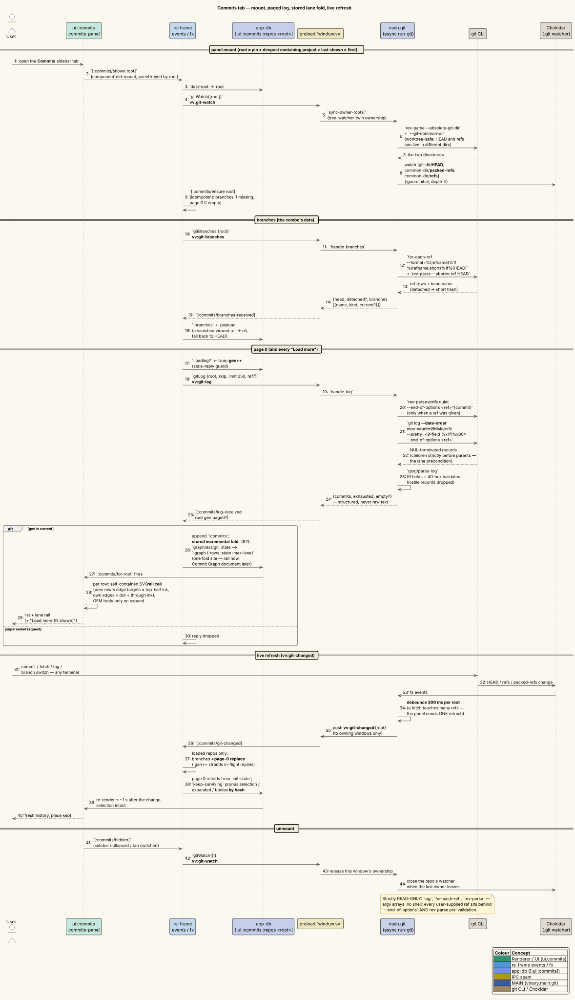
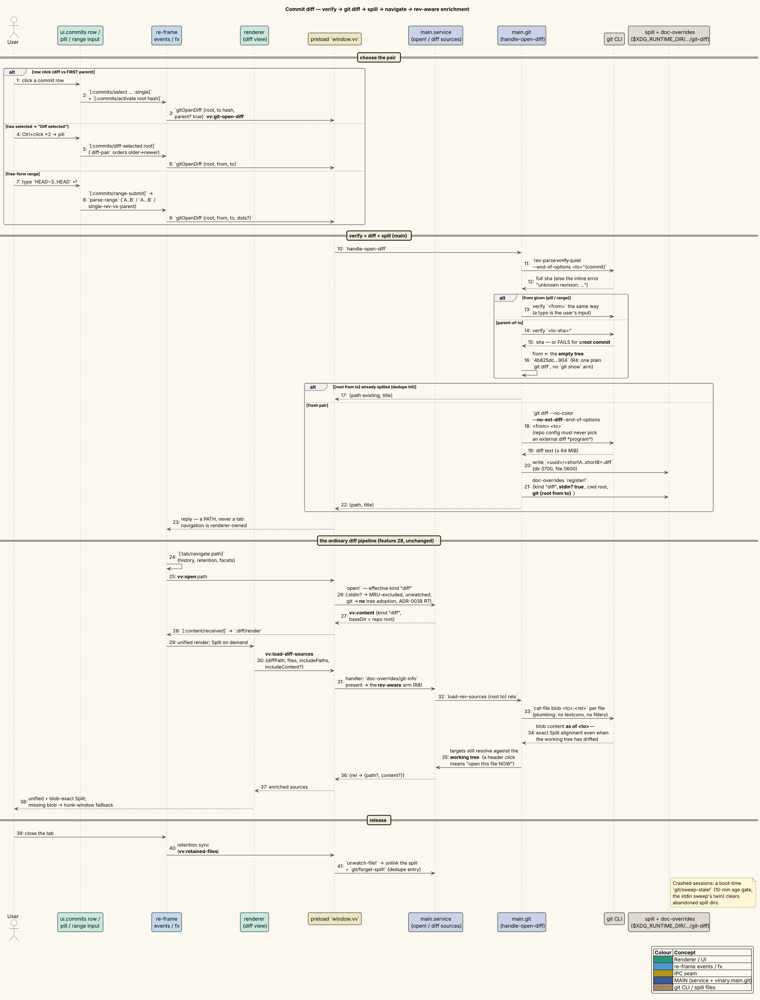

# Commits tab — repository history in the sidebar

**Status: Available now.**

---

## 1 · What it is

The sidebar's fourth tab, **Commits**, shows the git history of the repository behind the document
you are reading ([ADR-0039](../design-decisions/0039-commits-sidebar-and-git-data-layer.md)): a
paged commit list with a mini **lane-graph rail** (branches fork and merge visibly, GitLens-style),
subject lines with ref chips, an author · age · hash meta line, and commit **messages rendered as
GFM** when you expand them. Clicking a commit opens its diff — against its first parent by
default, or between any two commits you select, or across any range you type — as an ordinary
diff tab with everything [feature 28](28-diff-rendering.md) provides: unified and side-by-side
layouts, collapsible per-file previews, syntax highlighting, navigable headers. The panel
live-refreshes when the repository changes (a commit, fetch, tag, or branch switch — from any
terminal), and a filterable branch/tag combo switches the viewed ref.

All git access is **strictly read-only** — the layer contains queries only (`log`,
`for-each-ref`, `rev-parse`, `diff`, `cat-file`), hardened against hostile repositories (argv
arrays, `--end-of-options`, rev pre-validation, `--no-ext-diff`; see the
[threat model](../security/threat-model.md#the-git-data-layer-adr-0039)).

---

## 2 · How to use it

1. **Open the panel.** Click the **Commits** icon in the sidebar's vertical rail (Files ·
   Contents · Tabs · Commits — [ADR-0041](../design-decisions/0041-sidebar-vertical-icon-rail.md)).
   The panel shows the repository of the **active document** — the deepest git project
   in Files containing it. With no git project open it says "No git repository open"; while
   browsing non-repo files it keeps showing the last repository rather than thrashing.
2. **Pin a repository.** With more than one git project open, a **Repository** combo appears in
   the header; picking a root pins the panel to it (the pin holds while that project stays open).
3. **Switch the viewed ref.** The **branch combo** shows the current branch (or the short hash
   when detached). Click it, then *type to filter* — substring match over ref names — or use
   **↓/↑** and **Enter** to pick; **Escape** closes. Rows group into **Local / Remote / Tags**,
   the current branch first with a check mark; lists past 200 rows are capped with a
   "type to filter" hint.
4. **Read the log.** Each row is subject + ref chips, then author · age (`now`, `5m`, `3h`,
   `2d`, or the ISO date past two weeks) · 7-char hash, beside its rail cell. Rows with a message
   body carry an expander (**▸**); clicking it renders the message as GFM (relative links resolve
   against the repository root) — collapse with **▾**. Click **Load more (N shown)** at the
   bottom to page in the next 250 commits.
5. **Diff a commit.** **Click a row** → its diff against its **first parent** opens in a tab
   (a root commit diffs against the empty tree, i.e. shows its full addition). Re-activating the
   same commit navigates to the same diff document rather than producing a second copy. While
   that diff **is the active document**, its commit's row carries the strong highlight — and the
   highlight is *derived from the active document*
   ([ADR-0042](../design-decisions/0042-derived-open-commit-highlight.md)): navigate Back, switch
   tabs, or close the diff and it retargets or clears by itself. A range diff highlights **both**
   endpoint rows; a plain click never touches the Ctrl/Shift selection below.
6. **Diff two commits.** **Ctrl+click** toggles commits into the selection (a dashed accent
   ring, visually distinct from the open-commit highlight); **Shift+click** extends a range from
   the last anchor. With **exactly two** selected, a **Diff selected** pill appears in the
   header — it diffs them older→newer regardless of click order, and while that pair diff is the
   active document both endpoint rows carry the open highlight.
7. **Diff a range.** Type into the range input (placeholder `A..B, tag, HEAD~3`) and press
   Enter:
   - `HEAD~3..HEAD` — what the last three commits changed;
   - `v1.0` — a single rev: diffed against *its* parent, same as clicking its row;
   - `A...B` — the symmetric-difference form (changes on `B` since the merge base).
   A malformed range shows `unrecognized range` inline; an unknown ref shows main's
   `unknown revision: …`. Any rev-parse-able spelling works — tags, `HEAD~n`, short hashes.
8. **Right-click a row** for **Diff vs Parent**, **Copy hash**, **Copy short hash**, and
   **Copy subject**.
9. **Let it follow the repo.** Commit, fetch, or switch branches in any terminal: the panel
   refreshes within about a second, preserving your selection, expanded rows, and rendered
   messages (they are keyed by hash). If the branch you were viewing was deleted, the panel falls
   back to HEAD.

**Example.** Open this repository's README, switch to Commits, and click the latest commit — its
diff opens as a tab; toggle `[Unified | Split]` and the split aligns perfectly even for files
edited since (the enrichment is rev-aware, §3). Ctrl+click two release commits and press **Diff
selected** to read a whole release; or type `v0.2.0..HEAD` for everything since the tag.

---

## 3 · How it works internally

### Mount → data: `vv:git-branches` + `vv:git-log`, parsed in main

The panel (`vinary.ui.commits/commits-panel`) is keyed by its derived root
(`:commits/panel-root` → `commits/derive-root`: pin > deepest containing git project > last shown
> first). Mounting dispatches `[:commits/shown root]`, which (a) syncs this window's `.git`
watcher ownership over `vv:git-watch` and (b) runs `[:commits/ensure root]` — idempotent: fetch
branches if missing, load page 0 if empty. Both requests cross the
[mediator seam](../design-decisions/0009-mediator-ipc-over-point-to-point.md) to
`vinary.main.git`, whose async `run-git` (promise `execFile`, argv arrays, 64 MiB maxBuffer)
executes what the **pure** `vinary.git.log` built:

- branches: `for-each-ref --format=%(refname)%1f%(refname:short)%1f%(HEAD)` over
  heads/remotes/tags, plus `rev-parse --abbrev-ref HEAD`;
- log: `git log --date-order --max-count=250 --skip=N --pretty=<nine-field format>
  --end-of-options <ref>` — nine `%x1f`-separated fields per commit, `%x00`-terminated (git
  forbids NUL in commit text, so the boundary is unforgeable; a record with a wrong field count
  or a bad hash is dropped). `--date-order` guarantees children print before parents — the lane
  precondition — and a requested ref is rev-parse-verified before any log argv runs.

Main parses (sub-millisecond) and replies with structured commits; the renderer never sees raw
git output.

### The stored lane fold and the rail cells

`:commits/log-received` drops stale replies by generation, appends the page to `:commits`, and —
the one fold site — threads the page through `vinary.git.graph/assign` into
`[:ui :commits :repos <root> :graph {:rows :state :max-lane}]`. The fold is **incremental**
(property-tested: folding pages equals folding the concatenation), so "Load more" costs one
page's assignment, and the same stored rows feed the [Commit Graph document](33-commit-graph.md).

Each list row draws its own small SVG **rail cell** — a pure function of *(previous row's edges,
this row's edges, this row's lane)*. The previous row's edge *targets* tell the cell what ink
arrives at its top edge (drawn as verticals down to mid-height); the row's own edges supply the
rest — `:continue` drops from the dot, `:branch`/`:merge` curve from the dot toward their lane,
`:collapse` curves a sibling's lane into the dot, `:pass` runs straight through — as quadratics
with mid-height control points, so the two halves meet flush at every row border. Because a cell
never reads its neighbors' DOM, rows can skip offscreen rendering under
`content-visibility: auto` without seams. Colors are `--vv-lane-0..7` (theme tokens, lint-checked
in all four theme files), cycling `lane mod 8`; the sidebar rail clamps at 8 lanes.

### A row click → a spilled diff document → the ordinary diff pipeline

Clicking a row dispatches `[:commits/activate root hash]` → the `:vv/git-open-diff` effect →
`vv:git-open-diff {root, to hash, parent? true}`. Main verifies `to`, resolves `to^` (a root
commit substitutes the **empty-tree hash**, keeping one plain `git diff` path), runs
`git diff --no-color --no-ext-diff --end-of-options <from> <to>`, and **spills** the text to
`$XDG_RUNTIME_DIR/vinary-viewer/git-diff/<uuid>/<shortFrom..shortTo>.diff` (private `0700`/`0600`
— the [ADR-0036](../design-decisions/0036-stdin-documents-and-explicit-file-types.md) stdin-spill
twin), registered in doc-overrides as
`{:kind "diff" :stdin? true :cwd <root> :git {:root :from :to}}`. Main returns only `{path}`; the
**renderer** navigates (`[:tab/navigate path]` — history, retention, and facets are
renderer-owned), and the tab opens through the completely ordinary `vv:open` → kind `"diff"` →
`:diff/render` pipeline of [feature 28](28-diff-rendering.md). The override keys do the rest:
`:stdin?` excludes it from Open Recent, watches nothing, and unlinks the spill when its tab's
retention drops; `:git` opts it out of
[feature 31](31-diff-project-adoption.md)'s tree adoption (a commit diff is a transient
synthetic, not a project member) and switches enrichment to rev-aware mode. A dedupe map focuses
the existing document when the same pair is activated again; a boot sweep clears spills of
crashed sessions.

**Rev-aware enrichment.** When the Split view asks `vv:load-diff-sources` for full sources, the
handler sees the `:git` override and calls `git/load-rev-sources`: file **content** comes from
`git cat-file blob <to>:<rel>` — the very blobs the diff was computed from, so split rows align
exactly even when the working tree has moved on — while navigable header **targets** still
resolve against the working tree (a header click means "open this file *now*"). A missing blob
(rename, binary) simply falls back to the hunk-window rendering for that file.

### Live refresh: the `.git` watcher

`vinary.main.git` watches, per owned repo, exactly `<git-dir>/HEAD`, `<common-dir>/packed-refs`,
and `<common-dir>/refs` — resolved with `rev-parse --absolute-git-dir` / `--git-common-dir`, so
**worktrees** (where HEAD and refs live in different directories) notify correctly. Events
debounce 300 ms per root, then `vv:git-changed {root}` pushes to owning windows;
`:commits/git-changed` conservatively reloads branches + page 0 for repos the panel actually
loaded. The generation counter strands any in-flight page reply, and `commits/keep-surviving`
prunes the hash-keyed selection, expanded set, and body cache to commits that still exist —
which is why your place survives a `git commit --amend` upstream of it and vanishes with it.
Ownership follows the panel: unmounting (collapsing the sidebar, switching tabs) sends
`vv:git-watch []`, and the last owner out closes the repo's watcher.

---

## 4 · Design notes / trade-offs

- **Why parse in main, not the renderer?** Main already owns the subprocess; its parse is
  sub-millisecond; and a structured IPC reply keeps megabytes of hostile-adjacent text off the
  renderer's interactive thread. The renderer's `vinary.app.commits` model stays pure and
  DOM-free (node-tested).
- **Why `--date-order`?** It is the cheapest ordering that never prints a parent before its
  children — the invariant lane assignment folds over. `--topo-order` buffers the entire walk
  before the first byte; the default order gives no invariant at all. Clock skew degrades to a
  cosmetic fresh lane, never an error.
- **Why a spilled file rather than a virtual `vv-git-diff://` URI?** Every downstream subsystem —
  retention, doc-overrides, diff-source resolution, the MRU — keys on real paths; the spill makes
  a commit diff an ordinary ADR-0036 citizen whose whole lifecycle already existed. See
  [ADR-0039](../design-decisions/0039-commits-sidebar-and-git-data-layer.md) D4.
- **Lazy GFM bodies.** Messages render only on first expansion, through the **single** sanitizing
  markdown pipeline (base-dir = repo root), cached by hash, plain-`<pre>` on failure. Subjects
  are always escaped text — commit messages are untrusted input.
- **The depth-4 watcher exception.**
  [ADR-0034](../design-decisions/0034-expansion-scoped-file-tree-watchers.md)'s watchers are
  depth-0 because project trees are unbounded; a `refs/` tree is tiny and shallow watching would
  miss `refs/remotes/origin/…`. The exception is argued in ADR-0039 D8 and keeps the rule's
  spirit: bounded, ownership-scoped, deterministically released.
- **Test surface.** Argv shapes and record parsing (`log_test`), lane topologies + the
  paging-equivalence property (`graph_test`), the range grammar / selection reducers / root
  derivation / refresh survival (`commits_test`), the `:git` override facts
  (`doc_overrides_test`), and `git-log-smoke.js` against a real hermetic repository — including
  the rev-parse injection guard and the `cat-file`-vs-drifted-worktree proof — all wired into
  `npm test`.

### Limitations

- **Merge commits diff against their first parent only.** Combined merge diffs (`-m`/`--cc`) are
  out of scope for now; select the merge and a parent explicitly for the other leg.
- **The sidebar rail caps at 8 lanes.** Deeper lanes clamp to the last slot (colors cycle); the
  [Commit Graph document](33-commit-graph.md) is the roomier surface for wide histories.
- **Deep paging costs git an O(skip) walk** (`--skip`-based pages). Fine for human "Load more"
  browsing; jumping to commit 100 000 of a monorepo is not what this panel is for.
- **Per-file and line-range history run as MODES of this panel** — File History / Line Range
  History replace the listing (with a dismissible chip back to the branch log) rather than opening
  a separate surface. See [feature 34](34-git-blame-and-file-history.md) and
  [ADR-0040](../design-decisions/0040-commit-graph-blame-and-history.md).
- **Remote (`ssh://`) repositories are out of scope** — the git data layer serves local
  filesystems only.

---

## 5 · Diagrams

- **Sequence — log delivery and live refresh:**
  [`../diagrams/seq-commits-log.puml`](../diagrams/seq-commits-log.puml) — panel mount →
  `vv:git-watch` + `vv:git-branches` + `vv:git-log` → async `run-git` → main-side parse →
  `:commits/log-received` → the stored incremental lane fold → rail cells; plus the debounced
  `vv:git-changed` refresh leg with hash-keyed survival.

- **Sequence — a commit diff, row click to rev-aware Split:**
  [`../diagrams/seq-git-open-diff.puml`](../diagrams/seq-git-open-diff.puml) — `:commits/activate`
  → `vv:git-open-diff` → rev verification (empty tree for a root commit) → `git diff` → spill +
  doc-overrides registration → `{path}` → `[:tab/navigate]` → the ordinary diff pipeline →
  `vv:load-diff-sources` taking the `:git` branch → `cat-file blob` enrichment.

