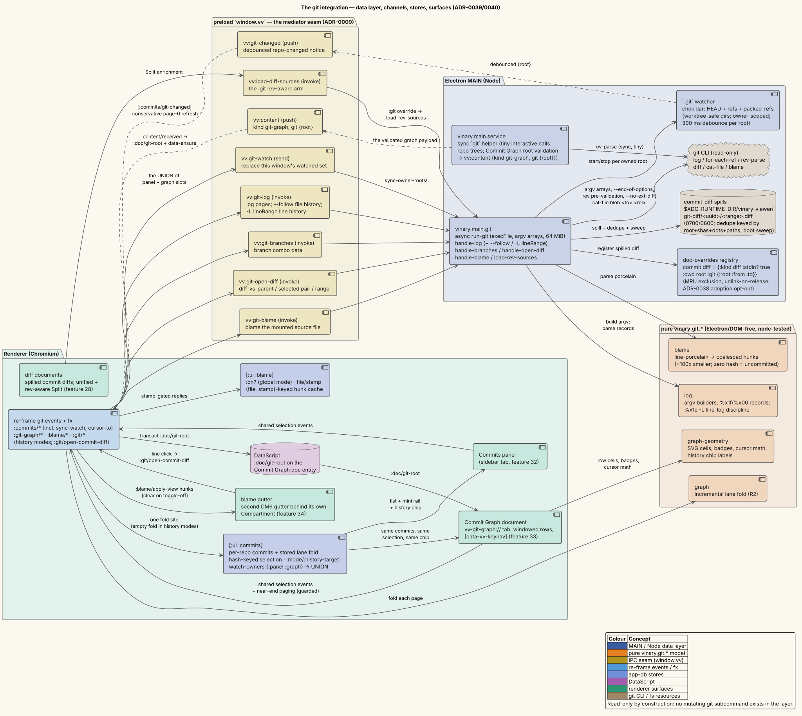

# Git blame & file history — per-line authorship and focused logs

**Status: Available now.**

---

## 1 · What it is

Two reading aids over the same read-only git layer
([ADR-0040](../design-decisions/0040-commit-graph-blame-and-history.md)):

- **The blame gutter.** Toggle a second gutter onto any source view
  ([feature 13](13-source-preview-tree-sitter.md)) showing, per line, *who last touched it and
  when* — compact "author · age" chips at each blame hunk's first line, an italic
  **Uncommitted** for lines you have edited but not committed, dimmed chips for boundary
  commits. Hovering shows the commit (short hash + summary + author); **clicking opens that
  commit's diff** as an ordinary diff tab.
- **History modes.** Ask for one **file's** history (`git log --follow`, crossing renames) or
  one **line range's** history (`git log -L`) and both Commits surfaces — the
  [sidebar panel](32-commits-tab.md) and the [Commit Graph](33-commit-graph.md) — show that
  focused log at once, with a dismissible chip to return to the branch log.

Both are strictly read-only queries through the hardened
[git data layer](../security/threat-model.md#the-git-data-layer-adr-0039).

---

## 2 · How to use it

### The blame gutter

1. **Toggle it on** over a source view: palette → **Toggle git blame**, or **`Ctrl+Shift+G`**
   (`C-S-g`, bound in the Standard keymap; Vim/Emacs users use the palette), or the
   `window.__vvblame()` DEV seam. The command self-gates: with no *local* source file showing
   (a remote `ssh://` file, an image, a preview facet) it is a silent no-op.
2. **Read the chips.** Each blame hunk's first line carries `author · age` — `now`, `5m`, `3h`,
   `6d`, or the ISO date past a month; continuation lines keep a quiet border column so hunk
   extents stay visible. Lines with uncommitted edits read **Uncommitted** (italic); commits at
   the history's boundary (e.g. a shallow clone's edge) render dimmed.
3. **Hover a chip** for the commit: an 8-character hash, the summary line, and
   `author <email>` (an uncommitted line reads "Not yet committed").
4. **Click a line's gutter** to open that commit's diff against its first parent — a root commit
   shows its full addition (the empty-tree base). Uncommitted lines are inert (there is no
   commit to open).
5. **It follows you.** Blame is one **global mode**: switch tabs, flip a facet to Source, or
   save the file in your editor, and the gutter re-ensures itself for whatever source view is
   showing — a live refresh re-blames the new content, so the chips never describe stale lines.
   Toggle off to clear.

A local file *outside* any repository accepts the toggle but gets main's honest
not-a-repository error recorded in the blame state — no gutter appears and nothing is invented.

### File history

1. From the **Files tree**: right-click a file → **File History**. Or right-click a **tab** →
   **File History**. Or palette → **File history** (uses the active document).
2. The sidebar reveals the **Commits** tab, pins it to the file's repository, and both surfaces
   now list only the commits that touched that file — `--follow`, so renames are crossed.
3. A chip — **History: \<file\>** — appears in the Commits panel header *and* the Commit Graph
   header. Click its **×** ("Back to the branch log") to exit.

### Line-range history

1. In a **source view**, select the lines you care about (or just leave the cursor on one line).
2. Right-click → **Line Range History**, or palette → **Line range history**. The selection's
   line span is used; an empty selection means the cursor line.
3. Both surfaces list the commits that touched those lines — `git log -L` traces the content
   itself, so the range follows edits and renames backward through history. The chip reads
   **History: \<file\> · L\<start\>–\<end\>**.

**While a history is shown:** the branch/tag combos in both headers disable with the tooltip
**"History follows HEAD"** (a branch pick would contradict working-file lineage); the lane rails
draw **flat lane-0 dots** instead of a graph (a filtered listing's parents are absent — lanes
would fabricate connectivity); rows still click, select, and diff exactly as in the branch log.
Line-range history is a **single shot** capped at 500 commits and marked exhausted — there is no
"Load more" for it.

**Example.** Open `src/vinary/app/events.cljs`, press `Ctrl+Shift+G` — the gutter attributes
every line; click a chip on some line you are curious about and its commit's diff opens. Select
a confusing function, right-click → *Line Range History* — the Commits tab pins to this repo and
shows exactly the commits that shaped those lines; press × on the chip to get the branch log
back.

---

## 3 · How it works internally

**Blame: main-side porcelain → hunks → a gutter Compartment.** `vv:git-blame {file}` re-derives
the repository from the *file's own directory* (the panel's repo is advisory) and runs
`git blame --line-porcelain -- <file>` against the **working tree** — exactly what the source
view displays — with no `-M`/`-C`/`-w` (literal attribution). The pure `vinary.git.blame` parses
the per-line records with a per-hash metadata cache and coalesces consecutive same-hash lines
(contiguous in both original and final numbering) into hunks — ~100× smaller than the porcelain
(a 10k-line file's porcelain is ~5 MB; its hunks a few KB), so structured hunks cross the IPC
seam, never raw text. Renderer-side, the source view mounts a **second CodeMirror gutter behind
its own `Compartment`** (the grammar-highlight pattern): empty at mount, reconfigured by
`set-blame!` when hunks arrive. Markers are **prototype-derived `GutterMarker`s**
(`Object.create` on the prototype — its constructor is empty, and plain interop stays clear of
class-extension machinery under the `:simple` build) implementing `eq` by value so unchanged
chips reuse their DOM; `set-blame!`/`clear-blame!` guard on the view's `isConnected` so an async
reply can never dispatch into a facet-flip-destroyed editor. `blame/hunk-for-line` (binary
search) resolves a gutter click to its hunk, and `:blame/line-click` opens the diff through the
shared `:git/open-commit-diff` entry.

**One global mode, stamp-gated.** `[:ui :blame]` holds the mode flag plus the mounted file/stamp
and a `(file, stamp)`-keyed hunk cache. Every source-view mount dispatches
`[:blame/source-mounted {file stamp}]` — the **single hook** that makes toggle-while-shown,
facet flips, tab switches, and live refreshes all converge on `[:blame/ensure]` (cache hit →
re-apply; miss → one `git blame`). Replies are dropped unless their `(file, stamp)` still
matches the mounted view, so a refresh race cannot paint stale hunks over new text.

**History: modes of the shared store.** `:git/file-history` / `:git/line-history` reset the
repo's listing into `:mode` + `:history-target`, pin the panel to that repo, and reveal the
Commits tab; `:commits/load` merges `commits/history-args` into the `vv:git-log` request —
`{file, follow: true}` for file history, `{lineRange {file start end}}` for line history (the
viewed `:ref` applies only to the plain log). Main's `lineRange` branch resolves the file
repo-relative (rejecting anything outside the repository) and runs the **`%x1e` record
discipline**: `-L<start>,<end>:<rel> --no-patch -n 500` with a format whose records *open* with
`%x1e` and end at a single-line subject — no body field. Pre-2.42 gits bleed patch text despite
`--no-patch`; because the marker opens records, everything after the last field is simply
discarded (and the subject truncates at its first newline), so old and new gits parse
identically — pinned by unit fixtures and by `git-blame-smoke.js` against the real installed
git. `--follow` file history reuses the ordinary nine-field `%x00` format (it emits no patches).
In history modes `:commits/log-received` stores an **empty lane fold**, which is what both rails
key their dots-only degradation on; `:git/history-exit` resets to `:log` and reloads page 0.

**The line source.** `:git/line-history-from-selection` reads the mounted source view's primary
selection through the `:git/selection-line-history` effect (`cm/selection-lines` — 1-based
`[start end]`, the cursor line twice when empty; swapped bounds normalize) — reading the DOM is
effect business, not event business.

---

## 4 · Design notes / trade-offs

- **Why a gutter and not line decorations?** Pooled DOM, horizontal-scroll immunity, zero
  perturbation of the text layout, and a per-line click seam — the gutter is the purpose-built
  primitive; see ADR-0040's alternatives.
- **Why blame the working tree?** The gutter must describe the text on screen. Uncommitted lines
  as an explicit zero-hash state ("Uncommitted") are more honest than attributing them to the
  last committed revision.
- **Why is history HEAD-pinned?** `--follow` and `-L` trace the *working file's* lineage; a
  branch pick would silently answer a different question. The disabled combo's tooltip states
  the constraint rather than hiding it.
- **Why flat rails in history?** A filtered listing's parents are mostly not in the listing;
  lanes would draw connectivity that does not exist. An honest dot column beats a fictional
  graph.
- **Why is `-L` single-shot?** It paginates poorly (each page would redo the content trace);
  one bounded walk of 500, marked exhausted, covers any real review.
- **Test surface.** `blame_test` (coalescing, the metadata cache, zero hash, boundary, CRLF,
  unknown keys, line lookup, date buckets); `log_test/line-log-argv-and-records` (the `-L` argv
  and the bleed-tolerant parse); `commits_test/history-mode-request-args`;
  `git-blame-smoke.js` on a hermetic repo (dirty line = zero hash, `--follow` crosses a rename,
  `-L --no-patch` cleanliness on git ≥ 2.42, source bindings); and the electron-smoke blame arm
  driving the real gutter (chips render, tooltips carry the hash, toggle-off clears).

### Limitations

- **Blame is v1-literal:** no `-M`/`-C` (moved/copied-line attribution) and no `-w`
  (whitespace-ignoring), so a reformat commit owns the lines it reindented.
- **`C-S-g` is bound in the Standard preset only** — the chord is free in Vim/Emacs, whose users
  reach the toggle through the palette (or bind it themselves,
  [feature 15](15-custom-keybindings.md)).
- **The blame error is quiet.** A not-a-repository reply records itself in the blame state
  rather than raising a toast; the gutter simply does not appear.
- **Line-range history is single-shot** (500 commits, exhausted) and **file history walks from
  HEAD** — neither pages by ref.
- **Local repositories only** — like the whole git layer, blame and history do not serve
  `ssh://` documents.

---

## 5 · Diagrams

- **Component — the whole git integration:**
  [`../diagrams/component-git-integration.puml`](../diagrams/component-git-integration.puml) —
  where `vv:git-blame` and the history-shaped `vv:git-log` requests sit among the channels, the
  `[:ui :blame]` store beside `[:ui :commits]`, and the blame gutter beside the other three
  consuming surfaces.

