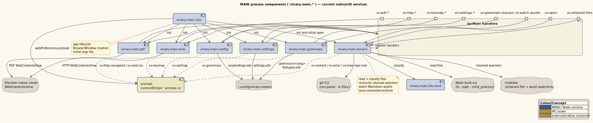
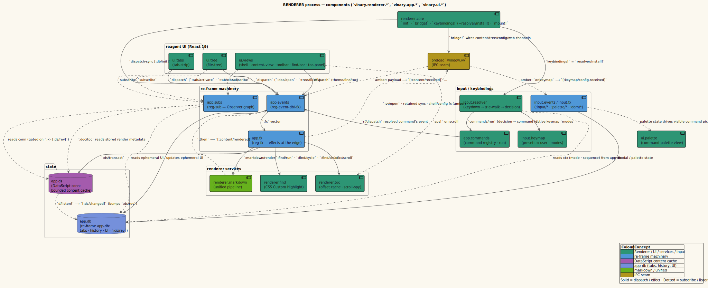

# Reference. Namespaces

This is a current map of the vinary-viewer source tree. Architecture overview:
[../architecture/01-overview.md](../architecture/01-overview.md).

---

## Main process

| Namespace | Responsibility |
|-----------|----------------|
| `vinary.main.core` | Electron app/window lifecycle, preload path, renderer entry, initial argv file. |
| `vinary.main.service` | File reads, content/error/tree sends, retained watcher reconciliation, Markdown asset watchers, git tree. |
| `vinary.main.file-kind` | Pure file-kind classifier. |
| `vinary.main.pdf` | Native PDF `WebContentsView` lifecycle, bounds, reload. |
| `vinary.main.web` | In-app HTTP/HTTPS web view lifecycle, bounds, navigation, TOC bridge. |
| `vinary.main.config` | `~/.config/vinary-viewer/keybindings.edn` load/save/watch. |
| `vinary.main.settings` | `~/.config/vinary-viewer/settings.edn` load/save/watch. |
| `vinary.main.recent` | `~/.config/vinary-viewer/recent.edn` load/save/watch: the dir→last-child `:trail`, the `:recent-files` MRU (File ▸ Open Recent), and the `:web-history` URL MRU. Mirrors `settings.cljs` (raw EDN text over IPC). |
| `vinary.main.adblock` | Native ad/tracker blocking (`@ghostery/adblocker-electron`, MPL) on `persist:vinary-web`: engine build/enable/refresh/schedule + cache (ADR-0014). |
| `vinary.main.extensions` | Scoped Chrome-extension runtime: Web-Store install/load/reconcile, manifest→toolbar model, popup open, state push (ADR-0015). |
| `vinary.main.ext-popup` | Browser-action popup host (origin-locked, content-sized `WebContentsView` on the web session). |
| `vinary.main.ext-config` | `~/.config/vinary-viewer/extensions.edn` load/save/watch + synchronous main-side `load-config` (ad-block + extension prefs). |
| `vinary.main.ext-util` | Pure, electron-free helpers: Web-Store id parse, config merge, enable/disable reconcile, manifest action model, popup geometry, ad-block cache/list. |
| `vinary.main.pdf` | *RETIRED* — native PDF `WebContentsView` superseded by the in-renderer pdf.js view (ADR-0013); kept commented for recoverability. |
| `vinary.main.window` | Persisted main-window geometry (`window.edn`): position, size, and maximized state, clamped to a visible display. Main-only (no renderer involvement). |
| `vinary.main.grammars` | Bundled and user grammar registry. |

---

## IPC seam

| File | Responsibility |
|------|----------------|
| `resources/preload.js` | Exposes `window.vv` via `contextBridge`; all renderer/main IPC crosses here. |
| `resources/web-preload.js` | Runs inside the HTTP web view; reports headings and active heading, handles TOC jumps. |

See [ipc-channels.md](ipc-channels.md).

---

## App layer

| Namespace | Responsibility |
|-----------|----------------|
| `vinary.app.db` | Default app-db: UI/navigation/settings/keybinding state. |
| `vinary.app.ds` | DataScript content cache, `:ds/rev` bridge, content-cache helpers. |
| `vinary.app.nav` | Pure browser-tab and per-tab-history transforms over app-db. |
| `vinary.app.uri` | URI/path normalization and local-vs-HTTP predicates. |
| `vinary.app.zoom` | Pure context-aware zoom helpers (`context` → `:pdf`/`:web`/`:window`, `percent`, `presets`) shared by the zoom events and the `:view/zoom-percent` sub. |
| `vinary.app.events` | re-frame events for content, tabs, history, settings, menu, tree, TOC, find, hints, shell commands. |
| `vinary.app.fx` | re-frame effects for DataScript transactions, Markdown render, IPC, DOM/media/find/theme work. |
| `vinary.app.subs` | Subscriptions over app-db and DataScript snapshots. |
| `vinary.app.commands` | Command registry used by keybindings and palette. |

---

## Input layer

| Namespace | Responsibility |
|-----------|----------------|
| `vinary.input.keys` | Normalize DOM keyboard events into canonical chord tokens. |
| `vinary.input.keymap` | Bundled presets, active keymap atom, user-delta merge. |
| `vinary.input.keymaps-registry` | app-db keymap-set registry helpers and persistence envelope. |
| `vinary.input.resolver` | Modal/chord resolver, pending-sequence atoms, global keydown handling. |
| `vinary.input.events` | Input mode, sequence, palette, keymap config, and keybinding-editor events. |
| `vinary.input.fx` | Input-related effects: active keymap installation, debounced persistence, DOM focus/scroll. |
| `vinary.input.kbedit-history` | Reversible editor commands for keybinding undo/redo. |
| `vinary.input.presets` | Superseded reference macro namespace; preset EDN is now inlined by `vinary.input.keymap`. |

---

## Renderer services

| Namespace | Responsibility |
|-----------|----------------|
| `vinary.renderer.core` | Renderer boot, DataScript bridge install, IPC bridge, keybinding resolver install, React root mount. |
| `vinary.renderer.markdown` | Markdown to `{html, toc, assets}` through unified/remark/rehype. |
| `vinary.renderer.math` | MathJax TeX-to-SVG rendering and cached Markdown math postprocessing. |
| `vinary.renderer.mermaid` | Mermaid source-to-SVG rendering for Markdown fences and direct Mermaid files. |
| `vinary.renderer.figures` | Measure and size embedded local SVG figures. |
| `vinary.renderer.toc` | Heading offset cache, binary-search scroll-spy, TOC jump helpers. |
| `vinary.renderer.scroll` | Pending scroll restore and late retry guard. |
| `vinary.renderer.pdf` | In-renderer pdf.js engine: worker bootstrap, canvas/text/link layers, virtualization, zoom, outline (ADR-0013). |
| `vinary.renderer.pdf-layout` | Pure, DOM-free PDF geometry/zoom/outline helpers (unit-tested). |
| `vinary.renderer.pdf-cache` | PDF byte cache (keyed by `:doc/path`, not DataScript) + the in-page-find text-materialization hook. |
| `vinary.renderer.find` | CSS Custom Highlight API search. |
| `vinary.renderer.media` | Local media URL cache busting and source helpers. |
| `vinary.renderer.syntax` | CodeMirror/web-tree-sitter source view construction, grammar registry, and source selection helpers. |
| `vinary.renderer.preview-navigation` | Classify links/targets from rendered preview interactions. |

---

## UI layer

| Namespace | Responsibility |
|-----------|----------------|
| `vinary.ui.views` | Main shell, content strategy, Markdown body lifecycle, toolbar, status/modeline, settings/palette inclusion. Also hosts the in-pane directory browser (`dir-view`, selected by `:doc/kind = "directory"`) and the Ctrl-hover `breadcrumb` URI bar. |
| `vinary.ui.tabs` | Horizontal tab strip and shared tab item behavior. |
| `vinary.ui.sidebar` | Sidebar shell and panel switching. |
| `vinary.ui.tree` | Git file-tree view and filtering. |
| `vinary.ui.context-menu` | Context menu targets and actions. |
| `vinary.ui.menubar` | Custom menu bar and submenu behavior (incl. the `View ▸ Fit` radio submenu). |
| `vinary.ui.zoombar` | The always-visible bottom zoom bar: − / editable % field / preset dropdown / +, dispatching the context-aware `[:view/zoom …]`/`[:view/zoom-set …]`. |
| `vinary.ui.palette` | Command/file palette overlay. |
| `vinary.ui.settings` | Preferences dialog. |
| `vinary.ui.extensions` | Settings ▸ Extensions dialog: ad-blocking controls + the Chrome-extension manager. |
| `vinary.ui.ext-toolbar` | Browser-action toolbar (extension icons in the address-bar row; click → open popup). |
| `vinary.ui.keybindings-editor` | Visual keybinding editor. |
| `vinary.ui.about` | About dialog. |
| `vinary.ui.platform` | Tiny renderer-side OS detection (`single-click-open?`): single-click opens on Linux, double-click on Windows/macOS — used by the directory browser and git file tree. |

---

## Dependency direction

Renderer code does not import `vinary.main.*`. Main code does not import renderer
UI namespaces. The preload IPC seam is the process boundary.
