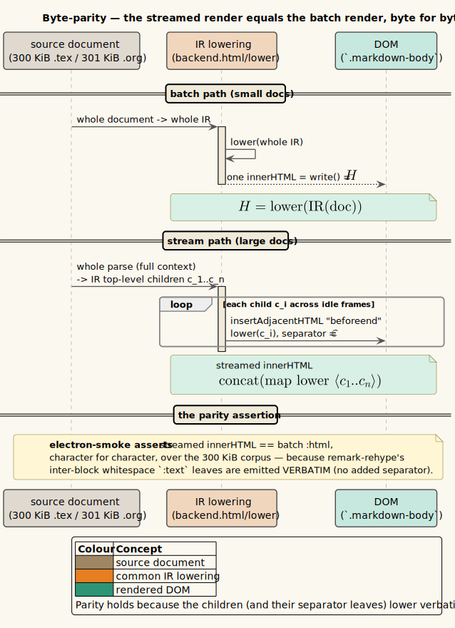

# 01 — Byte-parity verification

**Status: current for v0.3.0-dev.** This page documents the project's strongest correctness guarantee: that the
v0.3.0 rendering migration is *invisible in the output*. Two independent producers were replaced — the legacy
Markdown string renderer and the whole-document batch render — and in both cases the replacement is verified to
emit **byte-identical** HTML. This is the criterion that makes a migration safe to ship default-on.

> **Prerequisite.** [theory/08 — Common document IR](../theory/08-common-document-ir.md) (the front-end/back-end
> split) and [theory/09 — Document streaming and the WPDA](../theory/09-document-streaming-and-the-wpda.md) §6
> (the append sink and its separator nodes).


*Diagram source: [`../diagrams/seq-byte-parity.puml`](../diagrams/seq-byte-parity.puml).*

---

## 1 · Why byte-parity is the right criterion for a migration

A *migration* replaces a trusted producer `$`P_{\mathrm{old}}`$` with a new producer `$`P_{\mathrm{new}}`$` that
is supposed to do the same job better internally. The user-visible contract is the **output string**: the HTML
written into `.markdown-body`. The migration is *correct* precisely when, for every input document `$`d`$`,

```math
P_{\mathrm{new}}(d) \;=\; P_{\mathrm{old}}(d)
```

as byte strings. Byte-equality — not "renders the same", not "structurally equivalent", not "passes the same
visual tests" — is chosen deliberately, for four reasons.

1. **It has a trusted oracle.** `$`P_{\mathrm{old}}`$` shipped in v0.2.0 and was correct in the field. It is the
   ideal reference: byte-parity means we inherit *all* of its behaviour, including undocumented edge cases, for
   free. A weaker criterion would re-open questions the old path had already answered.
2. **It is decidable and total.** String equality is a single `===`; there is no tolerance to tune, no
   structural diff to interpret, no flaky pixel comparison. A mismatch is a hard failure with an exact character
   offset (the smoke prints `firstDiff`), so a regression is *localised*, not merely detected.
3. **It composes.** Downstream capabilities — in-page find, the scroll-spy table of contents, source-position
   jump, text selection — all walk the *serialized DOM*. If the bytes are identical, every capability that was
   correct over `$`P_{\mathrm{old}}`$` is correct over `$`P_{\mathrm{new}}`$` by construction. Byte-parity
   discharges an entire class of downstream regressions with one proof obligation.
4. **It is the strongest property that is still true.** The migration was engineered so that byte-parity would
   *hold*, not merely so it could be *claimed*. Where whole-document context genuinely forbids it — a truly
   incremental parser cannot dedup heading slugs it has not yet seen — the design chose the architecture that
   preserves byte-parity (a whole-document parse whose *children* are committed progressively) rather than
   weakening the criterion. The criterion drove the design; see §4.

Byte-parity is therefore not a testing convenience; it is the **specification** of the migration.

---

## 2 · Equivalence 1 — the HAST round-trip (`ir.parity-test`)

The Markdown and office front-ends do not invent a tree; they *mirror* the rehype HAST into the IR, and the
back-end lowers the IR back to HAST, which a single `rehype-stringify` serialises. Writing `$`\sigma`$` for the
legacy serializer (`ir.backend.html/stringify-hast`), `$`\phi`$` for the front-end mirror
(`ir.frontend.markdown/hast->ir`), and `$`\lambda`$` for the IR lowering + serialization
(`ir.backend.html/lower`), the guarantee is the **round-trip identity**

```math
\lambda \,(\phi(h)) \;=\; \sigma(h) \qquad \text{for every HAST tree } h .
```

That is: routing a tree through `HAST → IR → HAST → string` yields the *same string* as serialising it directly.
The IR is a lossless re-encoding of the HAST fragment it came from, so the detour is invisible.

`vinary.ir.parity-test/hast-ir-roundtrip-parity` witnesses this over ten representative fixtures — a heading with
an id, a paragraph with an inline link, a figure-linked image, tight/loose lists, a highlighted code block, a
GFM table, a source-position-tagged heading, a blockquote, inline math, and a raw-HTML-ish `div/span` with
custom classes and `data-*` attributes:

```pseudocode
for each fixture tree h in fixtures:                       ' 10 representative HAST shapes
    direct    ← stringify-hast(h)                          ' the legacy oracle σ(h)
    roundtrip ← lower(hast->ir(h))                         ' λ(φ(h)) — through the IR
    assert direct = roundtrip                              ' byte-string equality
```

Two companion tests guard the *reason* the identity holds rather than just the identity:

- `roundtrip-preserves-valid-ir` asserts every fixture maps to a structurally-valid IR tree
  (`node/valid-tree?`), so parity is not an accident of a malformed tree serialising to the same bytes.
- `semantic-kinds-and-metadata` asserts the front-end assigns the semantic kinds and derived metadata the
  capability layer depends on — a `:heading` gets `:level 2`, `:role :heading`, the `h2` tag, and the source
  `:span` offset `40` recovered from `data-vv-source-start-offset`; images/lists/tables get `:image`/`:list`/
  `:list-item` kinds. Byte-parity of the HTML must not come at the cost of losing the metadata the TOC and jump
  features read.

This is the parity condition cited (but not proven) in [theory/08 §4](../theory/08-common-document-ir.md#4--weighted-tree-transducers):
because the front-ends preserve each element's tag and properties verbatim, `HAST → IR → HAST` round-trips
losslessly, so the rendered HTML is byte-identical to the legacy pipeline and the `:vv/ir` cutover was invisible.
The migration flag has since been retired (`CHANGELOG.txt`, *Removed*): office and Markdown render through the IR
*unconditionally*, so this identity is now the sole guarantee that the retired path's output is preserved.

> **Scope note.** `ir.parity-test` is DOM-free: it proves parity of the *lowering*. Full-render parity over real
> Markdown — including the MathJax/Mermaid/tree-sitter post-passes, which need a DOM — is proven by the Electron
> smoke (§4). The two together cover the pipeline end-to-end.

---

## 3 · Equivalence 2 — streamed render equals batch render

The streaming pipeline ([theory/09](../theory/09-document-streaming-and-the-wpda.md)) renders a large document
*incrementally*: it commits IR blocks one batch at a time and appends them to the DOM, never holding the whole
HTML string. The correctness criterion is again byte-parity, now against the **batch render** as oracle: the
concatenation of the per-block lowerings must equal the whole-document lowering.

Writing `$`\lambda`$` for the block lowering, `$`\mathrm{children}(d)`$` for the batch IR document's top-level
children, and `$`\mathbin{\Vert}_{s}`$` for string concatenation interposing the separator `$`s`$`, the
**progressive-commit parity** condition is

```math
\big\Vert_{s}\; \big(\, \lambda(c) : c \in \mathrm{children}(d) \,\big) \;=\; \lambda(d) \;=\; \text{batch } \texttt{:html},
```

with the separator `$`s = \varepsilon`$` (the empty string) for the progressive Markdown/Org/LaTeX engine, and
`$`s = \texttt{"\textbackslash n"}`$` for the bounded log byte-stream. The choice of `$`s`$` is the entire
subtlety, and §5 explains why.

### 3.1 · The DOM-free witness (`org-test`)

`vinary.ir.frontend.org-test/org-stream-blocks-concatenate-to-the-batch-html` pins the `$`s = \varepsilon`$`
case directly, without a DOM, over a representative Org document (headings, a bold/italic paragraph, three
nested `#+begin_src` blocks, a table, an image):

```pseudocode
render the sample through the whole org-pipeline → IR document d, batch HTML = lower(d)
per-block ← concat(map lower (children d))                ' s = ε: no interposed separator
assert per-block = batch HTML                             ' byte-for-byte
```

The comment in the test states the contract verbatim: *"streamed per-block lowering is byte-identical to the
whole-document lowering … It holds because the inter-block whitespace lives in emitted `:text` leaves, not a
re-synthesized `\n`."* This is the load-bearing invariant that `md/org-stream-blocks` and the stream scheduler's
`sep-for` rely on, verified where it is cheapest to verify — in Node, over the real pipeline, with no browser.

### 3.2 · Why Org is the witness of choice

Org is the harder case, which is why it carries the DOM-free parity test. Org's front-end runs
`uniorg → uniorg-rehype → the shared Markdown hast suffix`, and several Org constructs are *normalized*
pre-lowering (`span.math → code.math-inline`, `todo-keyword TODO → span.todo`, footnotes demoted to `h2`). If any
of those normalizations were sensitive to whether the document was lowered whole or child-by-child, this test
would catch it. It passes, so the normalizations are *node-local* — which is the same context-freedom argument
that underwrites the sanitizer ([04](04-sanitizer-context-freedom.md)).

---

## 4 · Equivalence 2, on a real surface — the Electron smoke

The DOM-free witness proves the *lowering* concatenates cleanly. It cannot prove that the streamed and batch
renders agree *after* the asynchronous post-passes (MathJax SVG, Mermaid, tree-sitter highlighting) run against
a live DOM, because those passes need a browser. The Electron smoke (`test/electron-smoke.js`) closes that gap on
a real Chromium surface, over three large corpora built to exceed the 256 KiB streaming threshold:

| Format | Fixture builder | Target size | Constructs exercised per section | Parity assertion |
|--------|-----------------|-------------|----------------------------------|------------------|
| Markdown | `createLargeMarkdownFixtures` | `$`> 300`$` KiB | slug-dedup repeats, forward reference, tight/loose lists, highlighted code, GFM table, raw `<abbr>` | `streamHtml === batchHtml` |
| Org | `createLargeOrgFixtures` | `$`> 300`$` KiB (`$`\approx 301`$` KiB) | inline math (MathJax SVG), a rendered non-math `#+BEGIN_EXPORT latex` block, task checkboxes, table | `orgStreamHtml === orgBatchHtml` |
| LaTeX | `createLargeLatexFixtures` | `$`> 300`$` KiB | `\section`, `\textbf`/`\emph`, inline math, `itemize`, a `tabular` | `texStreamHtml === texBatchHtml` |

The protocol is an **A/B on the same content**: open the fixture with `:stream? false` and capture
`.markdown-body`'s `innerHTML` as the *batch reference*; re-open with `:stream? true`, wait for the progressive
paint to converge and the progress strip to reach `vv-stream-progress-done`, and capture the *streamed*
`innerHTML`; then assert them `strictEqual`. The Markdown case, for instance:

```js
// batch reference (flag OFF)
const batchHtml = await evalIn(win, `document.querySelector('.vv-content .markdown-body').innerHTML`);
// … streamed render (flag ON) …
const streamHtml = await evalIn(win, `document.querySelector('.vv-content .markdown-body').innerHTML`);
assert.strictEqual(streamHtml, batchHtml,
  'streamed markdown innerHTML must be byte-identical to the batch render');
```

Because the corpora deliberately contain the constructs whose per-block handling *could* diverge — heading-slug
dedup across the whole document, a forward reference definition resolved at EOF, MathJax SVG whose geometry the
post-pass computes, the ADR-0025 rendered-LaTeX export block — a mismatch anywhere prints the offending
character offset via `firstDiff` and fails the run. The `[ok]` lines record the covered constructs:
*"streamed markdown is BYTE-IDENTICAL to the batch render (slug dedup, forward refs, lists, code, tables,
positions)"*, and likewise for Org and LaTeX.

One further smoke assertion protects the *capture* itself: the whole-document scrollbar spacer is a **sibling**
of `.markdown-body`, not a child (`spacerIsSibling`), so the progressive engine's height model can never pollute
the `innerHTML` that the parity comparison reads.

---

## 5 · The separator-node argument (why `$`s`$` is what it is)

The parity condition of §3 depends entirely on choosing the concatenation separator `$`s`$` correctly, and the
two engines choose *differently*. The reason is a property of how `remark-rehype` serialises a document.

`remark-rehype` emits a **`\n` text node between every pair of top-level blocks**. When the whole document is
lowered, those separators appear *inside* the serialized string. So there are two ways to reconstruct the batch
string from a stream of blocks, and exactly one is correct per engine:

- **Progressive engine (Markdown, Org, LaTeX) — `$`s = \varepsilon`$`.** The whole document is parsed *once*
  (giving full context: slug dedup, forward references, footnote layout), and its IR document's **children are
  emitted verbatim**, *including the inter-block whitespace `:text` leaves that already carry remark-rehype's
  exact separators*. The children already contain the `\n`s, so the sink must concatenate them with **no added
  separator**. Adding one would double the newline and break parity. This is why `vinary.stream.sink/append-blocks!`
  is called with `sep = ""` for these kinds, and why the sink *skips the post-passes for whitespace-only
  fragments* — running a parse+serialize post-pass over a lone `\n` leaf would normalise the whitespace away and
  break parity.

- **Bounded log byte-stream — `$`s = \texttt{"\textbackslash n"}`$`.** The log front-end
  (`ir.frontend.log-stream`) emits `div.vv-log-record` blocks that carry **no** inter-block separators of their
  own (there is no `remark-rehype` in this path). So the sink must *supply* exactly one `\n` between records —
  `record₁\nrecord₂\n…` — with no trailing newline. This is why logs pass `sep = "\n"`.

`vinary.stream.sink/append-blocks!` encodes this with a per-controller `started?*` atom: `sep` is a *leading*
separator on every append **except the first**, so the streamed body carries no trailing separator regardless of
how many batches arrive:

```pseudocode
append-blocks!(node, blocks, posts-fn, started?*, sep):
    htmls   ← map lower blocks                             ' IR block → HTML string
    joined  ← if posts-fn then run-post-passes-preserving-whitespace(htmls, sep)
                          else  join(htmls, sep)
    piece   ← if started?* then (sep ⧺ joined) else joined ' leading sep on all but the first
    started?* ← true
    node.insertAdjacentHTML("beforeend", piece)            ' append; never replace innerHTML
```

The upshot is a precise statement of the invariant of [theory/09 §6.1](../theory/09-document-streaming-and-the-wpda.md#61--the-second-engine--progressive-block-commit-markdown-org-pdf-reflow):
because the children are emitted verbatim and the sink concatenates them with `$`s = \varepsilon`$` (versus
`$`s = \texttt{"\textbackslash n"}`$` for logs),
`$`\mathrm{concat}(\mathrm{map}\ \lambda\ \mathrm{children}) = \lambda(\text{whole document}) = \text{batch } \texttt{:html}`$`,
byte for byte. **Logs de-risk the spine first** precisely because their front-end has *no* separator nodes, so
their `$`s`$` is trivial to reason about; Markdown's `$`s = \varepsilon`$` is the subtle case, and the Org test
of §3.1 is where it is nailed down.

---

## 6 · The parity ledger

Collecting the witnesses, byte-parity is verified at three independent points, each catching what the others
cannot:

| Equivalence | Oracle | Witness | Layer | What only this layer sees |
|-------------|--------|---------|-------|---------------------------|
| `$`\lambda(\phi(h)) = \sigma(h)`$` | retired legacy serializer | `ir.parity-test/hast-ir-roundtrip-parity` | Node | the lowering is a lossless re-encoding |
| `$`\Vert_{\varepsilon}\,\lambda(\mathrm{children}) = \lambda(d)`$` | batch lowering | `org-test/org-stream-blocks-concatenate-to-the-batch-html` | Node | the separator choice `$`s=\varepsilon`$` is correct |
| streamed `innerHTML` `$`=`$` batch `innerHTML` | batch render | smoke: `streamHtml`/`orgStreamHtml`/`texStreamHtml` equalities | Electron | agreement *after* the DOM post-passes, at 300 KiB scale |

No single layer is sufficient: the Node tests cannot see the post-passes, and the smoke alone could not localise
a lowering bug to a fixture. Together they establish that the v0.3.0 render migration changed *how* the HTML is
produced without changing *which* HTML is produced.

---

## 7 · See also

- [theory/08 — Common document IR](../theory/08-common-document-ir.md) §4 (the round-trip that makes §2 hold).
- [theory/09 — Document streaming and the WPDA](../theory/09-document-streaming-and-the-wpda.md) §6, §6.1 (the
  append sink and the separator argument of §5).
- [02 — Bounded-memory streaming validation](02-bounded-memory-streaming-validation.md) — the *other* streaming
  guarantee (memory, not output).
- [04 — Sanitizer context-freedom](04-sanitizer-context-freedom.md) — the same node-locality argument, applied
  to security.
- [06 — Corpora & classifier experiments](06-corpora-and-classifier-experiments.md) §4 — the `:meta {:size}`
  gate bug, which is *why* the byte-parity smoke passed while nothing actually streamed for four phases.

## 8 · References

The byte-parity criterion rests on the front-end/back-end and streaming foundations cited in
[theory/08 §7](../theory/08-common-document-ir.md#7--references) and
[theory/09 §11](../theory/09-document-streaming-and-the-wpda.md#11--references) — in particular Fülöp & Vogler's
weighted tree transducers (DOI [10.1007/978-3-642-01492-5_9](https://doi.org/10.1007/978-3-642-01492-5_9)),
whose *deterministic* lowering is what makes `$`\lambda`$` a function (one output per input) and therefore makes
byte-equality a well-posed question.
