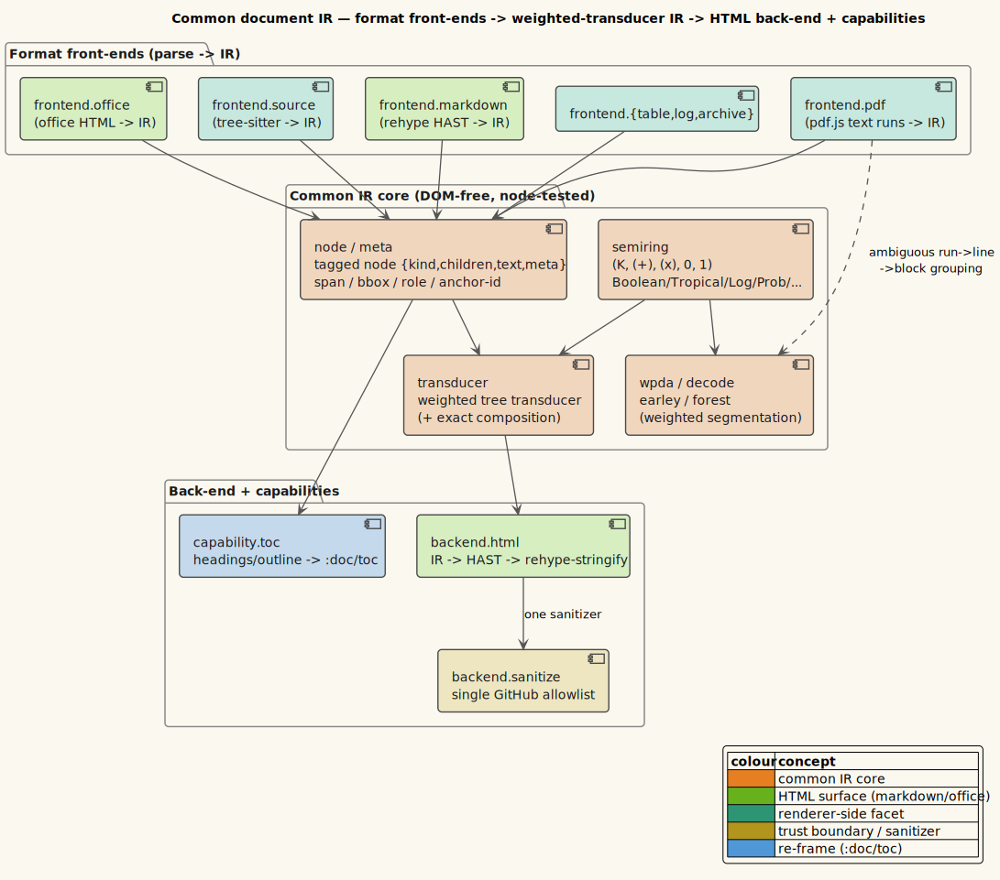

# 03 — Semiring algebraic laws

**Status: current for v0.3.0-dev.** The IR's weighted machinery — the tree transducer, the WPDA decoder, the
Earley-over-lattice parser — is *parameterized by a semiring*. That parameterization is only sound if the weight
types actually **are** semirings. This page defines a semiring, enumerates the six implemented weight types and
the exact laws each upholds, documents the property tests that verify them, and explains *why* those laws are
what make one weighted parser correctly compute recognition, best-parse, and total mass merely by swapping the
weight.

> **Prerequisite.** [theory/08 — Common document IR](../theory/08-common-document-ir.md) §3–§5 (semirings,
> weighted tree transducers, and the WPDA/Earley recognisers that consume them).


*Diagram source: [`../diagrams/component-common-ir.puml`](../diagrams/component-common-ir.puml).*

---

## 1 · Motivation — one algorithm, many objectives

Fixed-layout inputs (a PDF page's positioned glyph runs; a log's physical lines) must be *segmented* into logical
structure, and that segmentation is genuinely ambiguous. We want *one* parser to answer several different
questions about it: *Is there any valid segmentation?* *What is the lowest-cost one?* *What is the total
probability mass?* *What is the best under two objectives at once?* Writing a separate parser per question is
duplicative and error-prone.

The **semiring abstraction** (Goodman 1999; Mohri 2009) collapses them into one. A parser is written once over an
abstract weight algebra `$`(K, \oplus, \otimes, \bar{0}, \bar{1})`$`, where `$`\oplus`$` combines *alternative*
derivations and `$`\otimes`$` combines *sequential* steps. Swapping the concrete `$`K`$` swaps *what is computed*
without touching the parser: recognition, best-derivation, total mass, and multi-objective scores all fall out of
the same code. `vinary.ir.semiring` implements six weight types (ported from the author's `lling-llang`
blueprint), each verified against the semiring axioms in `semiring-test`.

The catch is that the abstraction is only correct if every concrete weight really satisfies the axioms. A weight
that *looked* like a semiring but violated, say, distributivity would make the parser silently compute the wrong
value — no crash, just wrong numbers. So the axioms are not documentation; they are a **verified contract**.

---

## 2 · Definition of a semiring

A **semiring** is a set `$`K`$` (the *carrier*) equipped with two binary operations and two distinguished
elements,

```math
(K,\ \oplus,\ \otimes,\ \bar{0},\ \bar{1}),
```

satisfying, for all `$`a, b, c \in K`$`:

1. **`$`(K, \oplus, \bar{0})`$` is a commutative monoid** — `$`\oplus`$` is associative and commutative, with
   identity `$`\bar{0}`$`:

   ```math
   (a \oplus b) \oplus c = a \oplus (b \oplus c), \qquad a \oplus b = b \oplus a, \qquad a \oplus \bar{0} = a .
   ```

2. **`$`(K, \otimes, \bar{1})`$` is a monoid** — `$`\otimes`$` is associative with identity `$`\bar{1}`$` (not
   necessarily commutative):

   ```math
   (a \otimes b) \otimes c = a \otimes (b \otimes c), \qquad a \otimes \bar{1} = \bar{1} \otimes a = a .
   ```

3. **`$`\otimes`$` distributes over `$`\oplus`$`** (on both sides):

   ```math
   a \otimes (b \oplus c) = (a \otimes b) \oplus (a \otimes c), \qquad (b \oplus c) \otimes a = (b \otimes a) \oplus (c \otimes a) .
   ```

4. **`$`\bar{0}`$` annihilates `$`\otimes`$`**:

   ```math
   a \otimes \bar{0} = \bar{0} \otimes a = \bar{0} .
   ```

Two *optional* properties, not required of a general semiring but decisive where they hold, recur below:

- **Idempotence of `$`\oplus`$`**: `$`a \oplus a = a`$`. An idempotent `$`\oplus`$` is *selective* — it picks one
  of its arguments — and induces the **natural order** `$`a \preceq b \iff a \oplus b = a`$`, the order
  `best-parse` uses to select an optimum.
- **Commutativity of `$`\otimes`$`**: holds for the scalar weights here (Boolean, Tropical, Log, Probability) and
  componentwise for Product/Lexicographic, though the parser never relies on it.

`vinary.ir.semiring` expresses the contract as a protocol whose four methods are exactly the algebra:

```clojure
(defprotocol Semiring
  (plus  [a b] "⊕ — combine alternative derivations")
  (times [a b] "⊗ — combine sequential steps")
  (zero  [a]   "additive identity 0̄ (⊕-identity, ⊗-annihilator)")
  (one   [a]   "multiplicative identity 1̄"))
```

`zero`/`one` dispatch on the weight's *type* (the argument's value is used only to select the record type), so
every algorithm can name `$`\bar{0}`$` and `$`\bar{1}`$` generically.

---

## 3 · The six implemented weight types

Each row is a `defrecord` implementing `Semiring`. The last two columns state the *extra* properties beyond the
required axioms — the ones the tests additionally assert.

| Weight type | `$`\oplus`$` | `$`\otimes`$` | `$`\bar{0},\ \bar{1}`$` | Computes | `$`\oplus`$` idempotent? |
|-------------|-------------|--------------|------------------------|----------|--------------------------|
| **Boolean** (`BoolW`) | `$`\lor`$` | `$`\land`$` | `$`\bot,\ \top`$` | recognition — *"is there any valid derivation?"* | **yes** |
| **Tropical** (`TropicalW`) | `$`\min`$` | `$`+`$` | `$`+\infty,\ 0`$` | best / lowest-cost derivation (Viterbi in `$`-\log`$`) | **yes** |
| **Log** (`LogW`) | `$`-\log(e^{-a}+e^{-b})`$` | `$`+`$` | `$`+\infty,\ 0`$` | total mass in `$`-\log`$` space (log-sum-exp) | no |
| **Probability** (`ProbW`) | `$`+`$` | `$`\times`$` | `$`0,\ 1`$` | total probability mass | no |
| **Product** (`ProductW`) | componentwise | componentwise | componentwise | two objectives at once | iff both components are |
| **Lexicographic** (`LexW`) | ordered-pair `$`\min`$` | componentwise | componentwise | primary objective, tie-broken by secondary | iff primary is |

A few design notes make the choices intelligible:

- **Tropical** is the Viterbi semiring in disguise: with costs as `$`-\log`$` probabilities, `$`\otimes = +`$`
  multiplies probabilities and `$`\oplus = \min`$` picks the most probable derivation. Directed HTML lowering
  uses **Boolean** (a single derivation exists); ambiguous PDF/log segmentation uses **Tropical** (rank by cost).
- **Log** computes the *same* quantity as Probability (total mass) but in `$`-\log`$` space, using a numerically
  stable log-sum-exp so many small probabilities do not underflow. Its `plus` special-cases `$`+\infty`$` (the
  `$`\bar{0}`$`) and otherwise factors out the smaller operand before exponentiating.
- **Product** carries two semirings at once (e.g. Boolean recognition *and* a Tropical cost), each operation
  applied componentwise — the standard multi-objective construction.
- **Lexicographic** is the tie-break construction: `$`\oplus`$` selects by the *primary* (selective) component and
  *merges* the secondaries on a primary tie; `$`\otimes`$` is componentwise. It is meaningful precisely when the
  primary component is idempotent/selective, which is why `semiring-test` instantiates it with a Tropical primary.

---

## 4 · Law coverage (`semiring-test`)

The verification is a single reusable law-checker applied to sample weights of every type. `check-laws` asserts
*all ten* required-axiom equations of §2 — both sides of distributivity, both sides of the `$`\bar{1}`$` identity,
both sides of annihilation — comparing with either `=` or the float-tolerant `approx=`:

```clojure
(defn- check-laws [a b c eq]
  (let [z (s/zero a) o (s/one a)]
    (is (eq (s/plus a b) (s/plus b a)))                              ; ⊕ commutative
    (is (eq (s/plus (s/plus a b) c) (s/plus a (s/plus b c))))        ; ⊕ associative
    (is (eq (s/plus a z) a))                                         ; 0̄ is the ⊕-identity
    (is (eq (s/times (s/times a b) c) (s/times a (s/times b c))))    ; ⊗ associative
    (is (eq (s/times a o) a)) (is (eq (s/times o a) a))              ; 1̄ identity (right, left)
    (is (eq (s/times a z) z)) (is (eq (s/times z a) z))              ; 0̄ annihilates (right, left)
    (is (eq (s/times a (s/plus b c)) (s/plus (s/times a b) (s/times a c))))  ; ⊗ left-distributes
    (is (eq (s/times (s/plus b c) a) (s/plus (s/times b a) (s/times c a)))))) ; ⊗ right-distributes
```

Each concrete type has a `deftest` that (a) runs `check-laws` on representative samples and (b) additionally
pins its *semantics* and *extra properties*:

| `deftest` | Runs `check-laws` on | Additional assertions |
|-----------|----------------------|-----------------------|
| `boolean-laws` | `$`\top, \bot, \top`$` (with `=`) | `$`\bar{1}=\top`$`, `$`\bar{0}=\bot`$`; `$`\oplus`$` **idempotent** (`$`\top\oplus\top=\top`$`, `$`\bot\oplus\bot=\bot`$`) |
| `tropical-laws` | `$`3, 5, 2`$` (with `=`) | `$`\oplus=\min`$` picks the cheaper; `$`\otimes=+`$` adds; `$`\oplus`$` **idempotent**; `$`+\infty`$` annihilates |
| `probability-laws` | `$`0.2, 0.5, 0.3`$` (with `approx=`) | `$`\oplus`$` sums mass; `$`\otimes`$` multiplies |
| `log-laws` | `$`0.4, 1.1, 0.7`$` (with `approx=`) | `$`\otimes`$` adds in `$`-\log`$`; `$`\oplus`$` is log-sum-exp (two `$`-\log 1`$` weights combine to `$`-\log 2`$`); `$`+\infty`$` is the `$`\oplus`$`-identity |
| `product-laws` | Boolean`$`\times`$`Tropical triples (with `approx=`) | each component combines independently |
| `lexicographic-laws` | Tropical-primary, Probability-secondary (with `approx=`) | smaller primary wins; a primary tie merges the secondaries |

A seventh test, `natural-order-and-best`, verifies the order machinery the parsers depend on (see §5). Because
`check-laws` is *type-generic* — it names `$`\bar{0}`$`, `$`\bar{1}`$`, `$`\oplus`$`, `$`\otimes`$` through the
protocol — adding a new weight type costs exactly one `deftest` calling `check-laws`, and the axiom battery comes
for free. This is why the changelog can state the IR ships *"a semiring algebra … with full law coverage"* as a
checked fact rather than an aspiration.

> **Provenance.** These are **tested** properties over hand-chosen representative samples (three same-type
> weights each), not machine-checked proofs over all of `$`K`$`. The samples are chosen to exercise the
> distinguishing behaviour (e.g. Tropical `$`3, 5, 2`$` makes `$`\min`$` non-trivial); a fully generative
> property-test over random weights is a possible future strengthening, noted here for honesty.

---

## 5 · Idempotence, the natural order, and best-parse

The axioms make the parser's *value* correct; **idempotence** is what lets it choose an *optimum*. For a selective
`$`\oplus`$` (Boolean, Tropical), the natural order

```math
a \preceq b \iff a \oplus b = a
```

is a genuine partial order, and `$`a \oplus b`$` returns the `$`\preceq`$`-smaller operand. `vinary.ir.semiring`
exposes this as `at-least-as-good?` (`$`a \oplus b = a`$`) and the strict `natural-less?` (`$`a \oplus b = a`$`
and `$`a \ne b`$`), and `best` as the `$`\oplus`$`-fold of a non-empty sequence:

```math
\mathrm{best}(w_1, \dots, w_k) \;=\; \bigoplus_{i=1}^{k} w_i .
```

For a selective `$`\oplus`$` this fold is the `$`\preceq`$`-minimum (Tropical `best = min`, Boolean `best = any`);
for a non-selective `$`\oplus`$` it is the `$`\oplus`$`-sum (Probability `best = total mass`).
`natural-order-and-best` pins all three readings: `$`\mathrm{tropical}(1)`$` is the best of
`$`\{4, 1, 7\}`$`; `$`\top`$` is the best of a Boolean set containing any true; and
`$`\mathrm{prob}(1.0)`$` is the best (sum) of `$`\{0.25, 0.25, 0.5\}`$`. It also checks the recognition-order
subtlety `$`\top \prec \bot`$` — "some derivation" is better than "none".

This order is not decorative — it is the same `at-least-as-good?` the **streaming decoder's ε-closure** uses to
keep the `$`\oplus`$`-optimal route to each config and relax on improvement
([theory/09 shortest-distance](../theory/09-document-streaming-and-the-wpda.md); see also
[02 §2](02-bounded-memory-streaming-validation.md#2--the-bounded-working-set-proposition)). Idempotence + monotone
`$`\oplus`$` is exactly what makes that relaxation terminate and be correct. So the same law verified in
`semiring-test` is the law the bounded-memory proof of page 02 leans on.

---

## 6 · Why the laws underwrite parser correctness

The laws are load-bearing in three concrete places.

**(a) Distributivity makes "sum over derivations" factor through the grammar.** A weighted parse computes a sum
over *all* derivations, each a product of the steps it takes. Distributivity is precisely what lets that global
sum be computed *compositionally* — combining sub-results at each grammar node — instead of enumerating derivations
one by one (which is exponential). This is the Viterbi/inside schema: for a node with alternative expansions,

```math
\underbrace{\bigoplus_{\text{derivations } D} \; \bigotimes_{\text{steps } s \in D} w(s)}_{\text{global: exponentially many } D}
\;\;=\;\;
\underbrace{\text{a fold of } \oplus,\ \otimes \text{ over the grammar structure}}_{\text{local: polynomial}} ,
```

and the equality is *valid only because* `$`\otimes`$` distributes over `$`\oplus`$`. Without distributivity the
compositional computation would not equal the thing it is supposed to compute. Goodman's *semiring parsing* is the
formal statement: a single parser parameterized by a semiring computes the intended value for every semiring
satisfying these axioms.

**(b) Annihilation prunes impossible derivations for free.** `$`\bar{0} \otimes a = \bar{0}`$` means an
impossible sub-step (weight `$`\bar{0}`$`) makes its entire product `$`\bar{0}`$`, and `$`\bar{0}`$` is the
`$`\oplus`$`-identity so it contributes nothing to the alternative-sum. A failed parse branch therefore
*disappears* algebraically — no special-case code, no sentinel checks. The WPDA's "stray close is absorbed, never
kills the tracker" totality ([theory/09 §3](../theory/09-document-streaming-and-the-wpda.md#3--the-wpda-log-grammar))
and `wpda-test/weighted-best-cost`'s *"unbalanced → no accepting weight"* (`nil`, i.e. no accepting derivation)
are this law in action.

**(c) The transducer threads weights by the same algebra.** The weighted tree transducer
([theory/08 §4](../theory/08-common-document-ir.md#4--weighted-tree-transducers)) assigns an output tree the weight

```math
w(\text{output}) \;=\; w_{\text{rule}} \;\otimes\; \bigotimes_{i} w(\text{child}_i),
```

and forms the `$`\oplus`$`-set over alternative derivations. `transducer-test` verifies exactly this: `composition`
shows `$`(\tau_1 ; \tau_2)`$` realised by transducing then transducing again, multiplying weights (the *exact
composition* [theory/08](../theory/08-common-document-ir.md) claims); `weighted-cost-threading` shows a Tropical
cost equal to the *sum* of the fired rules' costs (`$`\otimes = +`$`); and `ambiguity-and-best` shows two rules on
one kind yielding two derivations, with `best-output` picking the `$`\oplus`$`-optimal (`$`\min`$`) — Viterbi over
the transduction. The deterministic single-rule-per-kind lowering under the **Boolean** semiring then yields
exactly one output, which is how the IR lowers to HAST byte-deterministically (the premise of
[01 — byte-parity](01-byte-parity-verification.md)): byte-parity is only a well-posed question because the Boolean
lowering is a *function*, and it is a function because the algebra is a semiring with a single derivation.

The Earley-over-lattice parser closes the loop: it emits a **packed parse forest** and `best-parse` extracts the
`$`\oplus`$`-optimal derivation (Viterbi over the forest), verified by `earley-test/viterbi-best-parse` and
`ambiguity-packing`. Every one of these — transducer, WPDA, Earley — reads the *same* six weight types through the
*same* protocol, so the law coverage of §4 certifies all of them at once.

---

## 7 · See also

- [theory/08 — Common document IR](../theory/08-common-document-ir.md) §3 (the semiring table), §4 (the
  transducer weight identity), §5 (the WPDA/Earley recognisers).
- [02 — Bounded-memory streaming validation](02-bounded-memory-streaming-validation.md) §2, §5 — the ε-closure
  relaxation that relies on idempotence + the natural order verified here.
- [01 — Byte-parity verification](01-byte-parity-verification.md) — why the *deterministic Boolean* lowering must
  be a function (this page's §6c).

## 8 · References

1. **J. Goodman.** *Semiring Parsing.* Computational Linguistics **25**(4), 573–605, 1999.
   [ACL Anthology J99-4004](https://aclanthology.org/J99-4004/). — one parser, one semiring, every objective; the
   correctness statement of §6(a).
2. **M. Mohri.** *Weighted Automata Algorithms.* In *Handbook of Weighted Automata*, Springer, 2009. DOI
   [10.1007/978-3-642-01492-5_6](https://doi.org/10.1007/978-3-642-01492-5_6). — the weighted-automata algebra
   this module implements.
3. **Z. Fülöp and H. Vogler.** *Weighted Tree Automata and Tree Transducers.* In *Handbook of Weighted Automata*,
   Springer, 2009. DOI [10.1007/978-3-642-01492-5_9](https://doi.org/10.1007/978-3-642-01492-5_9). — the weighted
   tree transducer of §6(c).
4. **M. Mohri.** *Semiring Frameworks and Algorithms for Shortest-Distance Problems.* Journal of Automata,
   Languages and Combinatorics **7**(3), 321–350, 2002. — the shortest-distance computation (the ε-closure
   relaxation of §5), and the source `vinary.ir.semiring` cites in its own namespace docstring. (No DOI is
   registered for this article; cited by venue.)
