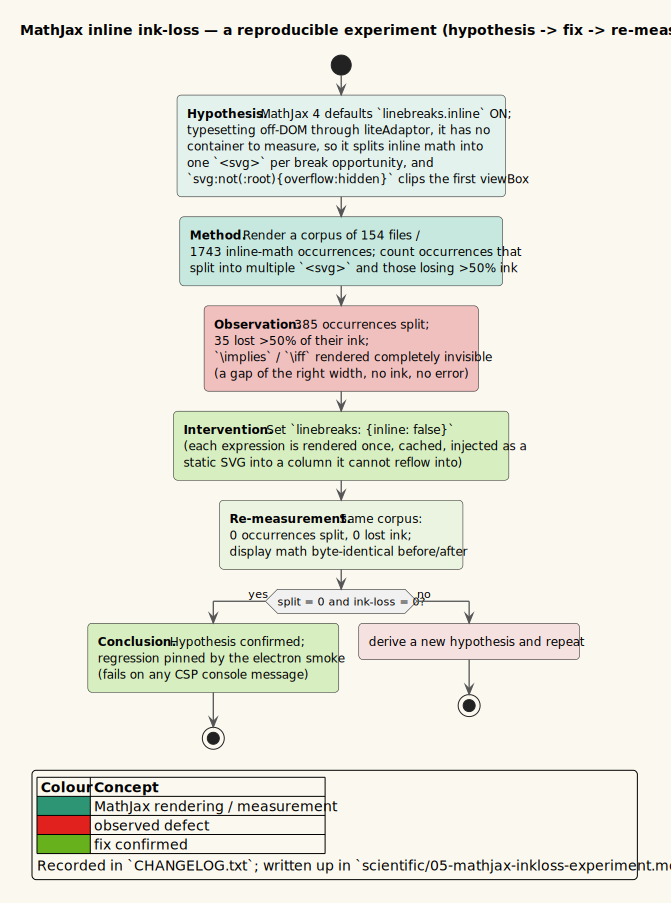

# 05 — The MathJax inline ink-loss experiment

**Status: Measured.** This page writes up a real rendering defect and its fix as a reproducible experiment,
following the scientific method the project's `CLAUDE.md` prescribes: a hypothesis about a mechanism, a
measurement over a named corpus, an intervention, and a re-measurement that confirms (or refutes) the
hypothesis. The raw result is recorded in [`CHANGELOG.txt`](../../CHANGELOG.txt); this page reconstructs the
reasoning so the experiment can be re-run.



*Diagram source: [`../diagrams/activity-inkloss-experiment.puml`](../diagrams/activity-inkloss-experiment.puml).*

---

## 1. Symptom

After the upgrade to MathJax 4, two of the most common logical connectives — `$`\implies`$` (`\implies`) and
`$`\iff`$` (`\iff`) — rendered as **completely invisible**: a gap of about the right width, no ink, no error,
no console message. A silent, ink-level rendering failure is the hardest kind to notice, because nothing
announces it; it is exactly the class of defect a corpus measurement exists to catch.

---

## 2. Hypothesis

The defect is produced by an interaction of three facts, each individually benign:

1. **MathJax 4 turns automatic *inline* line-breaking on by default** (`linebreaks.inline`).
2. **vinary-viewer typesets off-DOM through `liteAdaptor`** — math is rendered to an HTML string once, cached,
   and injected as a static SVG, so MathJax has **no container to measure**.
3. The browser's user-agent rule `svg:not(:root){overflow:hidden}` **clips** anything drawn outside an SVG's
   `viewBox`.

The hypothesized mechanism: with no container to measure, MathJax takes *every* break opportunity — and its
break opportunities are precisely `mo` (operators) and `mspace` (spacing). `\implies` expands to
`\;\Longrightarrow\;` — spacing, operator, spacing — so MathJax emits **one `<svg>` per "line"**. For
`\implies` that is three sibling `<svg>` elements, the *first* of which is a 16-unit-wide `viewBox`
containing the whole `⟹` glyph path — which the UA `overflow:hidden` rule then clips away entirely. Hence: a
gap of the right width, no ink.

Formally, the predicted failure set is every inline occurrence whose expansion contains a break opportunity;
the predicted severity is total ink loss for occurrences whose ink lies in a clipped leading `viewBox`.

---

## 3. Method

Render a corpus and **count**, rather than eyeball, two observables per inline-math occurrence:

- `$`\text{split}`$`: did the occurrence emit more than one `<svg>` element?
- `$`\text{inkloss} > 50\%`$`: did the rendered occurrence lose more than half of its glyph ink relative to a
  correctly-measured render?

```text
CORPUS   := 154 documents containing inline math
N        := 1743 inline-math occurrences across the corpus
for each occurrence o in CORPUS:
    render o off-DOM through liteAdaptor (the production path)
    record split(o)      := (#svg elements of o) > 1
    record inkloss(o)    := ink(o) < 0.5 · ink(reference(o))
report  |{o : split(o)}|,  |{o : inkloss(o) > 50%}|
```

The corpus is real documentation math, not synthetic — the point is to measure the defect at the frequency and
shape it actually occurs, so the fix can be shown to close it in practice, not just on a constructed example.

---

## 4. Result (pre-fix)

| Observable | Count | of `$`N = 1743`$` |
|------------|------:|:-----------------:|
| Occurrences that **split** into multiple `<svg>` | **385** | 22.1% |
| Occurrences that **lost > 50% of their ink** | **35** | 2.0% |
| `\implies` / `\iff` rendered fully invisible | (subset of the 35) | — |

The measurement confirms the mechanism's *shape*: a fifth of all inline math was being split (consistent with
"every break opportunity taken"), and a small but nonzero set lost most of its ink (consistent with "the
leading `viewBox` is clipped"). The most-common connectives fell in the worst bucket.

---

## 5. Intervention

A single configuration change, following directly from the hypothesis: if the cause is *breaking math that is
never reflowed*, then breaking should be disabled.

```clojure
;; MathJax SVG output options
{:linebreaks {:inline false}}
```

The justification is not merely "it works" — it is that inline line-breaking is *meaningless* on this path:
each expression is rendered exactly once, cached, and injected as a static SVG into a column it can neither
measure nor reflow into. There is no reader-visible reflow for a break to serve, so removing breaking cannot
lose a feature. Two supporting fixes accompanied it (recorded in the `CHANGELOG`): MathJax's own stylesheet is
now injected at startup so `mjx-container[jax="SVG"] > svg { overflow: visible }` and `path[data-c] {
stroke-width: 3 }` are present, and `font-src data:` is allowed for MathJax's zero-width line-break font.

---

## 6. Re-measurement (post-fix)

Re-running §3's method on the identical corpus:

| Observable | Count (post-fix) |
|------------|-----------------:|
| Occurrences that split | **0** |
| Occurrences that lost > 50% ink | **0** |
| Display math changed | **none** — output byte-identical before and after |

Both observables went to **zero**, and — a crucial control — *display* math (which was never affected) is
**byte-identical** before and after, showing the intervention touched only the failing case. The hypothesis is
confirmed: the mechanism was inline breaking on an unmeasured off-DOM surface, and disabling it is a complete,
side-effect-free fix.

---

## 7. Regression guard

An experiment's fix is only durable if a gate re-runs it. The Electron smoke now **fails on any
Content-Security-Policy console message**, which is how the accompanying `font-src` fix is kept honest; and the
byte-parity of display math is covered by the [byte-parity smoke](01-byte-parity-verification.md). The lesson
generalized in [06 — Corpora and classifier experiments](06-corpora-and-classifier-experiments.md): a silent,
ink-level defect is invisible to an example-based test and visible to a corpus measurement — so the corpus, not
the example, is the instrument of record.

## 8. See also

- [`CHANGELOG.txt`](../../CHANGELOG.txt) — the `[0.3.0-dev]` "Fixed" entry recording the 385/35 → 0/0 result.
- [06 — Corpora and classifier experiments](06-corpora-and-classifier-experiments.md) — more corpus-measured findings.
- [features/09 — Markdown rendering](../features/09-markdown-rendering.md) and
  [MathJax mathjax4 notes in the theory pillar](../theory/05-strategy-renderer-registry.md) — the math pipeline this experiment measures.
