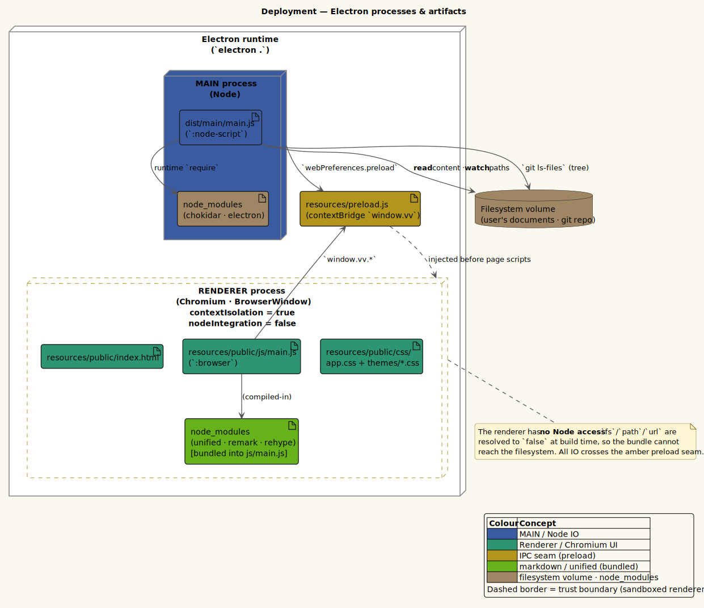

# Threat model

This document describes vinary-viewer's security posture: the Electron process model it relies on, the
**actual** hardening in place today, the attack surface of the IPC seam, the filesystem-exposure
implications, the markdown-rendering XSS analysis, and the **recommended hardenings** that are not yet
applied. Every claim is grounded in the source; recommended-but-unimplemented items are tagged
**Forthcoming (planned)**.

> **Scope and trust assumptions.** vinary-viewer is a **local, single-user document previewer**: you run
> it and you point it at files you can already read. It is *not* a sandbox for opening untrusted
> documents from the internet. It **does** load remote web content — but only in a **separate, isolated
> native web view** (a main-owned `WebContentsView` on the `persist:vinary-web` session, never the
> sandboxed app renderer), which hosts the in-app browser, the optional native ad-blocker (ADR-0014), and
> the optional scoped Chrome-extension runtime (ADR-0015). That distinct trust boundary is analyzed in
> **§6.5**. The analysis below is otherwise framed against the intended use, and explicitly flags where
> the current posture would be insufficient for a stricter "open untrusted input" use case.

---

## 1. The Electron process model

Electron applications run as two kinds of process, with very different privileges. Defining them
up front:

- **Main process** — a **Node.js** process. It is **trusted**: it has full filesystem, child-process,
  and OS access. In vinary-viewer it is `vinary.main.core` (window + lifecycle) and
  `vinary.main.service` (file reads, `chokidar` watchers, `git`). Output: `dist/main/main.js`.
- **Renderer process** — a **Chromium** (web content) process. It runs the UI as a web page. It should
  be treated as **untrusted relative to the OS**, because it executes the kind of code (HTML/JS, and any
  content rendered from a document) that is most exposed. In vinary-viewer it is
  `vinary.renderer.core` + the reagent/re-frame UI. Output: `resources/public/js/main.js`, loaded by
  `resources/public/index.html`.
- **Preload script** — a small script that runs in the renderer's process **before** the web page, in an
  **isolated** context that still has Node access. It is the **only** bridge between the two worlds. In
  vinary-viewer it is `resources/preload.js`, which exposes `window.vv`.

The deployment diagram makes the boundary explicit:



*Figure — source: [`docs/diagrams/deploy-electron-processes.puml`](../diagrams/deploy-electron-processes.puml)*

The **trust boundary** (drawn dashed in the figure) sits around the renderer: everything inside it is
web content with **no direct OS access**; everything crossing it must pass through the amber IPC seam.

---

## 2. Actual posture today

The window is created with these `webPreferences` (`vinary.main.core/create-window!`):

```clojure
(BrowserWindow.
  (clj->js {:width 1280 :height 860
            :backgroundColor "#292b2e"
            :autoHideMenuBar true
            :webPreferences {:contextIsolation true
                             :nodeIntegration false
                             :preload (preload-path)}}))
```

What this gives us, mapped to the Electron security checklist
([Electron — *Security*](https://www.electronjs.org/docs/latest/tutorial/security)):

| Setting                          | Value today    | Checklist item                                            | Effect                                                                                       |
|----------------------------------|----------------|-----------------------------------------------------------|----------------------------------------------------------------------------------------------|
| `contextIsolation`               | **`true`**     | "3. Enable Context Isolation"                             | The page's JavaScript runs in a **separate context** from the preload; the page cannot reach into the preload's Node-capable scope except through the explicitly exposed `window.vv`. |
| `nodeIntegration`                | **`false`**    | "2. Do not enable Node.js integration for remote content" | The page has **no** `require`, `process`, `Buffer`, etc. Renderer code cannot touch Node/OS APIs directly. |
| `preload`                        | a minimal seam | (enables item 3's safe-exposure pattern)                  | All cross-process access is funneled through one auditable script.                            |
| `autoHideMenuBar`                | `true`         | —                                                         | Cosmetic; the menu is hidden (press `Alt` to reveal). Not a security control.                 |

In addition, the **renderer build stubs Node modules** (`shadow-cljs.edn`:
`:js-options {:resolve {"fs" false "fs/promises" false "path" false "url" false}}`), so even the
*bundler* refuses to give renderer code a filesystem module. This is defense in depth alongside
`nodeIntegration:false`.

**Net posture:** the renderer is web content with no direct OS access; its *only* capability is the
narrow JSON message API described next.

---

## 3. The IPC seam — exposed attack surface

`resources/preload.js` uses `contextBridge.exposeInMainWorld('vv', …)` to expose a **minimal, JSON-only**
API. This is the entire surface the renderer can use to affect the outside world:

```js
contextBridge.exposeInMainWorld('vv', {
  open: (path) => ipcRenderer.send('vv:open', path),
  syncRetainedFiles: (paths) => ipcRenderer.send('vv:retained-files', paths),
  watchAssets: (docPath, paths) => ipcRenderer.send('vv:watch-assets', { docPath, paths }),
  copyText: (text) => ipcRenderer.send('vv:clipboard-write', text),
  onContent: (cb) => { … return unsubscribe; },
  onGrammars: (cb) => { … return unsubscribe; },
});
```

### What the seam **does** expose

| Capability class | Direction | Semantics |
|------------------|-----------|-----------|
| File content and watchers | renderer → main → renderer | Read retained local paths, watch retained files and embedded local media assets, and send `vv:content`, `vv:error`, and `vv:tree` payloads back. |
| Configuration | both | Request/persist settings and keybindings; request user grammar and filetype registry data. |
| Native views | renderer → main | Show, hide, and position main-owned PDF and HTTP views; relay HTTP heading metadata back to the renderer. |
| Clipboard and shell helpers | renderer → main | Copy explicit text to the OS clipboard, open local paths through the OS, open external URLs, zoom, devtools, and quit. |
| App metadata and dialogs | both | Open the native file dialog and deliver selected paths; deliver About metadata. |

Each `on*` returns an **unsubscribe** function and passes only the message **payload** to the callback
(`(_e, payload) => cb(payload)`) — the raw Electron `IpcRendererEvent` (which carries `sender`,
`ports`, etc.) is **not** handed to the renderer.

The channel catalog is maintained in
[reference/ipc-channels.md](../reference/ipc-channels.md).

### What the seam does **NOT** expose

This is the important half of the analysis. The renderer **cannot**:

- **touch the filesystem directly** — there is no `readFile`/`writeFile`/`readdir` on `window.vv`; the
  only file capability is "ask main to read a path you name."
- **run a shell or spawn a process** — no `exec`/`spawn` is exposed (the `git` calls live in main and
  are not parameterized by the renderer beyond the open file's directory).
- **reach raw `ipcRenderer`** — `ipcRenderer` is used **inside** the preload but is **not** placed on
  `window`. The renderer cannot `send`/`invoke` arbitrary channels; it is limited to the documented
  `window.vv` methods. (`contextIsolation:true` is what makes this confinement real — without it, the
  page could reach the preload's scope.)
- **access Node globals** — `require`, `process`, `Buffer`, `__dirname` are all absent in the page
  (`nodeIntegration:false`).

**Consequence:** the seam is a **mediator** with a fixed, small vocabulary. An attacker who fully
controls the renderer's JavaScript can, at worst, ask the main process to **read and watch arbitrary
paths the user can read**, write explicit text to the clipboard, control native preview surfaces, and
request the documented shell helpers — they cannot escalate to arbitrary file writes, running commands,
or arbitrary IPC. (Whether "read any path" is itself a concern is the subject of §4.)

> **Design note.** This single-seam shape is a deliberate decision: see
> [design-decisions/0009-mediator-ipc-over-point-to-point.md](../design-decisions/0009-mediator-ipc-over-point-to-point.md).
> One auditable, JSON-only boundary is far easier to reason about than ad-hoc `ipcRenderer` calls
> scattered through the UI.

---

## 4. Filesystem exposure

The main process reads **any path it is given** (`service/send-content!` →
`content_service.openUri` or the legacy text/source path), and runs `git` in the
**directory of the open file** (`service/repo-tree`). It performs no allow-listing
or path confinement.

**Why this is acceptable in the intended model:** vinary-viewer is a **CLI-invoked, single-user
viewer**. The paths it reads originate from (a) the command line you typed and (b) files you clicked in
the git tree of your own repository. The process runs with **your** privileges and reads files **you can
already read**; it never elevates. There is no remote input source that could name a path.

**Where this would be a problem:** if the renderer were ever to load **remote or untrusted web content**
that could script `window.vv.open("/etc/passwd")` (or any readable path) and exfiltrate the returned
`vv:content` text. Today the renderer loads only the local, first-party bundle from `index.html`, so
there is no such script. The mitigations in §6 (CSP, disabling navigation, sandbox) exist precisely to
preserve this property if the app grows features that touch the network.

**`git` invocation safety:** the `git` arguments are fixed verbs (`rev-parse --show-toplevel`,
`ls-files`) executed via `child_process.execFileSync` (which does **not** spawn a shell, so there is no
shell-injection vector), with `cwd` set to the open file's directory. The renderer cannot inject
additional `git` arguments; it only influences *which directory* `git` runs in by choosing which file to
open.

### Local parser and archive exposure

The expanded preview surface adds parsers for local Office, OpenDocument, workbook, delimited, log, and
archive files. These parsers run in the **main process**, so their inputs are a trust boundary even
though the app remains a local, single-user viewer.

| Input class | Main-process behavior | Bound today |
|-------------|-----------------------|-------------|
| `.docx` | Mammoth extracts HTML and plain text from a local buffer. | Preview bytes are capped before parsing; HTML is stripped of script/style/embed elements, event attributes, and `javascript:` URLs before it crosses IPC. |
| `.odt`, `.odp`, `.odf` | The OpenDocument `content.xml` member is read and converted into escaped paragraph/heading HTML. | Preview bytes are capped; generated HTML is escaped from XML text nodes. |
| `.xlsx`, `.xlsm`, `.ods`, `.fods` | Workbook XML is parsed into bounded sheet matrices. | Preview bytes are capped; rendered sheets are row/column/cell-length bounded. |
| `.csv`, `.tsv`, `.tab`, `.psv`, `.dsv` | Delimited text is parsed with Papa Parse. | Large files are stream-paged; each page is a bounded row window with one lookahead row to compute `hasNext`. |
| Log files and sniffed log-like text | Standard timestamp, severity, JSON-log, and common access-log formats are detected from a prefix sample and rendered as text lines. | Large files are stream-paged; compressed logs such as `.log.gz` and rotated `.log.N.gz` are decompressed through a stream. |
| `.zip`, `.jar`, `.war`, `.ear`, `.epub`, `.tar`, `.tgz`, `.tar.gz` | Archives are listed in-pane and entries are addressed as virtual archive URIs. | No entry is extracted to disk; nested archive depth, total listed entries, and entry bytes are bounded. |

The main invariant is: **parsers may read local user-selected bytes, but renderer payloads stay bounded
or structured.** Large logs and large delimited files cross IPC as pages, not as complete strings. Nested
archive entries cross as `vv-archive://open?chain=...` URIs until the user opens a final previewable
member.

Archive traversal is intentionally virtual. A URI such as
`vv-archive://open?chain=[root.zip,inner.tar.gz,logs/app.log]` means "stream `logs/app.log` out of
`inner.tar.gz`, which is itself an entry inside `root.zip`"; it does **not** mean "extract to a temporary
directory and open a path." This avoids path traversal writes such as `../../target`, because archive
member names are never materialized as filesystem destinations.

Residual risk is parser risk: malformed Office/workbook/archive inputs could exercise bugs in
third-party parser libraries or in the local XML/ZIP/TAR traversal code. That risk is acceptable for the
current **trusted local document** model. It would not be sufficient for hostile internet attachments
without stronger sandboxing, stricter IPC path authorization, and parser isolation.

---

## 5. Rendered-markdown XSS

Markdown is rendered in the **renderer** by the unified pipeline (`vinary.renderer.markdown/render`) and
written into the document body via `innerHTML` (`vinary.ui.views/set-inner!`). Setting `innerHTML` is the
classic XSS sink, so the question is: **can a malicious Markdown document inject executing script?**

### The pipeline (exact)

```text
unified → remark-parse → remark-gfm → remark-math → remark-rehype (allowDangerousHtml)
→ rehype-raw → rehype-sanitize (GitHub allowlist) → rehype-slug → rehype-highlight
→ rehype-stringify → MathJax SVG postprocess → Mermaid SVG postprocess
→ tree-sitter fenced-code postprocess
```

The decisive fact: **raw HTML is parsed by `rehype-raw` and then sanitized by `rehype-sanitize` against
GitHub's own allowlist** (`hast-util-sanitize`'s `defaultSchema` — the policy GitHub itself uses). Sanitize
runs immediately after `rehype-raw` and *before* the app's own trusted hast plugins. Concretely:

- A Markdown source containing `<script>…</script>`, ``, an inline `on*`
  handler, a `javascript:`/`vbscript:` URL, `<iframe>`/`<object>`/`<form>`, `<style>`/`style=`,
  `<meta http-equiv=refresh>`, or `<base href>` has that markup **removed** by the sanitizer — it never
  reaches the output. The safe tags GitHub renders (``, GFM/HTML tables, `<details>`/`<summary>`,
  `<sub>`/`<sup>`, `<kbd>`, …) **are** kept, so author diagrams embedded as `` render.
- The schema is `defaultSchema` plus two minimal extensions: keep `code.math-inline`/`math-display` (so
  math still distinguishes inline vs display) and allow `data:` image URIs. Everything else is GitHub's policy.
- Relative image `src` is left untouched by the sanitizer and rewritten to `file://` by the app's own
  `rewrite-urls` step *after* sanitize; author-supplied absolute `file:`/`javascript:` URLs are stripped
  (not in the allowlist). `rehype-slug` ids, `rehype-highlight` `hljs` spans, and the app's `file://`
  srcs / `data-vv-source-*` / `vv-figure-link` are all added *after* sanitize and are trusted.
- Math (MathJax) and Mermaid (`securityLevel:"strict"`) run as post-stringify SVG generators over local
  document text. MathJax is built **from source** (`mathjax-full/js/…`, bundled by shadow-cljs — one engine for
  the renderer and the Node tests; see `vinary.renderer.math`) importing **only** the safe TeX packages
  `[base ams amscd boldsymbol newcommand configmacros noerrors noundefined]`. The dangerous `html` (`\href`),
  `require`, and `autoload` packages are **never imported**, so they are absent from the module graph entirely
  — author TeX cannot reach `\href{javascript:…}`, and cannot re-enable it (`\require{html}` is undefined).
  This is stronger than an allowlist over a full bundle (which would still *ship* the `html` code): here it
  simply isn't present. (`amscd`/`boldsymbol` — the AMS commutative-diagram + bold-symbol packages — are pure
  math and carry no active-markup capability.)

So the `innerHTML` write receives HTML that has passed **GitHub's sanitizer**, further backed by a renderer
CSP (§6) whose `script-src` forbids inline script. This is why the `innerHTML` sink is safe.

### Residual considerations (and why they are low-risk today)

- **Links.** Rendered link clicks are intercepted and **fail closed**: the in-content `<a>` handler
  `preventDefault`s every click and only dispatches an open event for recognized safe targets, so a
  `javascript:` link (already stripped by the sanitizer) can never navigate the app frame. A stray
  navigation is additionally blocked by the `will-navigate`/`setWindowOpenHandler` guard (§6).
- **Images.** `` (Markdown or raw HTML) loads local (`file://`) and `data:` images, and — by
  project decision — remote **https** images (`http:` is blocked to force TLS). The renderer CSP
  `img-src 'self' file: data: https:` enforces this, and `connect-src` blocks remote fetch/XHR exfil.
- **Plain-text kind.** Non-markdown files are wrapped as `<pre class="vv-plain">` with the text
  **HTML-escaped** via `goog.string/htmlEscape` (`vinary.app.events/plain-html`), so a `.txt`/source
  file containing `<script>` is shown as inert, escaped text — never parsed as HTML.
- **Math and Mermaid.** These renderers convert local document text into generated SVG. MathJax and
  Mermaid failures are displayed as escaped inline error blocks. Mermaid rendering uses the library's
  strict security mode and does not add a main-process rendering channel.

> **Precise statement.** *Raw HTML embedded in a Markdown document is parsed and then sanitized against
> GitHub's allowlist (`rehype-raw` + `rehype-sanitize`) before the `innerHTML` write.* That sanitizer — plus
> the fail-closed link handler, the renderer CSP, and the navigation guard (§6), and HTML-escaping of the
> plain-text kind — is what makes the `innerHTML` body safe: dangerous markup (script, handlers,
> `javascript:`, iframe, style) is removed while GitHub-safe tags render.

> **Office documents (v0.3.0, common document IR — [ADR-0017](../design-decisions/0017-common-document-ir.md)).**
> With the IR render path default-on, office HTML (docx via `mammoth`, ODF block HTML) is parsed through the
> **same** `rehype-raw` + GitHub-allowlist `rehype-sanitize` path as Markdown (the single
> `vinary.ir.backend.sanitize` schema), so office now enjoys GitHub's allowlist as its effective policy — a
> strict upgrade over the previous weaker main-process regex sanitizer (`content_service.js/sanitizeHtml`).
> That weaker main-process regex sanitizer is now **RETIRED** (ADR-0017): office always renders through the
> common IR, so the GitHub allowlist is the **sole** office sanitizer — strictly stronger than the retired
> regex, and there is **no un-IR office path** that could bypass it. The office render is covered end-to-end by
> the electron smoke (a synthetic office document containing `<script>` / `on*` / `javascript:` is asserted
> stripped, in both the dev and release builds).

> **Streamed documents (v0.3.0, streaming pipeline — [ADR-0018](../design-decisions/0018-document-streaming-pipeline.md)).**
> A large document may render as a bounded-memory **stream** — per-record IR blocks appended to `.markdown-body`
> via `insertAdjacentHTML` — rather than one innerHTML write. This does **not** weaken the XSS posture: each
> block is lowered through the **same** `ir/backend/html` producer and the **same** GitHub-allowlist sanitizer
> as the batch path. The allowlist is **context-free** — a node is safe or unsafe independent of its siblings —
> so sanitizing block-by-block is provably identical to sanitizing the whole document at once; no cross-block
> construct can smuggle unsafe markup past a per-block pass. The Phase-1 log front-end emits only
> `div.vv-log-record`/`div.vv-log-line` elements whose text is a **`:text` leaf** (HTML-escaped on
> serialization, exactly like the plain-text kind), so log content such as `<script>` renders as inert escaped
> text — asserted by `log-stream-test/lowers-to-nonempty-html` and the electron smoke's streamed-log find test.
> On the main side the stream is a **bounded session registry** (`content_service.js`): one `createReadStream`
> fd per active stream, capped by credit-1 backpressure, swept by an idle-GC and closed on renderer unmount —
> the electron smoke asserts the registry drains to `0` after teardown (no fd/session leak).

---

## 6. Hardenings

The first four back the sanitizer (§5) as defense-in-depth and **shipped with raw-HTML support**; the
renderer sandbox remains planned.

| Hardening                                              | Checklist item                          | Why / what it buys                                                                                  | Status                |
|--------------------------------------------------------|-----------------------------------------|----------------------------------------------------------------------------------------------------|-----------------------|
| **HTML sanitizer stage** (`rehype-raw` + `rehype-sanitize`) | (Markdown HTML)                    | Parses raw HTML, then strips everything outside GitHub's allowlist (script, `on*`, `javascript:`, iframe, style, meta, base) before the `innerHTML` write — the primary control (§5). | **Applied** |
| **Strict `Content-Security-Policy`** (`<meta>` in `index.html`) | "7. Define a Content-Security-Policy" | `default-src 'none'`; `script-src` with **no `'unsafe-inline'`** (inline `<script>`/`on*` can't run even on a sanitizer miss) but `'unsafe-eval'`+`'wasm-unsafe-eval'`+`file:`/`blob:` for pdf.js/MathJax/mermaid/tree-sitter; https-only remote images; `connect-src` blocks remote exfil; `object-src`/`base-uri`/`form-action`/`frame-src` locked. | **Applied** |
| **Navigation lock-down**                                | "13. Disable or limit navigation"       | `will-navigate` is denied for any URL other than the bundled `index.html`, and `setWindowOpenHandler` denies new windows, so a stray navigation can't hand `window.vv` to another origin. | **Applied** |
| **Link-scheme fail-closed**                             | (Markdown links)                        | The in-content `<a>` handler `preventDefault`s all clicks and only opens recognized safe targets, so a `javascript:` link cannot navigate the app frame. | **Applied** |
| **Enable `sandbox: true`** on the renderer             | "4. Enable process sandboxing"          | OS-level renderer sandbox, reducing blast radius. **Requires migrating the preload off CommonJS `require`** (today `preload.js` does `require('electron')`). | Forthcoming (planned) |

> **Preload migration caveat.** Turning on `sandbox:true` is the single highest-value hardening, but it
> is gated on rewriting `resources/preload.js` so it does not call CommonJS `require('electron')` at
> module top level in a way the sandbox forbids. This is why it is sequenced as a deliberate, planned
> change rather than a one-line flag flip.

---

## 6.5 The web view, ad-blocking, and extensions trust boundary

The in-app web view (`vinary.main.web`), the native ad-blocker (`vinary.main.adblock`, ADR-0014), and the
scoped Chrome-extension runtime (`vinary.main.extensions`, ADR-0015) introduce a **second, distinct trust
boundary** — separate from the sandboxed app renderer analyzed above. This section makes its surface
explicit.

### Isolation

- **A separate session.** The web view, its popup host, the ad-blocker, and any extensions all live on the
  **`persist:vinary-web`** partition — a persistent, dedicated `Session` (cookies/logins for documentation
  sites survive restarts) that is **isolated from the app renderer's session** and from Node. The web view
  and popup views use `contextIsolation: true`, `nodeIntegration: false`. **Extensions cannot reach
  `window.vv`** (the app-renderer seam of ADR-0009 is unchanged and is not exposed to this session) or any
  Node/OS API.
- **Remote content stays in the native view.** Remote pages are *never* loaded into the first-party app
  renderer; the analysis of §1–§5 (which assumes the renderer loads only the local bundle) is unaffected.
- **Local HTML runs as a live page in the web session.** Opening a local `.html`/`.htm`/`.xhtml` file
  renders it in the same isolated web view via its `file://` URL (it **executes scripts**) rather than as
  escaped source. This is the **same isolation/session** as remote pages (`persist:vinary-web`,
  `contextIsolation: true`, `nodeIntegration: false`, no `window.vv`), and the ad-blocker + extensions
  apply. So an untrusted local `.html` carries the trust posture of *remote* content (its scripts run, in
  the sandboxed web view), not that of a trusted first-party document.
- **Overlay snapshots are inert rasters.** Because the native view always paints *above* the DOM, ANY DOM
  overlay (menu, context menu, or a modal dialog) is shown over the page by displaying a `capturePage`
  **still image** in the first-party renderer while the native view hides, then restoring the live view on
  close. The image is captured proactively (after load + on scroll-settle) and pushed to the renderer
  (`vv:http-snapshot-ready`) so the swap is instant. It is a flat JPEG — **no script, DOM, or
  interactivity** — carrying only pixels the user was already viewing, so it does **not** execute or re-host
  remote content in the renderer and does not extend this trust boundary.

### New attack surface (extensions) — and its mitigations

Extensions, once installed, **execute code within the web view** (content scripts read page content; the
background service worker + popups can make network requests on `persist:vinary-web`). This is a genuine
expansion of attack surface, mitigated by:

- **Web-Store-only provenance.** `installChromeWebStore` is configured with `allowUnpackedExtensions:
  false`; `beforeInstall` **denies** in-page "Add to Chrome", so the *only* install path is the user's
  explicit **Settings ▸ Extensions** action, where the pasted input is parsed to a strict 32-char
  (`[a-p]{32}`) Web Store id (`ext-util/parse-store-id`).
- **Unofficial update endpoint, called out.** Auto-update (`electron-chrome-web-store`, startup + ~5h)
  polls Google's update server — an **unofficial** channel for a non-Chrome client — and verifies CRX3
  signatures. Users who do not want background updates can disable the extension runtime.
- **Popup lock-down.** The popup `WebContentsView` runs with `nodeIntegration: false`; `will-navigate` is
  constrained to the extension's own `chrome-extension://<id>/` origin, and `setWindowOpenHandler` denies
  new windows (external `http(s)` links open in the OS browser).
- **Untrusted manifest data is validated.** A hostile/malformed manifest cannot inject via the toolbar:
  action icons are **magic-byte-sniffed** (PNG/JPEG/WebP) and **size-capped (< 2 MB)** before being
  rendered strictly as `;base64,…">` in the renderer (`extensions/icon-data-url`).

### How the native ad-blocker *reduces* risk

The MPL ad-blocker (ADR-0014) drops malvertising/tracker requests at `webRequest` **before the page sees
them**, shrinking the remote-content attack surface for the web view.

### Native password-manager bridge

The native password-manager bridge is intentionally separate from the Chrome-extension runtime. It runs
provider CLIs in the **trusted main process** (`vinary.main.passwords` and
`vinary.main.password-adapters`) and keeps the renderer on metadata-only IPC.

Security properties:

- **No shell.** Provider commands use `child_process.spawn` with argv arrays. Restricted custom JSON
  adapters are also executable-plus-argv; Vinary does not accept arbitrary shell snippets.
- **External unlock.** Vinary does not collect provider master passwords. Provider re-authentication,
  MFA, hardware keys, SSO, and LastPass-style periodic extra authorization remain provider-owned flows.
- **Renderer metadata only.** Search results sent to the app renderer contain provider id, item id, title,
  username, URL, and origin. Password fields are stripped before `vv:password-items`.
- **Direct fill path.** Revealed credentials follow this path only:
  `provider CLI -> main process -> web-view preload -> DOM fields`.
- **Short-lived save tokens.** Submitted login candidates are held in main memory for a short time. The
  renderer receives a token plus origin/username/provider metadata; it never receives the password.
- **No secret persistence by Vinary.** Secrets are not written to `settings.edn`, `recent.edn`,
  `passwords.edn`, logs, screenshots, or DataScript/app-db.

Residual risk: provider CLIs themselves are part of the trusted computing base for this feature. The
LastPass CLI does not provide a reliable URL-only metadata search, so origin matching uses its JSON output
inside the main process, immediately sanitizes it, and never logs it. This is still materially safer than
patching third-party password-manager extension files or exposing secrets to renderer state.

### Documented non-support (honest limits)

Native-messaging password managers (1Password, KeePassXC, Bitwarden desktop integration) are **not**
provided by Electron extensions. Use the native password-manager bridge for that class of integration. For
the APIs Electron lacks (`chrome.windows`/`webNavigation`/`cookies`/`notifications`/`contextMenus`/
`privacy`), a **self-contained chrome.\* polyfill preload** injects **inert, correctly-shaped stubs** into
extension pages. Those stubs **add no capability** (they fail closed: events never fire, getters resolve
empty). Real/heavy MV3 password-manager workers such as LastPass can still fail before the missing
`chrome.*` surfaces are present in their worker realm. `offscreen`/`nativeMessaging`/`sidePanel` remain
absent entirely.

---

## 7. Summary of the posture

| Property                                   | Today                                    |
|--------------------------------------------|------------------------------------------|
| Renderer ↔ OS isolation                    | **Strong** — `contextIsolation:true`, `nodeIntegration:false`, Node modules stubbed in the build. |
| Cross-process surface                      | **Mediated** — documented `window.vv` operations; no raw `ipcRenderer`, fs, arbitrary file writes, or shell. |
| Filesystem reads                           | Any path the user can read (CLI-viewer trust); `git` via `execFileSync` (no shell).               |
| Office/workbook/archive parsing           | Main-process parsers with capped preview bytes, bounded archive depth/entry count, and no extraction writes. |
| Large log / delimited previews             | Stream-paged over IPC as finite row/line windows; renderer keeps only nearby pages.               |
| Markdown XSS via raw HTML                   | **Sanitized** — `rehype-raw` + `rehype-sanitize` (GitHub `defaultSchema`) strip script/`on*`/`javascript:`/iframe/style; safe tags (img, tables, details, …) render. Plain-text/source kinds remain HTML-escaped. |
| Renderer sandbox (`sandbox:true`)          | **Off** — Forthcoming (gated on preload migration).                                               |
| CSP                                        | **Applied** — `<meta>` in `index.html`: `default-src 'none'`, `script-src` without `'unsafe-inline'` (allows `'unsafe-eval'`+`file:` — pdf.js JIT-compiles Type-4 shading via `eval` and loads its ESM via `new Function`, ADR-0013), https-only remote images, `connect-src` blocks remote exfil, `object-src`/`base-uri`/`form-action`/`frame-src` locked. |
| Navigation lock-down                       | **Applied** — `will-navigate` denies non-index navigation; `setWindowOpenHandler` denies new windows. |
| Native password-manager bridge             | **Main-owned** — provider CLIs run without a shell; renderer receives metadata/tokens only; revealed secrets go directly to the web-view preload. |

The current design is appropriate for its intended **local, single-user, trusted-document** use, and it
already follows the most important Electron isolation recommendations. The Forthcoming items in §6 are
the roadmap to a posture that would also be safe for **untrusted** input.

---

*See also: [design-decisions/0002-render-markdown-in-renderer.md](../design-decisions/0002-render-markdown-in-renderer.md),
[design-decisions/0003-ref-innerHTML-no-vdom-body.md](../design-decisions/0003-ref-innerHTML-no-vdom-body.md), and
[design-decisions/0009-mediator-ipc-over-point-to-point.md](../design-decisions/0009-mediator-ipc-over-point-to-point.md).*

---

### References

- Electron, *Security* (security checklist & recommendations) —
  <https://www.electronjs.org/docs/latest/tutorial/security> (no DOI).
- W3C, *CSS Custom Highlight API Module Level 1* (relevant to the find feature's no-DOM-mutation
  highlighting) — <https://www.w3.org/TR/css-highlight-api-1/> (no DOI).
