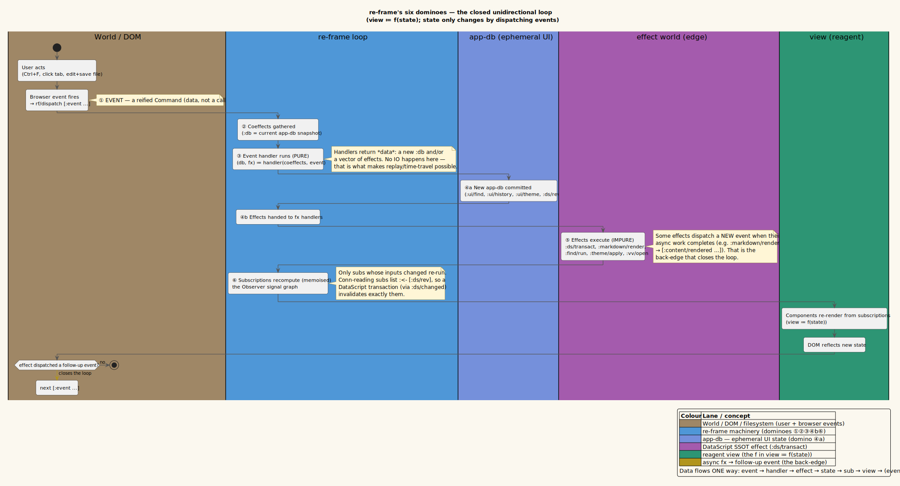

# Theory 01 — The Reactive Architecture

> **Where this fits.** This is the foundation of the theory pillar. It explains
> the *one idea* the whole application rests on — **unidirectional data flow** —
> and connects it to two classic *Gang-of-Four* patterns (**Command** and
> **Observer**). Everything in the later theory documents (the state model, the
> live-refresh spine, the Strategy renderer, find, history) is a specialisation of
> what is established here.

## 1. The central equation: `view ≔ f(state)`

A reactive UI obeys one invariant:

```
view ≔ f(state)
```

read *"the view is a pure function `f` of the application state."* The screen is
never edited directly; it is *derived* from state. To change what the user sees,
you change **state**, and the framework recomputes the view. The symbol `≔` reads
"is defined as".

Two consequences follow, and they shape every design decision in vinary-viewer:

1. **State needs a single home (SSOT).** If `view = f(state)`, then *which*
   `state` had better be unambiguous. **SSOT** (Single Source of Truth) means each
   fact lives in exactly one place. vinary-viewer takes this seriously enough to
   use *two* stores with a crisp division of responsibility (Theory 02): a
   relational store for documents, a plain map for ephemeral UI — with **no fact
   duplicated** between them.

2. **State must change in one direction only.** If anything could mutate the view
   *and* the state independently, `f` would no longer be a function of state alone.
   So state changes flow one way — this is **unidirectional data flow**.

## 2. Unidirectional data flow

Unidirectional data flow is the rule that state changes propagate in a single
direction and never loop back except by starting a new cycle:

```
        ┌─────────────────────────────────────────────────────────┐
        │                                                         │
   event ──▶ handler ──▶ new state + effects ──▶ subscriptions ──▶ view
   (intent)   (pure)        (data)                (derive)     (render)
        ▲                                                         │
        └───────────────── dispatch a new event ──────────────────┘
                         (e.g. async effect completes)
```

The view cannot reach back and poke the state. The *only* way to change anything
is to **dispatch an event** — a piece of data describing "something happened."
That single constraint is what makes the system predictable, testable, and
replayable.

> **Why this matters for a previewer specifically.** A live previewer is a
> firehose of asynchronous events: files change under you, Markdown rendering
> resolves later, the user scrolls and searches concurrently. Unidirectional flow
> turns that chaos into a queue of independent events, each transforming state by
> a pure function. The flagship payoff — *a file refresh that never disturbs your
> scroll/find/theme* (Theory 03) — is only *expressible* because content updates
> and UI updates are separate events over separate state.

## 3. re-frame's six dominoes

vinary-viewer is built on **re-frame**, a ClojureScript framework that implements
unidirectional flow as a chain of **six dominoes**. One nudge (a dispatch) topples
them in order; then the loop rests until the next dispatch. Define each domino
once:

| # | Domino | What happens | vinary-viewer code |
|---|--------|--------------|--------------------|
| 1 | **Event** | A data vector is dispatched naming an intent. | `rf/dispatch [:content/received payload]` |
| 2 | **Coeffects** | The framework gathers the handler's inputs (default: `:db` = current `app-db`). | `(fn [{:keys [db]} event] …)` |
| 3 | **Event handler (pure)** | A *pure* function maps `(coeffects, event)` to a new `app-db` and/or a vector of effects. **No IO here.** | `vinary.app.events` |
| 4 | **Effects** | The returned effects are handed to registered effect handlers. | `{:db … :fx [[:ds/transact …]]}` |
| 5 | **Effect handlers (impure)** | Each effect actually *does* its side effect — and may dispatch a new event when async work finishes. | `vinary.app.fx` |
| 6 | **Subscriptions (Observer)** | Memoised queries over `app-db` recompute, but only those whose inputs changed; views at the leaves re-render. | `vinary.app.subs` |

A **coeffect** is an *input* the handler needs from the world; an **effect** is a
*description of a side effect* to perform afterward. Keeping handlers pure (domino
3) by moving all inputs to coeffects and all outputs to effects is exactly
**Dependency Injection**, and it is what enables **time-travel/replay**: re-run the
recorded events and you reproduce the state.

The closed loop, with swimlane ownership of each step, is below. Source:
[`../diagrams/flow-unidirectional-dataflow.puml`](../diagrams/flow-unidirectional-dataflow.puml).



## 4. The two patterns underneath

re-frame is not arbitrary: its event side is the **Command** pattern and its
subscription side is the **Observer** pattern. Naming them makes the design legible
to anyone who knows the *Gang of Four* vocabulary (Gamma, Helm, Johnson &
Vlissides, 1994).

### 4.1 Events are Commands

The **Command** pattern *reifies a request as an object* so it can be stored,
queued, logged, and replayed instead of being an opaque function call. A re-frame
**event is literally a Command**: it is plain data (`[:history/back]`,
`[:find/toggle]`, `[:content/received {…}]`), *dispatched* rather than *called*.

Because the request is data, the framework can:

- **log** it (re-frame-10x shows the event stream),
- **queue** it (dispatches are processed on a single conveyor),
- **replay** it (time-travel),
- and — in vinary-viewer's domain — **stack** it: the **navigation history**
  (Theory 07) is a stack of reified path-visits that back/forward replay. That is
  the Command pattern paying rent at the application level, not just inside the
  framework.

### 4.2 Subscriptions are an Observer signal graph

The **Observer** pattern lets **observers** subscribe to a **subject** and be
notified when it changes — the lineage runs straight back to the *dependents*
mechanism of Smalltalk-80 MVC (Krasner & Pope, 1988,
[ACM DL](https://dl.acm.org/doi/10.5555/50757.50759); Reenskaug, 1979).

re-frame **subscriptions** are observers over `app-db`, wired into a **memoised
signal graph**:

- A subscription is registered with `reg-sub` and read with `rf/subscribe`.
- Subs are **memoised**: a sub recomputes *only* when one of its declared inputs
  changes; otherwise it returns its cached value.
- Subs compose: a sub can take *other subs* as inputs via `:<- [:other-sub]`,
  forming a directed graph whose leaves are the views.

So when state changes, re-frame does not re-render everything — it walks the
signal graph from the changed inputs and recomputes only the affected subtree.
*Views are observers of subscriptions; subscriptions are observers of state.*

> **The crucial vinary-viewer twist.** Most of `app-db` is observed directly. But
> the documents live in **DataScript**, not `app-db` — and DataScript is *not*
> part of re-frame's signal graph. The bridge that makes DataScript observable is
> the `:ds/rev` counter (Theory 02): a DataScript transaction bumps `:ds/rev`, and
> the document-reading subs declare `:<- [:ds/rev]`, so they recompute exactly when
> DataScript changes. This is the Observer pattern extended across a store the
> framework doesn't natively watch — and it is the single most important mechanism
> in the codebase.

## 5. How vinary-viewer instantiates the architecture

Concretely, the pieces map to source as follows (full catalogues live in
[`../reference/`](../reference/events-effects-subs.md)):

- **Events** — `vinary.app.events`: content arrival (`:content/received`,
  `:content/rendered`, `:content/error`), tabs (`:doc/open`, `:tab/activate`,
  `:tab/close`), history (`:history/back`, `:history/forward`), find
  (`:find/toggle`, `:find/set-query`, `:find/cycle`, `:find/close`), theme
  (`:theme/set`), tree (`:tree/received`, `:tree/filter`), TOC (`:toc/goto`,
  `:toc/active-heading`).
- **Effects** — `vinary.app.fx`: `:ds/transact` (the only DataScript write),
  `:markdown/render` (async unified pipeline), `:theme/apply`, `:find/run` /
  `:find/cycle` / `:find/clear`, `:toc/scroll`, `:vv/open` / `:vv/close` (the IPC
  edge).
- **Subscriptions** — `vinary.app.subs`: app-db slices (`:ui/active-path`,
  `:ui/theme`, `:ui/find`, `:ui/active-heading`, `:history/can-back?`,
  `:history/can-forward?`) and the DataScript-backed `:tabs` and `:doc/active`
  (both `:<- [:ds/rev]`), with `:doc/toc` derived from `:doc/active`.
- **Views** — `vinary.ui.views` and friends: the reagent shell (toolbar, tab
  strip, content area, find bar, TOC, file tree) rendered from subscriptions.
- **State** — `app-db` (ephemeral UI, `vinary.app.db/default-db`) **plus**
  DataScript (documents/tabs, `vinary.app.ds`), tied by `:ds/rev`.

The renderer's `init` (in `vinary.renderer.core`) assembles them in a fixed order:

```clojure
(defn ^:export init []
  (rf/dispatch-sync [:db/init])        ; 1. install the default app-db (synchronously)
  (ds/install-bridge!)                 ; 2. wire DataScript → re-frame (the :ds/rev bridge)
  (set! (.-__vvdb js/window) …)        ; 3. dev hooks: window.__vvdb() / __vvds() / __vvkeymap()
  (set! (.-__vvds js/window) …)
  (bridge!)                            ; 4. wire window.vv (IPC) → re-frame events
  (keybindings!)                       ; 5. install key handling
  (mount!))                            ; 6. mount the reagent UI (React 19 root)
```

Step 1 uses `dispatch-sync` (not `dispatch`) so `app-db` is populated *before* the
bridge, hooks, and UI come up — there is never a frame where the app renders
against an empty `app-db`.

> **A note on step 5.** `keybindings!` is the install point for keyboard handling.
> The **baseline** keys are **`Ctrl+F`** (toggle in-page find) and **`Alt+←` /
> `Alt+→`** (history back/forward), which dispatch `[:find/toggle]`,
> `[:history/back]`, and `[:history/forward]` respectively. The richer
> custom-keybinding system — a command registry, preset vim/emacs/default keymaps,
> a modal/chord resolver, and a `~/.config/vinary-viewer/keybindings.edn` config —
> is **now available**, with its IPC plumbing (`vv:keymap` /
> `vv:keymap-request`, `window.vv.onKeymap`/`requestKeymap`) and `app-db` slots
> (`:ui {:input … :palette …}`, Theory 02 §5) already scaffolded. See
> [`../usage/04-keyboard-shortcuts.md`](../usage/04-keyboard-shortcuts.md) for the
> current keys and the system under construction; this document's data-flow
> arguments hold regardless of *which* keys trigger an event.

## 6. A full cycle, literately: *opening a file*

Nothing makes the architecture concrete like following a single intent through all
six dominoes. We trace **opening `README.md`** from the moment its content arrives
in the renderer to the moment its HTML is painted. (The cross-process *front* of
this story — argv → main → IPC — is Theory 03/04; here we focus on the re-frame
cycle.)

**Step 0 — the intent arrives as an event.** When the main process sends the
file's content, the IPC bridge turns it into a dispatch (domino 1):

```clojure
;; vinary.renderer.core/bridge!
(.onContent vv (fn [payload]
  (rf/dispatch [:content/received (js->clj payload :keywordize-keys true)])))
```

The payload is `{:path "…/README.md" :kind "markdown" :text "# Title\n…"}`.

**Step 1 — the pure handler computes a transaction (dominoes 2–4).** The handler
receives the current `app-db` as a coeffect and returns a *new* `app-db` plus a
vector of effects. It performs **no IO** — it only builds data:

```clojure
;; vinary.app.events
(rf/reg-event-fx
 :content/received
 (fn [{:keys [db]} [_ {:keys [path kind text]}]]
   (let [snap    (ds/snapshot)                       ; read DataScript (a value)
         eid     (ds/eid-for-path snap path)
         cur-err (and eid (ds/doc-attr snap path :doc/error))
         order   (or (ds/order-for-path snap path) (ds/next-order snap))
         ;; nil-as-absence: only assoc :doc/text when truthy (DataScript rejects nil)
         base    (cond-> {:doc/path path :doc/kind kind :doc/open? true :doc/order order}
                   text (assoc :doc/text text))
         ;; retract a stale error rather than setting it nil
         tx      (cond-> [base] cur-err (conj [:db/retract eid :doc/error cur-err]))]
     {:db (nav-to db path)                            ; new app-db: focus + history
      :fx (cond-> [[:ds/transact tx]]                 ; effect: write the doc
            (= kind "markdown") (conj [:markdown/render
                                       {:text text :path path
                                        :on-done [:content/rendered path]}])
            (= kind "text")     (conj [:ds/transact
                                       [{:doc/path path :doc/html (plain-html text)}]]))})))
```

Two outputs leave the handler: a new `app-db` (via `nav-to`, which sets the active
path and pushes onto history — Theory 07), and a `:fx` vector. For Markdown, the
effects are *write the doc to DataScript* **and** *render the Markdown
asynchronously*. (The `cond->` threading is explained in Theory 02's
*nil-as-absence* and Theory 03's spine.)

**Step 2 — effect handlers do the IO (domino 5).** re-frame runs the effects.
`:ds/transact` mutates DataScript; `:markdown/render` kicks off the async pipeline
and *re-enters the loop* when the Promise resolves:

```clojure
;; vinary.app.fx
(rf/reg-fx :ds/transact (fn [tx] (d/transact! ds/conn tx)))

(rf/reg-fx
 :markdown/render
 (fn [{:keys [text path on-done]}]
   (-> (md/render text)                                  ; Promise<html>
       (.then  (fn [html] (rf/dispatch (conj on-done html))))   ; → [:content/rendered path html]
       (.catch (fn [e]    (rf/dispatch [:content/error {:path path
                                          :message (str "render error: " (.-message e))}]))))))
```

Notice the **back-edge**: the `.then` *dispatches a new event*. Async work does not
break unidirectional flow — it simply schedules the *next* cycle. The HTML re-enters
as `[:content/rendered path html]`, whose handler does one more transaction
(`{:doc/path path :doc/html html}`).

**Step 3 — the transaction trips the bridge (Observer side, domino 6).** Each
`d/transact!` fires the DataScript listener installed by `install-bridge!`, which
dispatches `[:ds/changed]`; its handler bumps `:ds/rev`:

```clojure
;; vinary.app.ds
(defn install-bridge! []
  (d/listen! conn ::reframe (fn [_tx-report] (rf/dispatch [:ds/changed]))))
;; vinary.app.events
(rf/reg-event-db :ds/changed (fn [db _] (update db :ds/rev inc)))
```

`:ds/rev` is now `n+1`. Because `:doc/active` declares `:<- [:ds/rev]` (and
`:<- [:ui/active-path]`), it is invalidated and recomputes — re-pulling the now-rendered
document from DataScript:

```clojure
;; vinary.app.subs
(rf/reg-sub
 :doc/active
 :<- [:ds/rev] :<- [:ui/active-path]
 (fn [[_rev path] _] (when path (ds/active-doc (ds/snapshot) path))))
```

**Step 4 — the view renders from the subscription.** `content-view` (a Strategy by
`:doc/kind`, Theory 05) reads `:doc/active`, sees `:doc/html` is present, and shows
the document body. The body is written imperatively via `innerHTML` in a **form-3**
component (Theory 05 / `architecture/06`), so it is *not* VDOM-diffed:

```clojure
;; vinary.ui.views (excerpt)
(:doc/html doc)  [markdown-body (:doc/html doc)]   ; → set! (.-innerHTML node) html
```

The loop rests. The user sees `README.md` rendered. Every later interaction — a
keystroke in find, a tab click, the next file change — starts the same six dominoes
again. *That* is the reactive architecture: one equation (`view ≔ f(state)`), one
direction of flow, two patterns (Command for events, Observer for subscriptions),
and a small bridge that brings DataScript into the signal graph.

## 7. Summary

- The UI is a pure function of state: `view ≔ f(state)`.
- State changes flow **one way**; the only way to change anything is to dispatch
  an **event**.
- re-frame realises this as **six dominoes**; its event side is the **Command**
  pattern, its subscription side is an **Observer** signal graph.
- vinary-viewer keeps documents in **DataScript** and ephemeral UI in **app-db**
  (two **SSOT**s), bridged into the Observer graph by the **`:ds/rev`** counter.
- All impurity lives in **effects** at the edge, which keeps handlers pure and the
  whole system replayable.

Continue with [Theory 02 — the state model](02-state-model-datascript-app-db.md)
for the two stores and the `:ds/rev` bridge in full, then
[Theory 03 — the live-refresh spine](03-live-refresh-spine.md) for the flagship
flow.

## References

- Gamma, E., Helm, R., Johnson, R., & Vlissides, J. (1994). *Design Patterns:
  Elements of Reusable Object-Oriented Software.* Addison-Wesley. **ISBN
  978-0201633610** (no DOI). — Command, Observer.
- Krasner, G. E., & Pope, S. T. (1988). "A Cookbook for Using the
  Model-View-Controller User Interface Paradigm in Smalltalk-80." *JOOP, 1*(3).
  [ACM Digital Library](https://dl.acm.org/doi/10.5555/50757.50759). — the
  MVC/observer lineage.
- Reenskaug, T. (1979). "Models–Views–Controllers." Xerox PARC.
  [Canonical PDF](https://folk.universitetetioslo.no/trygver/1979/mvc-2/1979-12-MVC.pdf).
- re-frame documentation. <https://day8.github.io/re-frame/> — the six dominoes.
- reagent. <https://reagent-project.github.io/>.
