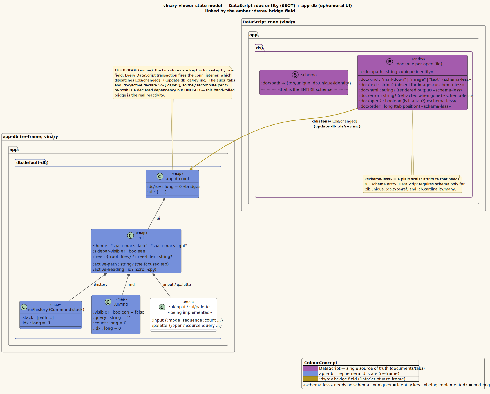
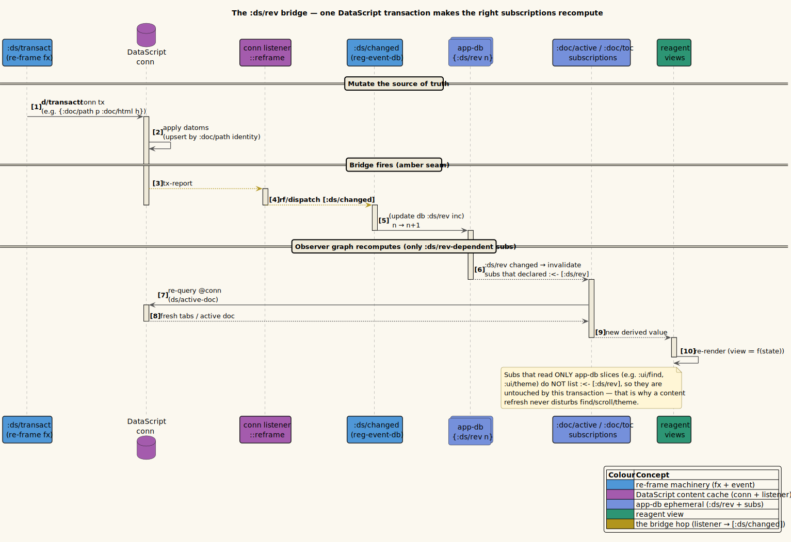

# Theory 02 — The State Model: DataScript + app-db

> **Where this fits.** Theory 01 established that the view is a pure function of
> **state**, and that state needs a single, unambiguous home (**SSOT**). This
> document defines *what that state is*. vinary-viewer deliberately keeps state in
> **two stores** — a relational one for documents, a plain map for ephemeral UI —
> joined by one small **bridge field, `:ds/rev`**. Get this model, and the rest of
> the system (live refresh, find, history) reads as obvious consequences.

## 1. Two stores, one rule

The design rule is **one fact, one home**. vinary-viewer splits state along a
natural seam:

| Store | Holds | Lives in | Authority for |
|-------|-------|----------|---------------|
| **DataScript** | the open *documents* and *tabs* — their path, kind, text, rendered HTML, error, open-flag, order | `vinary.app.ds` (a `conn`) | **document/tab domain** |
| **app-db** | *ephemeral UI* — active tab, theme, find state, history, git tree, scroll-spy heading, the `:ds/rev` counter | `vinary.app.db/default-db` | **UI/session** |

Why two? Because the two kinds of state have *different shapes and lifetimes*:

- A **document** is *entity-shaped* and *relational*: "the doc at this path has
  this kind and this html," "the tabs are the open docs ordered by `:doc/order`."
  Those are queries. A relational store answers them directly (`d/q`, `d/pull`)
  without you hand-maintaining derived collections.
- The **UI** is *small, flat, and session-scoped*: a boolean here, an index there.
  A plain map is the simplest possible home, and re-frame already gives you one.

Crucially, **no fact is duplicated** across the two. The tab list is *not* stored
in `app-db` and mirrored from DataScript; it is *computed* from DataScript on
demand (the `:tabs` sub). The active *path* is in `app-db`; the active *document*
is pulled from DataScript by that path. Each fact has exactly one home — that is
SSOT honoured, not just invoked.

The full picture — the DataScript `:doc` entity with its stereotyped attributes,
the nested `app-db` map, and the amber `:ds/rev` field linking them — is below.
Source: [`../diagrams/class-state-model.puml`](../diagrams/class-state-model.puml).



## 2. A DataScript primer (just enough)

**DataScript** is an immutable in-memory database for ClojureScript, modelled on
Datomic, with a Datalog query engine. Four concepts suffice for this codebase.

### 2.1 Datoms

The atomic unit of data is the **datom**, a tuple
`[entity attribute value transaction added?]`, usually abbreviated `[e a v]`. A
fact like *"entity 7 has `:doc/kind` `"markdown"`"* is one datom. A whole document
is just a handful of datoms that share an entity id `e`:

```
[7 :doc/path "…/README.md"]
[7 :doc/kind "markdown"]
[7 :doc/html "<h1>…</h1>"]
[7 :doc/open? true]
[7 :doc/order 0]
```

Because datoms are immutable, a transaction produces a *new* database value; you
never mutate a datom in place.

### 2.2 The connection and `transact!`

A **connection** (`conn`) is a mutable reference cell holding the current
(immutable) database value. vinary-viewer creates one and keeps it `defonce` so it
survives hot-reload:

```clojure
;; vinary.app.ds
(defonce conn (d/create-conn schema))
```

You write with **`d/transact!`**, passing *tx-data*: a vector where **a map
upserts** an entity and **`[:db/retract e a v]` / `[:db/retractEntity e]`** remove
facts. vinary-viewer routes *every* write through one re-frame effect so handlers
stay pure (Theory 01):

```clojure
;; vinary.app.fx
(rf/reg-fx :ds/transact (fn [tx] (d/transact! ds/conn tx)))
```

### 2.3 Querying: `d/q` (Datalog) and `d/pull`

You read with **`d/q`** (a Datalog query) or **`d/pull`** (fetch a tree of
attributes for a known entity). vinary-viewer's read helpers (`vinary.app.ds`) are
small, named queries — here is the whole vocabulary it needs:

```clojure
;; find the entity id for a path
(defn eid-for-path [db path]
  (d/q '[:find ?e . :in $ ?p :where [?e :doc/path ?p]] db path))

;; the tabs: every open doc as {:path :order :kind}, ordered by :doc/order
(defn open-docs [db]
  (->> (d/q '[:find ?path ?order ?kind
              :where [?e :doc/open? true] [?e :doc/path ?path]
                     [?e :doc/order ?order] [?e :doc/kind ?kind]] db)
       (sort-by second)
       (mapv (fn [[p o k]] {:path p :order o :kind k}))))

;; the active document: pull a fixed attribute set for a path
(defn active-doc [db path]
  (when (eid-for-path db path)
    (d/pull db [:doc/path :doc/kind :doc/html :doc/error] [:doc/path path])))
```

`[:doc/path path]` in the `pull` is a **lookup ref** — "the entity whose
`:doc/path` is `path`" — which works precisely because `:doc/path` is a *unique
identity* (next section).

### 2.4 Uniqueness and the minimal schema

DataScript needs a **schema** *only* for attributes that require special index
behaviour — uniqueness (`:db.unique`), references (`:db.type/ref`), or
many-cardinality (`:db.cardinality/many`). **Plain scalar attributes need no
schema at all.** vinary-viewer's entire schema is therefore one line:

```clojure
;; vinary.app.ds
(def schema
  {:doc/path {:db/unique :db.unique/identity}})
```

`:db.unique/identity` means *"there is at most one entity per `:doc/path`, and
transacting a map with an existing `:doc/path` **upserts** that entity."* This one
declaration is load-bearing:

- it makes **re-opening a file idempotent** (no duplicate tabs),
- it makes a **live edit update the same entity in place** (`LWW` by path —
  Theory 03),
- and it makes `[:doc/path path]` a valid **lookup ref** everywhere.

Every other doc attribute — `:doc/kind`, `:doc/text`, `:doc/html`, `:doc/error`,
`:doc/open?`, `:doc/order` — is **schema-less**: a plain scalar that DataScript
stores and queries with no schema entry. This is not an oversight; it is the point.
The schema is exactly as large as it *needs* to be (one uniqueness constraint) and
no larger.

## 3. The `:ds/rev` bridge — making DataScript observable

Here is the problem the bridge solves. re-frame's reactivity (Theory 01, domino 6)
watches **`app-db`**. But the documents are in **DataScript**, which re-frame does
*not* watch. A subscription like `:tabs` reads `@conn` directly — so how does
re-frame know to recompute it when a transaction changes the conn?

The answer is a single integer in `app-db`, **`:ds/rev`**, kept in lock-step with
DataScript by an explicit listener.

### 3.1 The mechanism, literately

**Install a conn listener** that fires on *every* transaction and dispatches a
re-frame event:

```clojure
;; vinary.app.ds
(defn install-bridge! []
  (d/listen! conn ::reframe (fn [_tx-report] (rf/dispatch [:ds/changed]))))
```

(`install-bridge!` is called once, during renderer `init` — Theory 01 §5.)

**The event bumps the counter** — that is its entire job:

```clojure
;; vinary.app.events
(rf/reg-event-db :ds/changed (fn [db _] (update db :ds/rev inc)))
```

**The document-reading subs depend on the counter** via `:<- [:ds/rev]`, so they
sit *downstream* of it in the signal graph and recompute whenever it changes:

```clojure
;; vinary.app.subs
(rf/reg-sub
 :tabs
 :<- [:ds/rev]                                   ; ← recompute on every transaction
 (fn [_ _] (ds/open-docs (ds/snapshot))))

(rf/reg-sub
 :doc/active
 :<- [:ds/rev] :<- [:ui/active-path]             ; ← recompute on tx OR active-path change
 (fn [[_rev path] _] (when path (ds/active-doc (ds/snapshot) path))))
```

The data path is therefore: `d/transact!` → conn listener → `[:ds/changed]` →
`(update db :ds/rev inc)` → `:ds/rev`-dependent subs invalidate → they re-query
`@conn` → views re-render. One transaction, exactly the right subs, every time.

The sequence of that handshake — and, importantly, why app-db-only subs are
*untouched* — is below. Source:
[`../diagrams/object-ds-rev-bridge.puml`](../diagrams/object-ds-rev-bridge.puml).



### 3.2 Why hand-rolled, and why `re-posh` is dormant

`re-posh` is a library that does roughly this for you — it lets subscriptions *be*
DataScript queries and handles invalidation internally. It is even a **declared
dependency** of vinary-viewer. Yet the project **does not use it**; it uses the
explicit `:ds/rev` bridge instead. The rationale:

- **Guaranteed, inspectable invalidation.** `:ds/rev` is a plain integer you can
  watch in `window.__vvdb()`; the trigger is one obvious `d/listen!`. There is no
  reliance on a library's subscription internals to decide what recomputes.
- **One mental model.** DataScript becomes "just another `app-db` input" — the
  subs read it like any layer-2 sub reads a layer-1 sub. Nothing about the Observer
  story from Theory 01 has to be special-cased.
- **Minimal surface.** The whole bridge is three forms (`install-bridge!`,
  `:ds/changed`, the `:<- [:ds/rev]` declarations). It is easy to reason about and
  impossible to mis-wire silently.

> **Status note.** `re-posh` being present-but-unused is intentional, not stale
> cruft to "fix": it leaves the door open to migrate later without a dependency
> change, while today's reactivity rests entirely on the `:ds/rev` bridge. (See
> [`../design-decisions/`](../design-decisions/README.md) for the recorded
> decision.)

## 4. nil-as-absence — modelling "no value"

DataScript **rejects `nil` as a value**: you cannot transact `[:doc/text nil]`.
So vinary-viewer adopts a rule: **"no value" is the *absence* of an attribute, not
a `nil` value.** Two patterns implement it, both visible in `:content/received`.

**Pattern A — conditionally include an attribute (`cond->`).** An image has no
text, so `:doc/text` must be *omitted*, not set to `nil`:

```clojure
(let [base (cond-> {:doc/path path :doc/kind kind :doc/open? true :doc/order order}
             text (assoc :doc/text text))]   ; assoc :doc/text ONLY when text is truthy
  …)
```

`cond->` threads `base` through each clause, applying the step only when its test
passes. For an image (`text` is `nil`), the `(assoc :doc/text text)` step is
skipped and the transacted map simply has no `:doc/text` key — exactly the intended
"absent."

**Pattern B — retract a stale value instead of nilling it.** When a file that
previously errored now reads fine, the old `:doc/error` must *go away*. You cannot
"set it to `nil`"; you **retract** it:

```clojure
(let [cur-err (and eid (ds/doc-attr snap path :doc/error))      ; current error, if any
      tx      (cond-> [base] cur-err (conj [:db/retract eid :doc/error cur-err]))]
  …)
```

If there is a current error, the tx-data gains a `[:db/retract eid :doc/error
cur-err]` datom that removes precisely that fact. Reads then use "absent = no
error": `content-view` shows the error div only `when (:doc/error doc)` (Theory
05), and `nil`/absent simply falls through.

> **Why this is the right model.** "Absent" and "nil" are genuinely different in a
> relational store: absent means *the fact does not exist*; a `nil` value would be
> *a fact asserting nothing*, which is incoherent. Modelling absence as absence
> keeps queries honest (`[?e :doc/error ?v]` matches only entities that actually
> have an error) and is why the error/clear lifecycle (Theory 03, the tab error
> substate in `state-tab-lifecycle`) is just assert-then-retract.

## 5. The full app-db, annotated

The other store is the re-frame **app-db**, whose initial value is `default-db`.
Here it is in full, annotated. Note that *every* slice here is **ephemeral UI** —
there is not a single document attribute among them.

```clojure
;; vinary.app.db
(def default-db
  {:ds/rev 0                         ; ← the DataScript bridge counter (Theory 02 §3)
   :ui {:active-path nil             ; the focused tab's path (drives :doc/active)
        :theme "spacemacs-dark"      ; current theme name → css/themes/<name>.css
        :active-heading nil          ; scroll-spy: id of the heading at the viewport top
        :sidebar-visible? true       ; git file-tree sidebar shown?
        :tree-selected nil           ; (reserved) tree selection
        :history {:stack [] :idx -1} ; navigation history — a Command stack (Theory 07)
        :find {:visible? false       ; in-page find (Theory 06)
               :query ""             ;   current query text
               :count 0              ;   number of matches
               :idx 0}               ;   1-based index of the focused match (0 = none)
        ;; ── keybinding / modal / sequence state ──────────────────────────────
        ;; ephemeral UI for the custom-keybinding system *now available*; the
        ;; keymap itself will live in vinary.input.keymap's atom, not here.
        :input {:mode :normal :sequence [] :count nil :in-input? false :timeout-id nil}
        ;; ── command palette / fuzzy finder (now available) ───────────────
        :palette {:open? false :source :command :prefix "" :query "" :items [] :selected 0}}})
```

A few things worth calling out:

- **`:ds/rev` starts at `0`.** It is incremented on every transaction; its absolute
  value is meaningless — only its *changing* matters (it is an invalidation token).
- **History starts "empty at -1".** `{:stack [] :idx -1}` is the empty Command
  stack with the cursor *before* the first entry; `:history/can-back?` and
  `:can-forward?` both read `false` here (Theory 07).
- **Find starts hidden and idle.** `{:visible? false :query "" :count 0 :idx 0}`
  (Theory 06).
- **`:input` and `:palette` are reserved for the keybinding system *being
  implemented*.** They are present in `default-db` so the slots exist, but the
  command registry, preset keymaps, modal/chord resolver, and palette logic are
  under construction (see [`../usage/04-keyboard-shortcuts.md`](../usage/04-keyboard-shortcuts.md)).
  Today's live keys are the baseline `Ctrl+F` and `Alt+←/→` wired in
  `keybindings!` (Theory 01 §5).

The app-db subs (`vinary.app.subs`) read these slices directly and *without*
`:<- [:ds/rev]`, because they have nothing to do with DataScript — and that
independence is exactly what protects find/scroll/theme from being disturbed by a
content refresh (Theory 03).

## 6. Summary

- vinary-viewer keeps **two stores**: **DataScript** for documents/tabs (relational,
  entity-shaped) and **app-db** for ephemeral UI (a small flat map) — with **no
  duplicated facts** (SSOT).
- DataScript stores **datoms**; you write with **`transact!`** and read with
  **`d/q`**/**`d/pull`**. The **schema is one line** — `:doc/path` is a
  `:db.unique/identity` — and everything else is **schema-less**.
- The **`:ds/rev` bridge** makes DataScript observable to re-frame: a listener
  bumps `:ds/rev` on each transaction, and document-reading subs declare
  `:<- [:ds/rev]`. **`re-posh` is a declared but unused dependency**; the explicit
  bridge is preferred for a guaranteed, inspectable signal.
- **nil-as-absence**: because DataScript rejects `nil`, "no value" is modelled by
  *omitting* an attribute (`cond->`) or *retracting* it (`[:db/retract …]`).
- The full **`default-db`** is all ephemeral UI; the `:input`/`:palette` slots are
  reserved for the keybinding system now available.

Next: [Theory 03 — the live-refresh spine](03-live-refresh-spine.md) puts this
model in motion, and shows why a refresh touches only `:doc/*`.

## References

- DataScript. <https://github.com/tonsky/datascript> — datoms, schema, `d/q`,
  `d/pull`, `transact!`, uniqueness.
- re-frame documentation. <https://day8.github.io/re-frame/> — `app-db`,
  `reg-sub`, sub-of-sub `:<- [:sub]`.
- re-posh. <https://github.com/denistakeda/re-posh> — the DataScript/re-frame
  bridge library deliberately left unused here.
