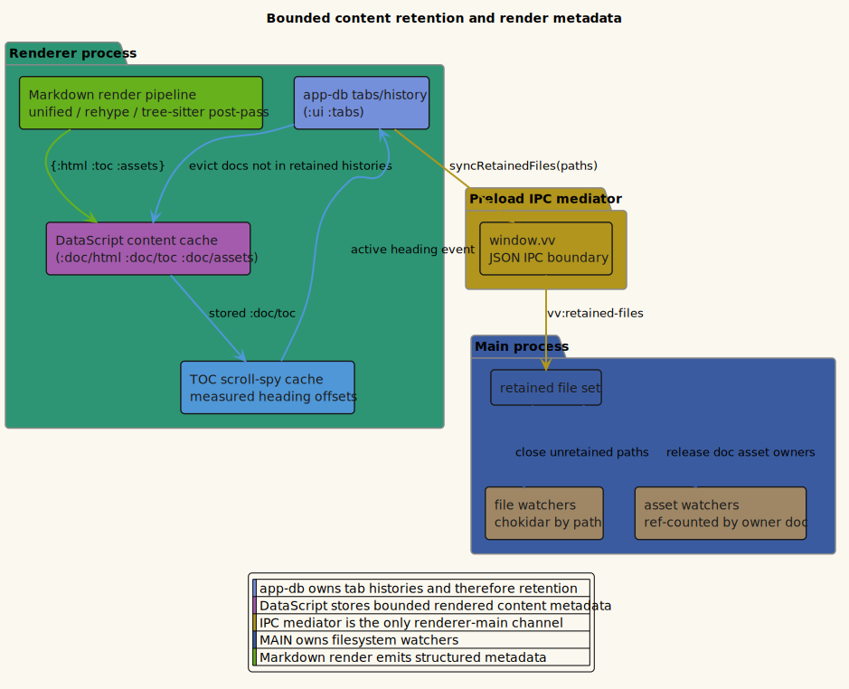
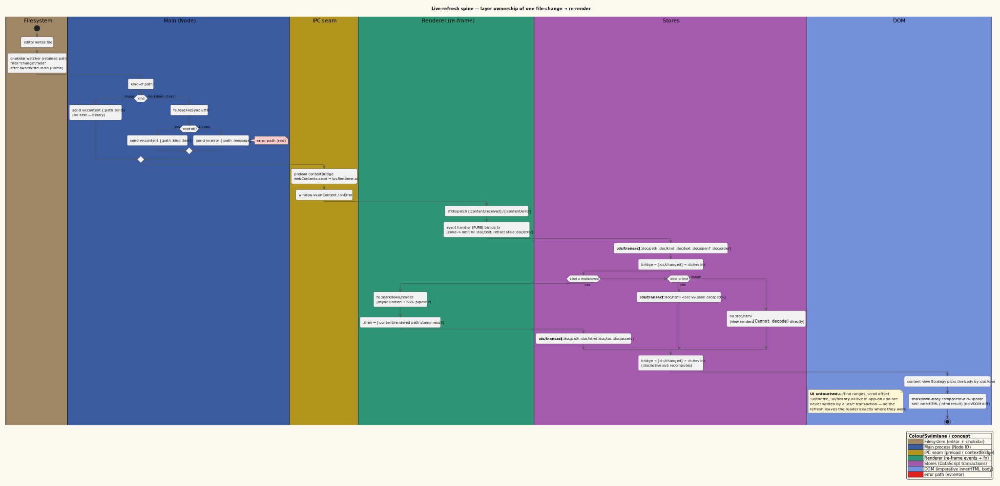

# Theory 03. Live-Refresh Spine

The live-refresh spine is the causal chain from a file save to updated pixels.

---

## 1. Chain

```text
editor save
  -> chokidar change/add
  -> main send-content!
  -> vv:content
  -> renderer bridge
  -> [:content/received]
  -> DataScript content transaction
  -> optional Markdown render
  -> [:content/rendered]
  -> DataScript render transaction
  -> :ds/rev subscriptions
  -> content view repaint
```

For PDFs, the chain includes a main-owned native PDF reload. For Markdown, the
chain includes render metadata and asset watcher sync.

---

## 2. Watcher ownership

A watcher exists for a retained local file path. Retained means reachable from at
least one open tab history entry. This is stronger than "active tab" and more
bounded than "ever opened".

The main process reconciles watchers whenever the renderer sends
`vv:retained-files`.

---

## 3. Atomic saves and partial writes

`chokidar` is configured with `awaitWriteFinish` and listens for both `change` and
`add`.

| Mechanism | Reason |
|-----------|--------|
| `awaitWriteFinish` | Avoid reading a partially written file. |
| `change` | In-place saves. |
| `add` | Atomic-save rename patterns. |
| retained reconciliation | Release watchers when paths leave every tab history. |

---

## 4. Render stamp

Markdown rendering is asynchronous. Each content payload carries a stamp. A render
commit is accepted only when the stamp still matches the cached document. This
prevents an older slow render from overwriting newer content.

---

## 5. UI preservation

Live refresh writes content attributes in DataScript. It does not replace the
active tab, reset per-tab history, clear find state, or rewrite settings. Scroll
restore has its own explicit path for navigation; ordinary file refresh does not
consume a navigation restore unless one is pending for the active render.

---

## 6. Diagram



*Diagram source: [`../diagrams/component-content-retention.puml`](../diagrams/component-content-retention.puml).*

## 7. Layer ownership of one file change

The spine crosses four layers. This swimlane view shows which layer owns each step, and where the `:doc/*`-only invariant is enforced.



*Diagram source: [`../diagrams/activity-live-refresh-spine.puml`](../diagrams/activity-live-refresh-spine.puml).*
