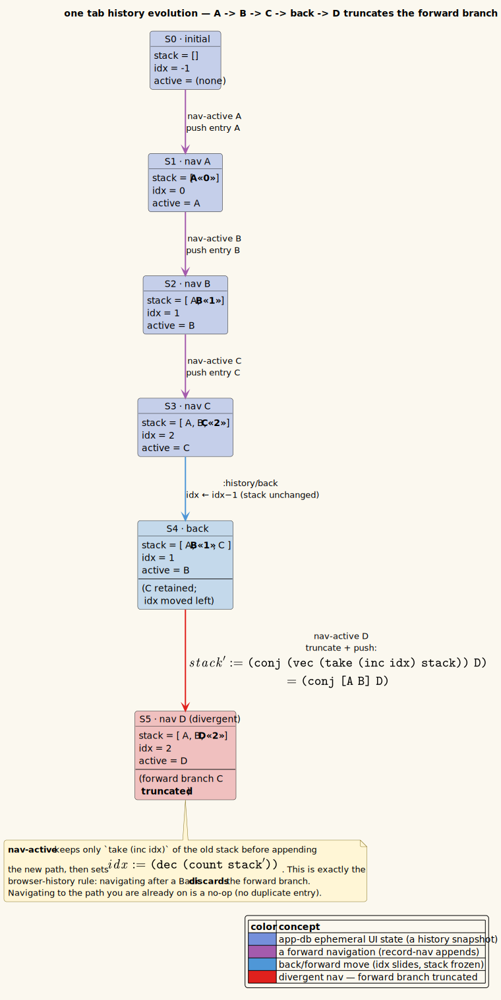

# Theory 07. Command History Model

Navigation history is a Command/Memento-style model over per-tab history entries.
Each tab owns its own timeline.

**Unified-history principle.** *All* navigation funnels through this one model
(`vinary.app.nav` — `step` for Back/Forward, `nav-active` to push). Filesystem
navigation is included: directories open *in-tab*, so going up to a parent folder
(`Alt+Up`), opening a directory entry (`Alt+Down`), clicking a breadcrumb segment,
and following a link all push or step the *same* stack. This is what lets a single
back-stack carry you fluidly across documents and folders alike.

---

## 1. Entry shape

```clojure
{:uri "/abs/path/doc.md"
 :scroll 320}
```

A tab stores:

```clojure
{:hist {:stack [{:uri "/a.md" :scroll 0}
                {:uri "/b.md" :scroll 320}]
        :idx 1}}
```

The cursor `idx` points at the current entry. Back and Forward move the cursor;
new navigation from a non-final cursor truncates the forward branch.

---

## 2. Operations

| Operation | Behavior |
|-----------|----------|
| Navigate active tab | Save current scroll, truncate forward branch, append `{uri, scroll 0}`, set current URI. |
| Back | Save current scroll, decrement `idx`, return target URI and target scroll. |
| Forward | Save current scroll, increment `idx`, return target URI and target scroll. |
| Activate tab | Save leaving tab scroll and restore target tab's current entry scroll. |

The implementation lives in `vinary.app.nav`; event handlers in
`vinary.app.events` add effects for loading local files and applying scroll
restore.

---

## 3. Retention consequence

History entries are ownership roots. A local file reachable from a background tab
history remains retained, watched, and cached. Closing or navigating away releases
a file only when no open tab history can reach it.

---

## 4. Browser semantics

The model intentionally matches browser history:

```text
A -> B -> C
Back to B
Navigate to D
history becomes A -> B -> D
```

The abandoned forward entry `C` is dropped.

---

## 5. Filesystem navigation: `Alt+Up` / `Alt+Down`

Two commands extend the model to folders, both bound in the `:all` block of every
keymap (so they are keymap- and mode-independent):

| Command | Key | Operation |
|---------|-----|-----------|
| `:nav/parent` | `Alt+Up` | Navigate the active tab to `uri/dirname` of the current path (a normal `nav-active` push), and pre-highlight the came-from child in `[:ui :dir-selected]`. No-op for `http(s)` or at the filesystem root. |
| `:nav/open-target` | `Alt+Down` | Open the highlighted entry of the active directory listing. Inert unless `:doc/kind = "directory"`. |

Because `Alt+Up` is a normal push, **Back** still returns to wherever you ascended
from — folders are first-class history entries.

---

## 6. Trail memory (a `dir → child` map)

> **Definition.** The **trail** is a persistent map from each directory to the last
> child opened from it: `dir → child`. It lives at `[:ui :recent :trail]` and is
> saved to `recent.edn`.

On every forward navigation to a local path, the pure helper `record-recent` writes
a `dir → child` entry for **every ancestor step** of the path. The highlighted entry
of a directory listing is then *derived* by `nav/effective-selected` in this order:

```text
explicit :dir-selected   →   trail[dir]   →   first sorted entry
```

This makes the signature round-trip hold: **`Alt+Up` then `Alt+Down` returns to the
most-recently-opened full path.** Worked example — open `/home/me/docs/report.md`:

```text
record-recent writes:
   /              → /home
   /home          → /home/me
   /home/me       → /home/me/docs
   /home/me/docs  → /home/me/docs/report.md

Alt+Up    → navigate to /home/me/docs
            (report.md is pre-highlighted via :dir-selected)
Alt+Down  → effective-selected → /home/me/docs/report.md → open it
            (back to exactly where you were)
```

Two cooperating mechanisms give this both **immediacy** and **durability**:

- the explicit `:dir-selected` set by `:nav/parent` handles the *immediate*
  round-trip;
- the persisted `trail` handles the *durable* case — ascend to `/home/me/docs` from
  anywhere, even in a new session, and `Alt+Down` still re-opens `report.md` because
  `trail["/home/me/docs"]` remembers it.

The trail is bounded (the 200 most-recent directories); a sibling `:recent-files`
MRU (capped at 10) records opened **files** for File ▸ Open Recent. Both persist via
the debounced `:vv/save-recent` effect. See
[features/17-breadcrumb-and-up-down-navigation.md](../features/17-breadcrumb-and-up-down-navigation.md).

---

## 7. References

- Gamma, E., Helm, R., Johnson, R., & Vlissides, J. (1994). *Design Patterns:
  Elements of Reusable Object-Oriented Software.* Addison-Wesley. ISBN
  978-0201633610.
- ADR-0010: [../design-decisions/0010-bounded-content-retention-and-render-metadata.md](../design-decisions/0010-bounded-content-retention-and-render-metadata.md)

## 8. Truncating the forward branch

Navigating to a new path after going back discards the forward branch — the same rule a browser uses.



*Diagram source: [`../diagrams/object-history-stack.puml`](../diagrams/object-history-stack.puml).*
