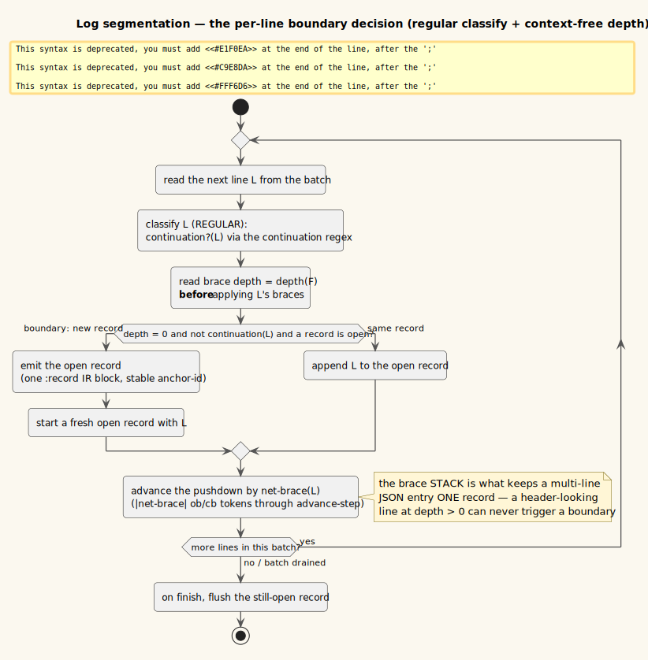

# Document streaming and the WPDA — bounded-memory incremental rendering

**Status: Implemented (v0.3.0), default-ON for large documents. Two engines share this spine: a bounded WPDA
*byte-stream* (logs/text — this document's model) and a byte-parity *progressive block-commit* (Markdown,
PDF-reflow — §6.1). Source stays batch: CodeMirror 6 already viewport-virtualizes.**


*One batch flows disk → main session → transport → parser+sink → DOM under a credit-1 pull loop; the working
set stays bounded on every participant.*

---

## 1 · Motivation

The [common document IR](08-common-document-ir.md) parses each format into one tagged tree, transforms it, and
lowers it to HTML. Until v0.3.0 it did so on **whole documents**: read the whole file, build the whole IR,
lower the whole HTML, and replace `.markdown-body`'s innerHTML in one write. Two costs grow with file size:

- **Memory is unbounded** — file, parse, and rendered HTML coexist; a large log or Markdown file freezes or
  OOMs the renderer. The prior mitigations (the $\approx 5$ MiB log/table *paging* boundary, the PDF viewport window)
  are per-format and show only a *slice*.
- **First paint waits for the whole document** — nothing renders until the entire parse completes.

The IR already shipped a **WPDA + streaming decoder** (`vinary.ir.decode`) built to *stream and rank* ambiguous
segmentation in bounded memory — but nothing used it. Document *streaming* wires it in: treat the document as a
**bounded-memory incremental stream** of lines/tokens/runs, drive the WPDA for the ambiguous **segmentation**
step, and emit IR + DOM **incrementally**, never holding the whole parse. The trade is explicit and sets the
policy: streaming does **more** total work (per-block lowering, post-passes, IPC pulls, scheduling), so it is
worthwhile **only for large documents** — it buys *latency* and *bounded memory*, not throughput. Small
documents keep the faster batch path, byte-for-byte (see [ADR-0018](../design-decisions/0018-document-streaming-pipeline.md)).

### 1.1 · Key terms

| Term | Definition |
|------|------------|
| **Batch path** | The whole-document render: whole file → whole IR → whole HTML → one innerHTML write. |
| **Stream path** | The incremental render defined here: line batches → per-record IR blocks → appended DOM. |
| **StreamParser** | The pure `feed`/`finish` protocol (`vinary.stream.protocol`) emitting only *newly-completed* IR blocks. |
| **Record** | A log entry = a header line plus its continuation/braced lines, up to the next depth-0 header. |
| **WPDA** | *Weighted pushdown automaton* — recognises context-free nesting, weighted by a semiring ([theory/08 §5](08-common-document-ir.md)). |
| **Config** | A WPDA configuration $(q,\gamma,w)$: state $q$, stack $\gamma\in\Gamma^{*}$, weight $w\in K$. |
| **Frontier** | The current set (beam) of live configs — the streaming decoder's whole live state. |
| **Beam / credit** | The prune width $\beta$ bounding the frontier; the outstanding-pull count ($=1$) bounding transport. |

---

## 2 · The streaming contract

A **StreamParser** is a pure state machine over batches of input symbols:

$$\textsf{feed} : (\text{parser},\ \text{batch}) \mapsto (\text{parser}',\ \text{blocks}) \qquad
  \textsf{finish} : \text{parser} \mapsto \text{blocks}$$

`feed` returns **only the blocks completed by this batch** and a successor parser carrying the still-open block;
`finish` flushes the final open block. Two invariants make it correct and testable:

- **Batch-split invariance.** For any partition of a symbol sequence $s = b_1 \frown b_2 \frown \dots \frown b_n$
  into batches, folding `feed` over the batches and appending `finish` yields the **same** block sequence as
  feeding $s$ whole. Formally, writing $\textsf{drain}$ for that fold-then-finish, $\textsf{drain}(s) =
  \textsf{drain}(b_1,\dots,b_n)$ for every partition. (Tested exhaustively over splittings in
  `log-stream-test/streaming-across-batches-equals-whole`.)
- **Bounded retention.** The successor parser's size is $O(\text{largest open block})$, independent of how many
  symbols have been fed (§5).

Because it is pure and DOM-free, the StreamParser is fully node-testable; the DOM append lives separately in the
sink (§6).

---

## 3 · The WPDA log grammar

Log segmentation is *almost* regular — most lines are classified as **header** or **continuation** by a regular
expression — but one shape is genuinely **context-free**: a multi-line JSON/braced entry

```
{
  "level": "ERROR",
  "2026-07-07T00:00Z ...":  "a value that LOOKS like a header"
}
```

must stay **one** record even though an inner line looks exactly like a header. Deciding "am I inside braces?"
requires counting balanced `{ … }` to arbitrary depth — the golden **balanced-brackets** language, which no
finite-state counter recognises in general. This is where the **pushdown** earns its keep.

`vinary.ir.grammar.log` defines the WPDA $M = (Q,\Sigma,\Gamma,\delta,q_0,Z_0,F,K)$ with a single state
$Q=F=\{\textsf{in}\}$, per-line brace tokens $\Sigma=\{\textsf{ob},\textsf{cb}\}$ (a line that *net-opens* vs
*net-closes* a brace level), stack alphabet $\Gamma=\{\textsf{b}\}$ (one marker per open level), and the Boolean
semiring $K=\mathbb{B}$ for recognition. Its transition function $\delta$ (each rule reads a token, inspects the
stack top, and moves state while pushing/popping) is:

| Token | Stack top | Stack action | Effect |
|-------|-----------|--------------|--------|
| $\textsf{ob}$ | $\varepsilon$ (empty) | push $\textsf{b}$ | open a brace level at depth 0 |
| $\textsf{ob}$ | $\textsf{b}$ | push $\textsf{b}$ | open a deeper level |
| $\textsf{cb}$ | $\textsf{b}$ | pop | close one level |
| $\textsf{cb}$ | $\varepsilon$ (empty) | noop | absorb a stray close (never dies) |

The last rule makes the machine **total** — a malformed line with more `}` than `{` at depth 0 is absorbed
rather than killing the tracker. The **brace depth** of a frontier is the number of $\textsf{b}$ markers on its
config's stack, i.e. $\textsf{depth}(F) = |\gamma|$ for the (single) config $(q,\gamma,w)\in F$.

This grammar is **deterministic**: from any config, each token has exactly one applicable transition. Hence the
frontier is always a *single* config — the beam never needs to branch here. The weighted machinery is still
present (and used for PDF in Phase 3, where line/block segmentation is genuinely ambiguous and a **Tropical**
weight $\big(\mathbb{R}\cup\{\infty\},\ \min,\ +,\ \infty,\ 0\big)$ ranks competing segmentations); for logs it
collapses to plain recognition.

---

## 4 · Segmentation — a regular classifier over a context-free pushdown



*Each line is classified (regular) and checked against the brace depth (context-free); a header at depth 0 with
a record open commits the previous record, then the pushdown advances by the line's net-brace delta.*

`vinary.ir.frontend.log-stream` combines the regular and context-free parts. For each incoming line $\ell$:

1. **Classify (regular).** `continuation-line?` matches `^(\s|\}|\]|at\s|Caused by\b|\.\.\.\s\d+\smore)` — an
   indented line, a lone closer, a stack frame, or an "… N more" line visibly belongs to the record above it.
2. **Read depth (context-free).** Consult $\textsf{depth}(F)$ *before* applying $\ell$'s braces.
3. **Decide the boundary.** $\ell$ starts a **new** record iff it is a header at depth 0 with a record already
   open:
   $$\textsf{boundary}(\ell) \;=\; \big(\textsf{depth}(F)=0\big)\ \wedge\ \neg\,\textsf{continuation?}(\ell)\ \wedge\ (\textsf{open}\neq\langle\rangle).$$
   On a boundary, the open record is emitted and $\ell$ begins the next; otherwise $\ell$ joins the open record.
4. **Advance the pushdown.** Feed $\ell$'s net-brace delta $\textsf{nb}(\ell) = \#\{\texttt{\{}\} - \#\{\texttt{\}}\}$
   as $|\textsf{nb}|$ tokens of $\textsf{ob}$ or $\textsf{cb}$ through the streaming primitive.

The streaming primitive is `decode/advance-step`, **the** bounded-memory step: advance the frontier by one input
symbol, then prune to the beam,
$$F_i \;=\; \textsf{prune}_\beta\big(\textsf{advance}(M,\ F_{i-1},\ a_i)\big),$$
where $\textsf{advance}$ applies $\delta$ plus a bounded $\varepsilon$-closure and $\textsf{prune}_\beta$ keeps
the $\beta$ lowest-weight configs. `decode` is exactly the left fold of `advance-step` over the input, so
`advance-step` composes into a whole-sequence decode while never materialising more than one frontier.

A completed record lowers to `div.vv-log-record` (carrying a collision-free stable `ir.meta/anchor-id`, so ids
never churn as the document grows) wrapping one `div.vv-log-line` **element per source line**. The line text
lives in a `:text`-kind child, not the element's `:text` field: the IR→HAST lowering emits a leaf's text only
for `:text` nodes, so a bare `:line` leaf would lower to an *empty* `<div>` and the text would vanish — a trap
guarded by `log-stream-test/lowers-to-nonempty-html`.

---

## 5 · The bounded-memory property

The central guarantee. Let $F_i$ be the frontier after $i$ symbols, $\gamma_i$ its stack, $\beta$ the beam width
and $d_{\max}$ the max stack depth (`decode/default-max-stack` $=4096$).

> **Proposition (bounded working set).** For every $i$: $\;|F_i| \le \beta\;$ and $\;|\gamma| \le d_{\max}$ for
> every config in $F_i$. For the deterministic log brace grammar, $|F_i| = 1$. Hence the streaming decoder's
> live state is $O(\beta \cdot d_{\max})$ — a constant independent of the document length $N$.

*Proof sketch.* $|F_i|\le\beta$ is immediate: $F_i = \textsf{prune}_\beta(\cdot)$ keeps at most $\beta$ configs.
$|\gamma|\le d_{\max}$ holds because `advance` discards any config whose push would exceed $d_{\max}$.
Determinism of $\delta$ (§3) gives $|F_i| = |F_{i-1}| = \dots = |F_0| = 1$ for the log grammar by induction:
each token has exactly one applicable transition, so `advance` maps one config to one config and prune is a
no-op. $\square$

Lifting to the front-end: the StreamParser retains the open record's lines plus this single config. The open
record is bounded by the size of the **largest single record**, not by $N$ — a depth-0 header emits the previous
record and starts a fresh one, so at most one record is ever open. `log-stream-test/bounded-memory-property`
feeds 500+ batches and asserts the frontier stays a single config and only the last (open) record is retained.

The bound extends across the whole pipeline (see the diagram): the **transport** holds $\le 2$ batches (the current
one plus one double-buffered prefetch); **main** reads $\le 1$ batch ahead (it pauses `readline` at the batch cap —
the credit-1 backpressure); and the render is **never snapshotted** back to `:doc/html`, so a re-mount re-streams
rather than materialising the whole HTML. The *parse/transport* working set is thus $O(1)$ in $N$. (The rendered
**DOM** node count still tracks the streamed prefix until Phase 4 windows it — see the trade-offs in ADR-0018.)

---

## 6 · The append sink and byte-parity

`vinary.stream.sink` turns completed IR blocks into DOM without ever replacing innerHTML:

1. **Lower** each block with the shared `ir/backend/html/lower` (the same producer the batch path uses).
2. **Post-process** with the *identical* `markdown/apply-posts` string passes — MathJax → Mermaid → syntax
   highlighting — reused unchanged, so a streamed block renders exactly like a batch one. (Logs pass `nil`; they
   need no post-passes.)
3. **Append** the whole batch in one `insertAdjacentHTML "beforeend"`, blocks joined by `"\n"` and a trailing
   `"\n"`. `remark-rehype` emits a `\n` text node between top-level blocks; re-emitting those separators is what
   keeps streamed HTML **byte-identical** to batch HTML (the load-bearing parity condition for Markdown in
   Phase 2). Pure log/PDF front-ends have no such nodes, which is exactly why **logs de-risk the spine first**.

Appends are serialised through a per-controller promise queue so asynchronous Mermaid/syntax passes still land
in document order, and each is **cancel-aware** — if the stream is torn down while a block's post-passes are in
flight, the append is skipped.

**Security.** Each block is sanitized by the same GitHub-allowlist schema as the batch path. The allowlist is
**context-free** — a node's safety is independent of its siblings — so per-block sanitization is provably
identical to whole-document sanitization. See [security/threat-model](../security/threat-model.md).

### 6.1 · The second engine — progressive block-commit (Markdown, PDF-reflow)

Sections 2–5 describe the **bounded byte-stream** used for logs/text, whose bytes are *not* in renderer memory.
Markdown and PDF-reflow are different: the whole source (Markdown) or extracted text (PDF) is **already in
renderer memory**, and their renderers are **document-global** — CommonMark dedups heading slugs, resolves
*forward* reference definitions, and lays out footnotes across the whole document; `reflow-ir` classifies
heading-vs-paragraph against a **document-global median line-height**. A byte-parity *bounded-parse* is
therefore infeasible: any block may depend on content arbitrarily far away.

So these kinds use a **progressive block-commit**. The exact batch renderer runs **once** (`md/stream-blocks`:
the whole `base-pipeline`; `pdf/reflow-blocks!`: the whole page scan → `reflow-ir`), giving full document
context, and the resulting IR document's **top-level children** are committed across idle frames by the *same*
scheduler + sink. Because the children are emitted **verbatim** — element blocks *and* the inter-block
whitespace `:text` leaves that carry remark-rehype's exact separators — and the sink concatenates them with **no
added separator** ($\textsf{sep}=\varepsilon$, versus $\textsf{sep}=\texttt{\textbackslash n}$ for logs), the
result satisfies

$$\textsf{concat}\big(\textsf{map}\ \textsf{lower}\ \textsf{children}\big) \;=\; \textsf{lower}(\text{whole document}) \;=\; \text{batch } \texttt{:html},$$

**byte for byte** (verified by the electron smoke's streamed-vs-batch `innerHTML` comparison over a 300 KiB
corpus). The win here is **not** bounded parse memory (the text is already resident) but a **non-blocking
progressive paint**: the expensive per-block post-passes (MathJax → Mermaid → tree-sitter) and DOM writes are
paced across frames, and the whole HTML string is never held. The sink skips the post-passes for
whitespace-only fragments, which a parse+serialize pass would otherwise normalise away.

---

## 7 · Scheduling and backpressure

`vinary.stream.scheduler` drives the loop on the renderer's idle budget. Each `requestIdleCallback` tick (with
`{timeout 100}`, so a batch still fires within 100 ms under sustained load or when the window is backgrounded,
and an `rAF`/8 ms fallback where rIC is absent) pulls one batch, feeds it to the parser, appends the completed
blocks, and dispatches `:stream/progress` (+ a capped `:stream/toc-append` of error/warning records). The
transport's double-buffer means the next main-process pull overlaps this batch's append, so the pull latency is
hidden. On `:done` the parser is flushed (`finish`) and `:stream/done` fires; on unmount/tab-switch/live-refresh
the controller is marked destroyed (in-flight appends bail) and the main-process session is closed, releasing
its fd. The electron smoke asserts the session registry returns to `0` — no fd/session leak.

---

## 8 · Complexity

For a document of $N$ input symbols segmented into $R$ records:

| Resource | Batch path | Stream path |
|----------|-----------|-------------|
| Parse **time** | $\Theta(N)$ | $\Theta(N)$ (a constant factor higher: per-block lower + post-passes + IPC) |
| Parse/transport **space** | $\Theta(N)$ | $\Theta(\beta\,d_{\max} + L_{\max})$ — **independent of $N$** ($L_{\max}$ = largest record) |
| Rendered **DOM** | $\Theta(N)$ | $\Theta(\text{streamed prefix}) \to \Theta(\text{viewport})$ after Phase 4 windowing |
| **Latency to first paint** | $\Theta(N)$ | $\Theta(\text{first batch})$ |

Streaming trades a higher constant on total time for an **asymptotically smaller** memory bound and a
**dramatically smaller** first-paint latency — the reason it is reserved, by threshold, for large documents.

---

## 9 · Phased roadmap

| Phase | Scope | Outcome |
|-------|-------|---------|
| 0 | Scaffolding (flag, protocol, transport, `advance-step`, main sessions) | ✅ inert, app byte-identical |
| **1** | **Logs/text — bounded WPDA byte-stream (this document's model)** | ✅ >5 MiB log streams progressively; find + Contents mid-stream; small logs unchanged; no fd leak |
| 2 | Markdown — **progressive block-commit** (§6.1), not micromark-incremental | ✅ streamed `innerHTML` **byte-identical** to batch over a 300 KiB corpus |
| 3 | PDF-reflow — progressive block-commit; canvas already page-windowed | ✅ streamed reflow byte-identical to batch reflow |
| 4 | Capabilities hardened + **default-on** | ✅ find-materialize, live-refresh re-anchor, Preferences toggle, `stream-default true`. *Windowed DOM: scoped optional, not implemented (streamed DOM = batch DOM → no regression).* |
| 5 | Source — spike-gated | ✅ **stays batch**: CodeMirror 6 already viewport-virtualizes; async outline parse. No beneficial streaming path. |

---

## 10 · Where it lives

| Concern | Namespace / file |
|---------|------------------|
| Feature gate (flag + per-kind threshold + implemented set) | `vinary.stream.flag` |
| StreamParser protocol + `drain` | `vinary.stream.protocol` |
| Pull-client transport (double-buffered, credit-1) | `vinary.stream.transport` |
| Append-mode render sink | `vinary.stream.sink` |
| Idle-budget scheduler + backpressure + teardown | `vinary.stream.scheduler` |
| WPDA brace grammar | `vinary.ir.grammar.log` |
| Streaming log front-end (segmentation) | `vinary.ir.frontend.log-stream` |
| Streaming decoder primitive (`advance-step`/`decode`) | `vinary.ir.decode` ([theory/08 §5](08-common-document-ir.md)) |
| Main-process session registry | `src/vinary/main/content_service.js` (`streamOpen`/`streamPull`/`streamClose`) |
| Renderer view + `content-view` branch | `vinary.ui.views` (`ir-stream-body`) |
| State + subscriptions | `vinary.app.events` / `vinary.app.ds` / `vinary.app.subs` (`:doc/streaming?`, `:doc/stream-progress`) |

---

## 11 · References

1. Reps, T., Schwoon, S., Jha, S., Melski, D. (2005). *Weighted pushdown systems and their application to
   interprocedural dataflow analysis.* Science of Computer Programming **58**(1–2), 206–263. DOI
   [10.1016/j.scico.2005.02.009](https://doi.org/10.1016/j.scico.2005.02.009). — the weighted-pushdown model
   that `vinary.ir.grammar.log` specialises (here, to brace-nesting record segmentation).
2. Muthukrishnan, S. (2005). *Data Streams: Algorithms and Applications.* Foundations and Trends in Theoretical
   Computer Science **1**(2), 117–236. DOI [10.1561/0400000002](https://doi.org/10.1561/0400000002). — the
   one-pass, sublinear-space **data-stream** model this pipeline instantiates for documents (the bounded-memory
   property of §5).
3. The semiring, weighted tree-transducer, WPDA streaming decoder, and Earley-over-lattice foundations — Goodman's
   *semiring parsing*, Droste & Kuich's *weighted automata*, and Knuth's *semiring shortest distance* — are cited
   in [theory/08 §7](08-common-document-ir.md#7--references); this document builds directly on them.
4. Reactive Streams (2015). *Reactive Streams specification.* <https://www.reactive-streams.org/> — the
   credit-based demand/backpressure protocol whose credit-1 form the transport (§7) and main session use.
