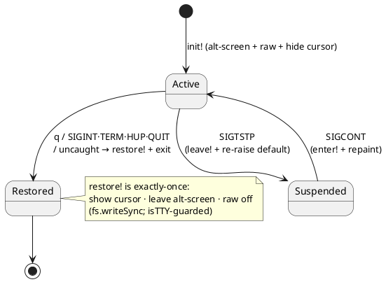

# 10 — Terminal rendering: a second renderer over the shared spine

> **Prerequisites.** [08 — Common document IR](08-common-document-ir.md) and
> [09 — Document streaming and the WPDA](09-document-streaming-and-the-wpda.md). This chapter assumes the IR
> (`vinary.ir.node/Node`, a tagged tree) and the streaming `StreamParser` contract are familiar.

## 1. The intuition: one document engine, two renderers

The GUI and the terminal are the **same document engine with different output**. A format is parsed once, by the
shared front-ends, into the common IR; a *backend* then lowers that IR to a concrete medium. The GUI's backend
(`ir.backend.html`) emits HTML for a DOM; the terminal's backend (`ir.backend.ansi`) emits **styled ANSI** for a
character grid. Everything upstream of the backend — the front-ends, the WPDA decoder, the streaming
`StreamParser`, and the TOC/find capabilities — is reused unchanged.

```plantuml
@startuml
skinparam shadowing false
left to right direction
rectangle "bytes" as B
rectangle "Front-end\n(format → IR)" as FE
rectangle "Common IR\n(tagged tree)" as IR
rectangle "ir.backend.html\n→ HTML → DOM" as H #E6F4EA
rectangle "ir.backend.ansi\n→ ANSI → tty" as A #FCE8E6
B --> FE --> IR
IR --> H
IR --> A
@enduml
```

Because the split is at the *backend*, adding the terminal cost only what is genuinely medium-specific: a layout
engine that thinks in character cells and SGR colours instead of CSS boxes. The reward is that every present and
future front-end (Markdown, office, PDF, logs, source, tables, archives) is previewable in the terminal for free.

## 2. The ANSI backend: a width-aware character-cell layout engine

`ir.backend.ansi/render` walks the IR and lays each block onto a grid of `width` columns. The unit of styled text
is a **span** — `{:text string :style {…} :link href?}` — and inline IR (text, emphasis, inline code/math, links,
images, line breaks) is flattened into a span sequence carrying the accumulated style. Block layout then:

1. **word-wraps** spans to the column budget, honouring **display width** — ANSI escapes count as zero cells and
   East-Asian-wide glyphs (CJK) as two, so `display-width` strips SGR via a regex and sums cell widths;
2. **coalesces** adjacent same-style spans into one SGR run (word-wrap fragments a run into per-word tokens; a
   coloured log line must emit *one* `ESC[…m … ESC[0m`, not one pair per word — a ~5× byte saving on a streamed
   log); and
3. **decorates** per kind: headings get a bold level colour, blockquotes a green `│` gutter, code blocks a gray
   `▏` gutter with tree-sitter → SGR highlighting, tables unicode box-drawing with computed column widths, log
   records a severity colour, links an OSC-8 hyperlink (`ESC]8;;<url>ESC\ <text> ESC]8;;ESC\`).

An SGR (Select Graphic Rendition) escape is `ESC[<params>m`; e.g. truecolor foreground is
`ESC[38;2;<r>;<g>;<b>m` and reset is `ESC[0m`. The backend is a **pure function of `(ir, opts)`** — `opts` carries
`:width :color? :truecolor? :hyperlinks? :highlight :image` — so it is deterministic and golden-file tested, and it
consumes the *exact* IR the HTML backend consumes (a cross-backend consistency guarantee).

### 2.1 `render-lines`: the line model + anchor map

For the TUI, `render-lines` returns `{:lines :anchors}`: the flat vector of **visual lines**
(`:lines` = `(str/split (render ir opts) #"\n")`) plus a map from each id-bearing block's anchor id to its
0-based line index. This is the authoritative source for **TOC jump** — the backend, not fragile text matching,
reports where each heading landed, which is correct even when a heading wraps across lines or repeats.

## 3. Terminal graphics: kitty, sixel, and honest degradation

A terminal is a character grid, but two escape protocols let modern terminals paint pixels inline.
`terminal.graphics` decodes an image (PNG/JPEG/GIF via pngjs/jpeg-js/omggif, SVG via `@resvg/resvg-wasm`) to RGBA,
resizes it to the display size, and encodes it:

- **kitty graphics protocol** — `ESC_Gf=32,s=<w>,v=<h>,c=<cols>,r=<rows>,C=1;<base64-RGBA>ESC\`, chunked into
  ≤4096-byte pieces. `f=32` is raw RGBA; `C=1` fixes the cursor so the caller reserves the image's row footprint
  deterministically.
- **sixel** — a DCS string (`ESC P … ESC \`) of six-pixel-tall colour bands, quantised to ≤256 colours.

**Sizing (aspect-preserving fit).** Given a native image `w × h` px, a column budget `C`, and a cell of `cw × ch`
px, the fit is:

$$
\text{cols} = \min\!\left(\left\lceil \tfrac{w}{cw} \right\rceil,\; C\right),\qquad
s = \frac{\text{cols}\cdot cw}{w},\qquad
\text{px}_w = \operatorname{round}(w\,s),\quad \text{px}_h = \operatorname{round}(h\,s),\qquad
\text{rows} = \left\lceil \tfrac{\text{px}_h}{ch} \right\rceil .
$$

The image is downscaled to $\text{px}_w \times \text{px}_h$ **once** and shared by both encoders — kitty must not
transmit native-resolution RGBA (a 1080p photo would be an 11 MB base64 escape). `rows` uses $\lceil\cdot\rceil$,
not rounding: a 25 px image in 20 px cells occupies 2 rows, and under-counting would let the next line overprint
it. The default cell is $10 \times 20$ px (a $1:2$ w:h ratio, typical of monospace fonts) when the real geometry
is unqueried.

**Degradation is first-class.** Where the terminal has no graphics (piped output, unsupported `TERM`,
`--no-graphics`), the format is undecodable (webp/avif/ico), the source is a remote URL, or the encoded escape
would exceed a byte cap, the port returns a labelled `🖼 name — reason` placeholder. `terminal.caps/detect`
resolves the protocol from `TERM`/env + `isatty`; `--graphics kitty|sixel` forces it (bypassing detection — useful
for a misdetected terminal and to make graphics testable headlessly). **Math** renders as its LaTeX source and
**mermaid** as its diagram source, because typesetting either in a terminal would require a browser.

## 4. The TUI: a pure core behind a thin raw-ANSI driver

`vv --tui` is a full-screen interactive viewer built on **raw ANSI** — no ncurses/blessed. The design isolates all
policy in a **pure, terminal-free core** and confines side effects to a **thin driver**, so the interesting logic
is unit-tested without a pseudo-tty.

| Module | Purity | Responsibility |
|---|---|---|
| `tui.keys` | pure | raw bytes → key events (CSI + SS3 + bracketed-paste; retains a split escape; a lone ESC is held for the driver's timeout) |
| `tui.viewport` | pure | windowed line buffer: paints an `:h`-row window; a `:cap` makes the streaming path a bounded ring |
| `tui.find` | pure | search over ANSI-stripped text; reverse-video highlight that survives interior RESETs |
| `tui.toc` | pure | resolve toc entries to line indices via the anchor map; selectable overlay |
| `tui.state` | pure | key → command reducer across `:normal` / `:find` / `:toc` modes |
| `tui.term` | impure | raw mode, alternate screen, cursor, bracketed paste, **teardown** |
| `tui.core` | impure | wiring: stdin → keys → state → paint; streaming; resize |

### 4.1 Windowed viewport

The document lowers once to a flat vector of visual lines; the viewport paints only `lines[top : top+h]`, so a
frame costs $O(h)$ regardless of document length — the terminal analog of the GUI's windowed DOM. A streamed log
uses a `:cap`-ed **ring** (older lines drop, counted in `:dropped`), keeping RSS flat; a scrolled-up reader is not
yanked to the tail, and when old lines drop their `:top` is decremented so their view stays on the same content.

### 4.2 Teardown: the safety crux

A TUI that leaves the terminal in raw mode / alternate screen / cursor-hidden is a wedged shell needing `reset`.
`tui.term` registers an **idempotent** `restore!` on *every* exit path, written with `fs.writeSync` because
`process.exit` truncates async stdout, and guarded by `isTTY` + a done-flag because `setRawMode` throws off a TTY.



`process.on('exit')` does **not** fire on a signal kill, so SIGINT/TERM/HUP/QUIT get explicit handlers (exit
`128 + signo`); SIGTSTP restores then re-raises the default suspend; SIGCONT re-enters and repaints. SIGKILL/SIGSTOP
are uncatchable — the acknowledged residual.

### 4.3 The `--drive` test seam

Raw mode needs a TTY, which a piped test lacks. `vv --tui --drive <keyfile>` replays key bytes through the *same*
`keys → state → frame` pipeline and dumps the final frame deterministically (forced width), so scroll/find/toc/
streaming are asserted with no pseudo-tty; a small Linux/python-`pty` check covers only the teardown invariants
(`ESC[?1049h` on start, `ESC[?1049l` + cursor restore on `q`) that `--drive` cannot observe.

## 5. Streaming in the terminal

`terminal.stream/stream-records!` is the sink-agnostic, cancellable open → pull → feed → emit → finish → close loop
over `content_service`'s pull-cursor + the `log-stream` `StreamParser` — the same WPDA core [chapter 09] describes,
now in a terminal. `vv --cli` supplies a stdout sink (`vv --cli huge.log | less` never holds the whole file); the TUI
appends to the viewport ring, paced by `setImmediate`. This is where the bounded-memory guarantee pays off: a
multi-GB log streams to either surface with a working set of the open record + one WPDA config.

## 6. PDF-reflow

The terminal has no canvas, so a PDF is shown as its **reflowed text**. `terminal.pdf` runs pdf.js's legacy build
(pure JS, no canvas) to extract text items per page, which the shared, DOM-free `ir.frontend.pdf` turns into a
fixed-layout `:page/:block/:line/:run` tree and then **reflows** (`reflow-ir`): each block becomes a `:paragraph`
of its joined line text, and a lone heading-sized line (taller than $1.3\times$ the median line height) becomes a
`:heading`. The ANSI backend then wraps it to the terminal width, and the TUI gets scroll + find + a font-size
Contents.

pdf.js v5's legacy build is **ESM-only**, and shadow-cljs's CommonJS `:node-script` output cannot dynamic-import
it (a bare `(js/import …)` munges to an undefined `import$`; `Function`/`eval`-built `import()` calls lack a
module-resolution callback; bundling a local helper makes Closure choke on the `import`). The escape hatch is
`resources/public/js/pdf-loader.js` — a plain CommonJS file that ships alongside the compiled script and is
required at **runtime** via a computed path, so shadow neither bundles nor analyses it, and Node loads it as a real
module whose `import()` resolves against `node_modules`.

## 7. What is shared, what is new

The measure of the design: adding two whole surfaces (a CLI and a full-screen TUI) required **no change** to the
front-ends, the WPDA decoder, the `StreamParser`, or the capabilities — only a pure ANSI backend, a terminal
capability/graphics/pdf/stream layer, and the CLI/TUI drivers. The GUI is untouched (no `renderer`/`main` namespace
requires the terminal layer), and the bounded-memory streaming that was the hard part of [chapter 09] carries over
verbatim. See [ADR-0019](../design-decisions/0019-terminal-preview-layer.md) for the decision record.
