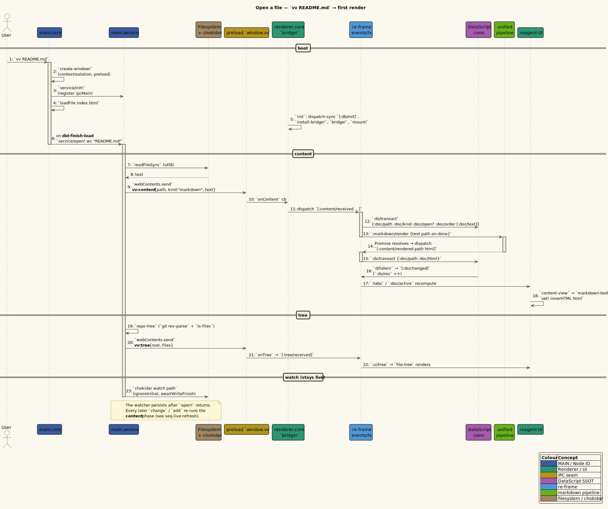

# Getting started

This guide takes a clean checkout to a live preview. It covers the installed
`vv` launcher, the development run path, opening files, live refresh, tabs,
history, search, themes, and the Contents panel.

> **What vinary-viewer is.** vinary-viewer is a local-first Electron previewer
> for GitHub-Flavored Markdown and related repository resources. The renderer is
> a ClojureScript re-frame application; the Electron main process owns file IO,
> native views, configuration, and watchers.

---

## 1. Prerequisites

| Tool | Why it is needed | Check |
|------|------------------|-------|
| Node.js with `npm` and `npx` | Installs JavaScript dependencies and runs Electron/shadow-cljs scripts. | `node --version` |
| JDK | Runs the `shadow-cljs` compiler. | `java -version` |
| git | Provides the sidebar file tree through `git ls-files`. | `git --version` |

The JDK is only the compiler runtime; you do not write Java for this project.

---

## 2. Install the launcher

From the repository root:

```bash
./install.sh
vv README.md
```

`./install.sh` performs three actions:

1. Runs `npm install --no-fund --no-audit`.
2. Builds the `main` and `renderer` shadow-cljs targets. By default it runs a
   release build; use `VV_BUILD=compile ./install.sh` for a development build.
3. Installs `vinary-viewer` and the short `vv` symlink into `~/.local/bin`.

Override the launcher directory with:

```bash
BIN=/path/to/bin ./install.sh
```

Remove only the launchers with:

```bash
./uninstall.sh
```

The repository and `~/.config/vinary-viewer/` are left intact.

---

## 3. Run from source

During development you can skip launcher installation:

```bash
npm run dev
```

`npm run dev` expands to:

```text
shadow-cljs compile main renderer
electron .
```

For a tighter edit loop, run the compiler watcher and Electron separately:

```bash
npm run watch
npm run start
```

You can also pass an initial file through Electron:

```bash
npm run start -- README.md
electron . README.md
```

---

## 4. Open a file

The launcher forwards arguments to Electron, so the normal command is:

```bash
vv docs/usage/01-getting-started.md
```

What happens:

1. The main process extracts the first non-flag argument from `process.argv`.
2. The main process reads the file, classifies it, and sends `vv:content` to the
   renderer through the `window.vv` preload mediator.
3. The renderer caches document content in DataScript.
4. Markdown is rendered asynchronously through unified/remark/rehype and stores
   `:doc/html`, `:doc/toc`, and `:doc/assets`.
5. The tab/history state in re-frame `app-db` points the active tab at the file.
6. The main process starts watching every retained local file path.



*Diagram source: [`../diagrams/seq-open-file.puml`](../diagrams/seq-open-file.puml).*

---

## 5. Core walkthrough

### 5.1 Live refresh

With a Markdown file open, edit it in your normal editor and save. The preview
updates without replacing tab state, scroll state, keybinding state, or sidebar
state.

For a quick terminal check:

```bash
printf '\n## Live edit demo\n\nHello from a live edit.\n' >> README.md
```

The watcher uses `chokidar` with `awaitWriteFinish` and listens for both
`change` and `add`, so ordinary saves and common atomic-save patterns both
refresh.

### 5.2 Tabs and history

Open another local file from the sidebar, from the menu, or from a Markdown link.
Each tab has its own browser-like history stack. Back/Forward restores both the
target document and the saved scroll position for that history entry.

Useful defaults:

| Action | Input |
|--------|-------|
| Back | `Alt+Left`, toolbar Back, or mouse back button |
| Forward | `Alt+Right`, toolbar Forward, or mouse forward button |
| Open link in active tab | left-click |
| Open link in new tab | `Ctrl+click` |

### 5.3 Find

Press `Ctrl+F`, type a query, then use `Enter` and `Shift+Enter` to move through
matches. `Esc` closes the find bar. The implementation uses the browser's CSS
Custom Highlight API, so it does not inject marker spans into rendered Markdown.

### 5.4 Themes and preferences

Use `Settings > Theme` to switch between bundled themes. Use
`Settings > Preferences...` for variable-width and fixed-width font settings.
Selections persist to `~/.config/vinary-viewer/settings.edn`.

### 5.5 Contents panel

Markdown rendering records heading metadata during the HAST traversal, stores it
as `:doc/toc`, and the Contents panel uses cached heading offsets for scroll-spy.
Embedded SVG sizing completes before the first offset refresh so the active
heading does not flicker while large diagrams settle.

---

## 6. Current file kinds

| Kind | Extensions or source | Preview |
|------|----------------------|---------|
| Markdown | `.md`, `.markdown`, `.mdx` | Rendered GFM with slugged headings, code highlighting, MathJax SVG math, inline Mermaid diagrams, TOC metadata, and asset tracking. |
| Org | `.org` | Emacs Org-mode rendered GitHub-style through the same pipeline, with a Contents outline and highlighted `#+begin_src` blocks. |
| LaTeX | `.tex`, `.latex`, `.ltx` | `.tex` rendered as a formatted document (sections, styling, tables, figures, math, code) via unified-latex; `.sty`/`.cls`/`.bib` stay source. |
| Image | `.png`, `.jpg`, `.jpeg`, `.gif`, `.svg`, `.webp`, `.bmp`, `.ico`, `.avif` | Browser image preview from the local file URL. |
| PDF | `.pdf` | Rendered **in the renderer** via pdf.js (ADR-0013): each page draws to a `<canvas>` inside the content pane as it scrolls into view. See [../features/11-native-pdf.md](../features/11-native-pdf.md). |
| Mermaid | `.mmd`, `.mermaid` | Renderer-side Mermaid SVG preview with live refresh. |
| Diff | `.diff`, `.patch` | Colored unified diff, with a side-by-side split view available. |
| Source | Known source files, configured filetype mappings, and non-Mermaid diagram-source extensions | Read-only CodeMirror 6 view with tree-sitter highlighting when a grammar is available. |
| Text | Fallback | Escaped preformatted text. |
| Directory | Any folder path | In-pane directory browser listing the immediate children. |

Diagram source files such as `.puml`, `.d2`, and `.dot` open as source code;
Mermaid source files render directly. Files on a remote host open the same way
through `ssh://` / `sftp://` URIs — see [08-remote-files-ssh.md](08-remote-files-ssh.md).
The same documents can also be previewed in the terminal with `vv --cli` /
`vv --tui` — see [07-terminal-cli-tui.md](07-terminal-cli-tui.md).

---

## 7. Where to go next

| If you want to... | Read |
|-------------------|------|
| Understand build modes and artifacts | [02-installation-and-build.md](02-installation-and-build.md) |
| Learn file opening and tab behavior | [03-opening-files-and-tabs.md](03-opening-files-and-tabs.md) |
| See the keybinding system | [04-keyboard-shortcuts.md](04-keyboard-shortcuts.md) |
| Configure settings and grammars | [05-configuration.md](05-configuration.md) |
| Diagnose a problem | [06-troubleshooting.md](06-troubleshooting.md) |
| Preview documents in the terminal (CLI/TUI) | [07-terminal-cli-tui.md](07-terminal-cli-tui.md) |
| Open remote files over SSH | [08-remote-files-ssh.md](08-remote-files-ssh.md) |
| Understand the architecture | [../architecture/01-overview.md](../architecture/01-overview.md) |

---

*Next: [02-installation-and-build.md](02-installation-and-build.md).*
