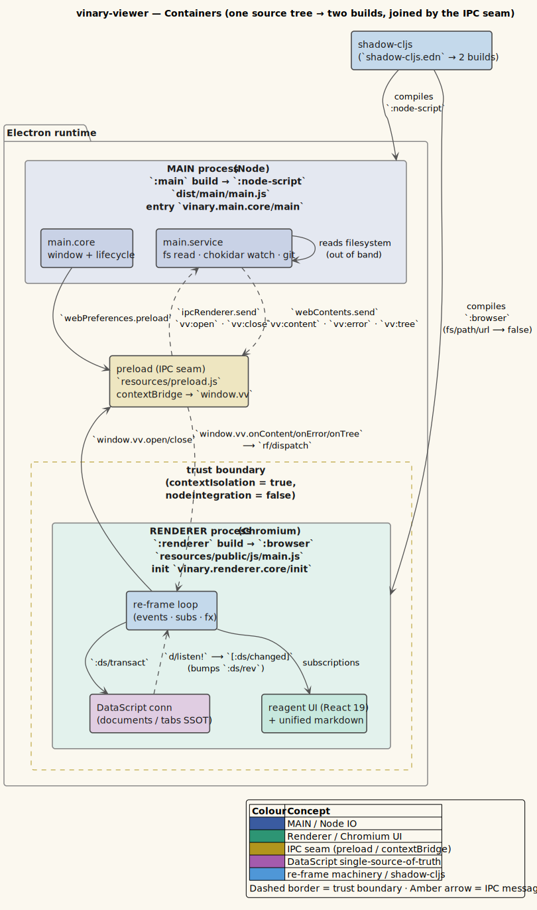

# Installation and build

This page explains how vinary-viewer is built from source: the two `shadow-cljs` builds, the artifacts
they produce, the development hot-reload loop, the dev tools available in the renderer, and the
**planned** packaged-launcher story. It also carries an important **warning** about the legacy
`install.sh` script still present in the repository.

> **Audience.** Anyone building or hacking on the app. For a first run, start with
> [01-getting-started.md](01-getting-started.md); this page is the deeper build reference.

---

## 1. The two builds

vinary-viewer is one ClojureScript source tree compiled into **two** JavaScript artifacts — one for
each Electron process. Both builds are declared in [`shadow-cljs.edn`](../../shadow-cljs.edn).



*Figure — source: [`docs/diagrams/container-two-build.puml`](../diagrams/container-two-build.puml)*

| Build       | `:target`      | Entry                          | Output                          | Role                                                          |
|-------------|----------------|--------------------------------|---------------------------------|--------------------------------------------------------------|
| **`main`**  | `:node-script` | `vinary.main.core/main`        | `dist/main/main.js`             | Electron **main** process: window, file IO, watchers, git.   |
| **`renderer`** | `:browser`  | `vinary.renderer.core/init` (`:modules {:main {:init-fn …}}`) | `resources/public/js/main.js` (dir `:output-dir "resources/public/js"`, `:asset-path "js"`) | Electron **renderer**: the re-frame/reagent UI.          |

Two important compiler details from `shadow-cljs.edn`:

- **Main is a Node script.** `:node-script` uses shadow's `:js-provider :require`, so
  `require("electron")` and Node built-ins (`fs`, `path`, `child_process`) stay as **runtime** requires
  resolved by Electron — they are not bundled. The main process therefore has full Node access.
- **Renderer stubs Node modules.** The `:renderer` build sets
  `:js-options {:resolve {"fs" false "fs/promises" false "path" false "url" false}}`. The renderer is
  browser-targeted and has **no filesystem access**; it talks to the main process exclusively over the
  contextBridge IPC seam (`window.vv`). This is a security property, not just a packaging choice — see
  [security/threat-model.md](../security/threat-model.md).

`package.json` ties it together: `"main": "dist/main/main.js"` tells Electron which file to run as the
main process, and `resources/public/index.html` loads `js/main.js` (the renderer bundle) via a
`<script>` tag.

---

## 2. Build commands

All build commands are `npm` scripts that wrap `shadow-cljs`:

| Command            | Expands to                                    | Use it when…                                          |
|--------------------|-----------------------------------------------|-------------------------------------------------------|
| `npm run compile`  | `shadow-cljs compile main renderer`           | you want a one-shot debug build of both artifacts.    |
| `npm run watch`    | `shadow-cljs watch main renderer`             | you are actively developing (recompiles on save + hot-reloads the renderer). |
| `npm run release`  | `shadow-cljs release main renderer`           | you want optimized, minified builds (Closure `:advanced`-style optimizations). |
| `npm run start`    | `electron .`                                  | the artifacts already exist and you just want to launch. |
| `npm run dev`      | `shadow-cljs compile main renderer && electron .` | a single command to build-then-launch (the common case). |

### One-shot build

```bash
npm run compile
ls dist/main/main.js resources/public/js/main.js   # both should exist
npm run start                                       # launch Electron against them
```

### Optimized build

```bash
npm run release
```

`release` produces minified output suitable for distribution. (Packaging the optimized output into a
distributable application bundle is **Forthcoming (planned)** — see §5.)

---

## 3. Development hot-reload

For the tightest edit loop, run the watcher and Electron side by side:

```bash
# Terminal 1 — keep this running; it recompiles on every save.
npm run watch

# Terminal 2 — launch once the first compile finishes.
npm run start                # or: electron . README.md
```

`shadow-cljs watch` recompiles **both** builds on file save. The `:renderer` build is configured for
**hot code reload** via shadow's devtools:

```clojure
;; shadow-cljs.edn (renderer build)
:devtools {:after-load vinary.renderer.core/reload
           :preloads   [devtools.preload
                        day8.re-frame-10x.preload.react-18
                        re-frisk.preload]}
```

On each recompile, shadow calls `vinary.renderer.core/reload`, which re-mounts the reagent UI
(`mount!`) **without** losing application state — your open tabs, scroll position, and find state
survive a code reload, because the documents live in DataScript and the UI state in the re-frame
`app-db`, neither of which is reset by `reload`.

> **Main-process changes.** Hot-reload applies to the *renderer*. Changes to the **main** process
> (`vinary.main.core` / `vinary.main.service`) require restarting Electron (stop and re-run
> `npm run start`), because the Node process is loaded once at startup.

---

## 4. Dev tools

When you run a debug build, three inspection facilities are wired into the renderer:

1. **`re-frame-10x`** — the re-frame time-travel/event inspector. The build sets
   `:closure-defines {"re_frame.trace.trace_enabled_QMARK_" true}` so tracing is on; the
   `day8.re-frame-10x.preload.react-18` preload installs the panel. Open it with its default hotkey to
   step through events, subscriptions, and app-db diffs.
2. **`re-frisk`** — a live app-db viewer (`re-frisk.preload`), handy for watching UI state mutate in
   real time.
3. **`binaryage/devtools`** — Chrome DevTools formatters (`devtools.preload`) that render
   ClojureScript data structures legibly in the browser console.

Two **window hooks** are installed by `vinary.renderer.core/init` for ad-hoc inspection from the
DevTools console:

| Hook            | Returns                                                      |
|-----------------|-------------------------------------------------------------|
| `window.__vvdb()` | the current re-frame `app-db` (ephemeral UI state) as a JS object. |
| `window.__vvds()` | the list of open documents from DataScript (`ds/open-docs`). |

```js
// In the renderer DevTools console:
__vvdb()    // → { :ds/rev 12, :ui { :active-path "…/README.md", :theme "spacemacs-dark", … } }
__vvds()    // → [ { :path "…/README.md", :order 0, :kind "markdown" }, … ]
```

Open the renderer's DevTools from Electron's *View → Toggle Developer Tools* (the menu is auto-hidden;
press `Alt` to reveal it) or with the standard shortcut.

---

## 5. Packaging and launchers — Forthcoming (planned)

The following are **planned and not yet built**. They are documented here so you know what exists today
versus what is coming.

- **`vv` / `vinary-viewer` bin launchers** *(Forthcoming, planned)* — thin command-line wrappers so you
  can run `vv README.md` from anywhere instead of `electron . README.md` from the repo root.
- **`install.sh` rewrite** *(Forthcoming, planned — "master plan P5")* — a new installer that deploys
  the built application and the `vv` launcher. **This does not exist yet.**

### WARNING — do not run the in-repo `install.sh`

> ⚠️ **The `install.sh` script currently in the repository is the LEGACY installer for the superseded
> v0.1.0 vmd-patching tool.** It does **not** install this ClojureScript application. Instead it:
> patches your globally installed `vmd` package, edits `~/.vmdrc`, builds a native X11 mouse addon, and
> installs a `vmd()` shell wrapper. Running it against the new app will modify your `vmd` install and
> your home directory for no benefit.
>
> **Do not run `./install.sh` (or `./uninstall.sh`, `apply.sh`) for the new app.** Likewise, the
> top-level `docs/01-…09-*.md`, `README.md`, `NOTICE`, `src/style.css`, `src/themes/*`,
> `src/sidebar.js`, `src/patch-*.js`, and `src/mouse-forward-back/*` all describe the **old**
> vmd-patching tool and are not current. The current application lives entirely under `src/vinary/**`
> and `resources/**`. The legacy installer and its docs will be removed when the P5 installer lands.

Until P5 ships, the supported way to run the app is from source: `npm run dev` (or `npm run watch` +
`npm run start`), as described above.

---

## 6. Artifact map

| Path                              | What it is                                         | Produced by            |
|-----------------------------------|----------------------------------------------------|------------------------|
| `dist/main/main.js`               | the Electron main-process bundle                   | `:main` build          |
| `resources/public/js/main.js`     | the Electron renderer bundle                       | `:renderer` build      |
| `resources/public/index.html`     | the renderer HTML entry (loads `js/main.js`)       | hand-authored          |
| `resources/preload.js`            | the contextBridge IPC seam (`window.vv`)           | hand-authored          |
| `resources/public/css/app.css`    | structural stylesheet (references `var(--vv-*)`)   | hand-authored          |
| `resources/public/css/themes/*.css` | theme palettes (`--vv-*` tokens)                 | hand-authored          |
| `resources/public/assets/shield.svg` | the watermark emblem                             | hand-authored          |

---

*Next: [03-opening-files-and-tabs.md](03-opening-files-and-tabs.md).*
