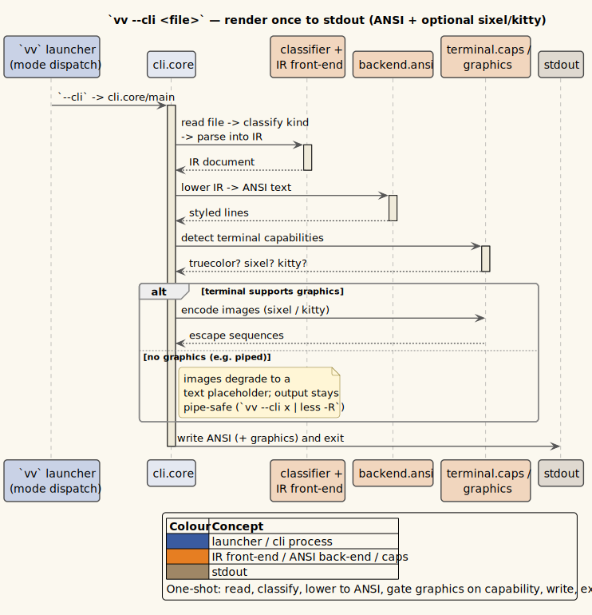

# Terminal preview: CLI and TUI

vinary-viewer is a desktop GUI, but the same document engine also renders **in
the terminal** — a one-shot `vv --cli` that writes a rendered document to stdout,
and an interactive full-screen `vv --tui` pager. Both are a *second renderer over
the shared document spine*: the format front-ends, the streaming decoder, and the
Contents/Find capabilities are the **same** code the GUI uses; only the
output-facing layers (an ANSI backend instead of an HTML/DOM backend) are new.
Neither terminal mode loads Electron or a browser.

> **Design background.** The terminal layer is
> [ADR-0019](../design-decisions/0019-terminal-preview-layer.md). It lowers the
> common document IR ([ADR-0017](../design-decisions/0017-common-document-ir.md))
> to styled ANSI via `vinary.ir.backend.ansi`, and streams large logs through the
> same bounded-memory WPDA core as the GUI
> ([ADR-0018](../design-decisions/0018-document-streaming-pipeline.md)).

---

## 1. The `vv` mode dispatcher

`vv` (and its long name `vinary-viewer`) is **one command with three modes**. The
launcher installed by [`./install.sh`](02-installation-and-build.md) inspects the
first argument and dispatches:

| Invocation | Mode | Behavior |
|------------|------|----------|
| `vv [files…]` | GUI (default) | Opens the desktop app, one tab per file/URL (first focused). |
| `vv --gui [files…]` | GUI | Explicit form of the default; `--gui` is an accepted no-op that is shifted off before the arguments reach Electron. |
| `vv --cli <file> …` | CLI | Renders each document once to stdout and exits (§2). |
| `vv --tui <file>` | TUI | Opens the interactive full-screen pager (§3). |
| `vv --help`, `vv -h` | help | Prints the three-mode usage summary and exits without launching anything. |
| `vv --version`, `vv -V` | version | Prints `vinary-viewer 0.3.0-dev` (the package version, baked into the launcher) and exits. |

The mode flag must be **first**. `vv README.md --cli` is a GUI launch of two
arguments (a file and a stray flag Electron ignores), *not* a CLI render — put
`--cli`/`--tui`/`--gui` ahead of the files.

Each mode has its own `--help`/`--version`, reached by placing the mode flag
first:

```bash
vv --help          # the launcher's three-mode summary
vv --cli --help    # vv-cli options (below)
vv --tui --help    # vv-tui options and keys
vv --cli --version # prints "vv --cli 0.3.0"
```

---

## 2. `vv --cli` — render once to stdout

`vv --cli <file>` reads a document, lowers it to ANSI, writes it to stdout, and
exits. It is **pipe-friendly**: colour and inline graphics auto-disable when the
output is not a terminal (the `isatty` and `NO_COLOR` conventions), so piping into
a pager or a file is clean by default.

```bash
vv --cli README.md                 # rendered to your terminal, in colour
vv --cli README.md | less -R       # page it (-R lets less pass ANSI colour through)
vv --cli CHANGELOG.txt > out.txt    # plain text (colour auto-off when redirected)
vv --cli --color README.md | less -R  # force colour through a pipe
```

`vv --cli` accepts **multiple** files and renders them in argument order,
separated by a blank line:

```bash
vv --cli docs/usage/01-getting-started.md docs/usage/02-installation-and-build.md | less -R
```

### 2.1 Options

| Option | Effect |
|--------|--------|
| `-t`, `--toc` | Print the document outline (Contents) before the body. |
| `--width N` | Wrap column (default: the terminal width, else 80). |
| `--no-color` | Disable ANSI colour (also auto-off when piped or under `NO_COLOR`). |
| `--color` | Force colour even when stdout is not a TTY (e.g. through a pipe). |
| `--no-graphics` | Disable inline image graphics (sixel/kitty). |
| `--graphics P` | Force the image protocol `P` (`kitty` or `sixel`), bypassing terminal detection. |
| `-p`, `--plain` | Plain output: no colour, no graphics, no hyperlinks. |
| `-h`, `--help` | Show the CLI help. |
| `-V`, `--version` | Show the CLI version. |

Examples:

```bash
vv --cli --toc --width 100 docs/usage/07-terminal-cli-tui.md
vv --cli --plain README.md            # safest for logging / grep-ing the output
vv --cli --graphics sixel diagram.png  # force sixel where auto-detection can't tell
```



*Diagram source: [`../diagrams/seq-cli-render.puml`](../diagrams/seq-cli-render.puml).*

### 2.2 Streaming large logs

A large log or text file (over 5 MiB) is **streamed** to stdout bounded-memory:
completed record blocks are rendered and written incrementally, so
`vv --cli huge.log | less` never holds the whole file in memory. Multi-line
entries (stack traces, pretty-printed JSON) stay whole and are severity-coloured.

```bash
vv --cli /var/log/big-service.log | less -R
```

---

## 3. `vv --tui` — interactive pager

`vv --tui <file>` opens a full-screen, raw-ANSI pager (no ncurses/blessed
dependency). It takes a **single** file (the first non-flag argument). A status
line at the bottom shows the file name, the scroll position (`line/total`), and a
key reminder.

```bash
vv --tui CHANGELOG.txt
vv --tui --width 100 README.md
```

### 3.1 Keys

The bindings below are the pure key→command reducer in
[`src/vinary/tui/state.cljs`](../../src/vinary/tui/state.cljs); the low-level byte
parser (arrows, bracketed paste, split escapes) is
[`src/vinary/tui/keys.cljs`](../../src/vinary/tui/keys.cljs).

| Key | Action |
|-----|--------|
| `↓` / `j` | Scroll down one line. |
| `↑` / `k` | Scroll up one line. |
| `Space` / `PgDn` | Page down. |
| `b` / `PgUp` | Page up. |
| `g` / `Home` | Jump to the top. |
| `G` / `End` | Jump to the bottom. |
| `/` | Open the find prompt (§3.2). |
| `n` / `N` | Next / previous find match. |
| `t` | Toggle the Contents (table-of-contents) overlay (§3.3). |
| `q` | Quit. |
| `Ctrl+C` | Quit (also handles an external interrupt cleanly). |

The terminal is always restored on exit — a clean `q`, a `Ctrl+C`, a crash, a
SIGINT, or an SSH drop all funnel through a single idempotent teardown, so the
terminal is never left in raw mode or on the alternate screen.

### 3.2 Find

Press `/` to open the find prompt; the status line becomes `/your-query` as you
type. `Backspace` edits it, `Enter` runs the search and jumps to the first match,
and `Esc` cancels. After a search, `n` and `N` step forward and backward through
matches. Matching is over the **displayed text** (ANSI styling stripped), so
searches are not confused by colour codes.

### 3.3 Contents overlay

Press `t` to open the Contents overlay (available whenever the document has a
heading outline — Markdown, Org, LaTeX, PDF, office, and source files all supply
one). Use `↑`/`↓` (or `k`/`j`) to move the selection, `Enter` to jump to that
heading, and `t` or `Esc` to close the overlay without moving.

### 3.4 Streaming and resize

A large log streams into a **bounded viewport ring**, so RSS stays flat no matter
how long the log is; a `(+N earlier)` note in the status line marks lines that
have scrolled out of the retained window. Resizing the terminal (SIGWINCH)
re-wraps a batch document at the new width without re-reading the file. Unlike
`vv --cli`, the interactive pager forces **graphics off** (images render as
labelled placeholder lines) so the scrolling viewport stays line-exact.

---

## 4. Supported formats in the terminal

Both terminal modes reuse every format front-end the GUI has:

| Format | Terminal rendering |
|--------|--------------------|
| Markdown (`.md`, `.markdown`, `.mdx`) | Styled ANSI: level-coloured headings, word-wrapped paragraphs, bulleted/numbered lists, `│`-guttered blockquotes, `▏`-guttered code blocks (tree-sitter → colour), box-drawing tables, OSC-8 hyperlinks. |
| Org (`.org`) | Same IR and ANSI backend as Markdown (only the parse prefix differs). |
| LaTeX (`.tex`, `.latex`, `.ltx`) | Sections, text styling, lists, and tables via unified-latex; math shown as its LaTeX source. |
| Source code | One syntax-highlighted code block in the file's language when a bundled tree-sitter grammar matches (else plain). |
| Diff / patch (`.diff`, `.patch`) | Coloured unified diff (`+`/`-`/hunk lines). |
| PDF (`.pdf`) | Headless pdf.js text extraction reflowed to prose, with a font-size heading outline; not rasterised pages. |
| Log / plain text | Severity-coloured records; large files stream bounded-memory (§2.2, §3.4). |
| Office (`.docx`, `.odt`, …) and tables (`.csv`, `.tsv`) | Parsed to the shared IR and rendered as prose / box-drawing tables. |
| HTML | Parsed like an office document and rendered as prose. |
| Mermaid (`.mmd`, `.mermaid`) | Shown as its source code block (a terminal has no DOM to render Mermaid). |
| Images (`.png`, `.jpg`, `.svg`, …) | `vv --cli`: drawn as kitty/sixel graphics where the terminal supports them, else a labelled `🖼` placeholder. `vv --tui`: always a placeholder. |
| Directory / archive | A listing of entries (folders marked with `📁`). |

---

## 5. Graphics, colour, and designed degradation

Terminal capabilities are detected from `process.stdout` plus the environment
(`vinary.terminal.caps`):

- **Colour** is on when stdout is a TTY and `NO_COLOR` is unset; `--no-color`
  forces it off, `--color` forces it on through a pipe. Truecolor is used when
  `COLORTERM` advertises `truecolor`/`24bit`.
- **Inline images** use the **kitty** graphics protocol (detected via
  `KITTY_WINDOW_ID` or a `kitty` `TERM`) or **sixel** (foot, WezTerm, mlterm,
  yaft, or a `sixel` `TERM`). Where the terminal supports neither — or output is
  piped, or `--no-graphics` is set — images degrade to a labelled placeholder.
  `--graphics kitty|sixel` overrides detection for a terminal that is not sniffed
  correctly.
- **Hyperlinks** use OSC-8 escapes when stdout is an interactive TTY.

Some content cannot be reproduced faithfully in a text cell; the degradations are
**designed and labelled**, not failures:

| Content | Terminal result |
|---------|-----------------|
| Math (`$…$`, `\begin{align}…`) | Rendered as its LaTeX source (a terminal cannot typeset MathJax). |
| Mermaid diagrams | Rendered as their source code block. |
| PDF pages | Extracted, reflowed text — no figures, no page geometry. |
| Raster images (TUI) | Placeholder lines (graphics are forced off for line-exact scrolling). |
| SVG diagrams (CLI) | Rasterised to kitty/sixel via the bundled resvg WASM where graphics are available. |

When fidelity matters, open the document in the GUI, or open its collocated PDF
(see the [Document↔PDF switch](../design-decisions/0025-latex-rendering-via-unified-latex.md)).

---

## 6. Remote files in the terminal

`vv --cli` renders documents over SSH, exactly like a local path — the SSH/SFTP
transport is reused from the GUI:

```bash
vv --cli ssh://user@host/etc/os-release
vv --cli ssh://build-box/var/log/deploy.log | less -R
```

Authentication is TTY-gated: on an interactive terminal you are prompted for a
host-key trust decision and any needed password/passphrase/one-time code; a
**non-interactive** run (piped, or under CI) relies on your `ssh-agent` and key
files and declines to prompt. Pooled connections are closed on exit so the process
can terminate. See [08-remote-files-ssh.md](08-remote-files-ssh.md) for the full
remote-file model (`~/.ssh/config`, host-key trust, `connections.edn`).

> **The interactive `vv --tui` opens local files only.** Its document loader reads
> through the local filesystem and does not route `ssh://`/`sftp://` URIs through
> the remote reader, so `vv --tui ssh://…` fails to open. Use `vv --cli` to preview
> a remote document in the terminal, or open it in the GUI with `vv ssh://…`. (This
> narrows [ADR-0027 §6](../design-decisions/0027-remote-files-over-ssh.md), which
> describes terminal parity for both terminal modes; only `vv --cli` is wired for
> remote today.)

---

## 7. Where to go next

| If you want to... | Read |
|-------------------|------|
| Open remote files over SSH (GUI + CLI) | [08-remote-files-ssh.md](08-remote-files-ssh.md) |
| Build the CLI and TUI targets | [02-installation-and-build.md](02-installation-and-build.md) |
| Configure themes, fonts, and remote polling | [05-configuration.md](05-configuration.md) |
| Understand the terminal renderer's design | [../design-decisions/0019-terminal-preview-layer.md](../design-decisions/0019-terminal-preview-layer.md) |

---

*Next: [08-remote-files-ssh.md](08-remote-files-ssh.md).*
