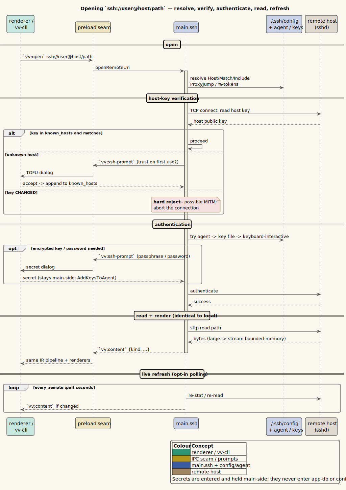

# Remote files over SSH

vinary-viewer opens files and browses directories on a **remote host over SSH**,
using the `ssh://` and `sftp://` URI schemes. A remote URI flows through the
*same* open pipeline as a local path — the same renderers, the same streaming, the
same directory browser, the same live-refresh — so previewing a remote Markdown
file, PDF, log, or source tree works exactly like a local one. Nothing is copied
to a temporary directory; the remote path is addressed in place over SFTP.

> **Design background.** Remote SSH support is
> [ADR-0027](../design-decisions/0027-remote-files-over-ssh.md). The transport is
> the `ssh2` library, and it runs **entirely in the trusted main process** — the
> sandboxed renderer never opens a socket, holds a key, or sees a passphrase. Only
> non-secret metadata crosses the `window.vv` mediator.

---

## 1. Opening a remote file or directory

A remote URI has the shape `ssh://[user@]host[:port]/path`. `sftp://` is an exact
alias — both drive the SFTP subsystem; the scheme is kept only for display. The
path is absolute from the remote root; a leading `~` or `~user` is expanded on the
host.

| Form | Meaning |
|------|---------|
| `ssh://host/etc/os-release` | The user comes from `~/.ssh/config` (or your local username); default port 22. |
| `ssh://alice@host/home/alice/notes.md` | Explicit user. |
| `ssh://host:2222/srv/app/README.md` | Explicit port. |
| `ssh://host/~/todo.org` | `~` expands to the login user's home on the host. |
| `sftp://host/var/log/deploy.log` | The `sftp://` alias — identical behavior. |

You can open a remote URI four ways:

| Entry point | Behavior |
|-------------|----------|
| **Address bar** | Type or paste a remote URI and press Enter; it navigates the active tab. |
| **Command line** | `vv ssh://host/notes.md` opens it in the GUI. Multiple arguments open one tab each (first focused), so `vv ssh://host/a.md ssh://host/b.md local.md` mixes remote and local freely. |
| **Remote directory listing** | Opening a remote directory lists it in the pane; each entry carries a child `ssh://` URI, so clicking descends or previews, `Ctrl+click` opens a new tab, and the breadcrumb / `Alt+Up` parent navigation all work as they do locally. |
| **File ▸ Open Recent** | Recently-opened remotes are surfaced in the recent list (see §5). |

A remote **directory** browses in-pane just like a local folder — the listing
shows each child's name, size, and modified time, and folders descend on click.



*Diagram source: [`../diagrams/seq-ssh-open.puml`](../diagrams/seq-ssh-open.puml).*

The renderer classifies a remote file by its basename extension, so a remote
`report.md` renders as Markdown, a remote `main.rs` as highlighted source, a
remote `paper.pdf` in the pdf.js viewer, and a large remote `service.log` streams
bounded-memory — a mid-stream connection drop keeps the partial content with a
non-fatal note rather than silently truncating.

---

## 2. `~/.ssh/config` integration

Remote connections honor your existing OpenSSH client configuration at
`~/.ssh/config`, so host aliases, per-host users, jump hosts, and identity files
you already use on the command line work here unchanged. The supported directives
are:

| Directive | Effect |
|-----------|--------|
| `Host` / `Match` | Section selectors. `Match` supports `host`, `user`, `originalhost`, `exec`, `all`, `final`, and `canonical`. |
| `HostName` | The real hostname an alias resolves to. |
| `User` | Default remote user. |
| `Port` | Default port. |
| `IdentityFile` | Preferred private key(s). |
| `IdentitiesOnly` | Restrict authentication to the configured identities. |
| `ProxyJump` | One or more jump hosts (see below). |
| `AddKeysToAgent` | Add a just-unlocked key to the running `ssh-agent`. |
| `Include` | Pull in other config files (globs, recursive). |

Percent-token expansion is supported in the usual places: `%h` (host), `%p`
(port), `%r` (remote user), `%n` (original host), and `%u` (local user). Directives
are resolved OpenSSH-style — two passes, first value wins.

**ProxyJump / multi-hop.** A `ProxyJump bastion` (or `ssh://host` behind a bastion
in your config) is honored: each hop is its own pooled connection, chained through
to the target, so you reach hosts that are only accessible via a jump box without
any extra configuration here.

---

## 3. Authentication

Authentication reuses your existing SSH setup and tries methods in order, first
success wins. You are only prompted when the automatic methods do not suffice.


*Diagram source: [`../diagrams/activity-ssh-auth.puml`](../diagrams/activity-ssh-auth.puml).*

| Method | Behavior |
|--------|----------|
| **Agent** | The running `ssh-agent` is tried first (after a `none` probe). If your key is already loaded, no prompt appears. |
| **Key files** | The `IdentityFile` from `~/.ssh/config`, then the default `~/.ssh/id_ed25519` / `id_ecdsa` / `id_rsa` / `id_dsa`. An **encrypted** key prompts for its passphrase; if `AddKeysToAgent` is set, the unlocked key is added to the agent (ed25519 / RSA / ECDSA) so you are not asked again this session. |
| **Keyboard-interactive** | Full multi-prompt keyboard-interactive, for MFA / one-time codes. |
| **Password** | Interactive password (up to three attempts). |

In the GUI, prompts appear as a modal dialog; in `vv --cli` they are read from the
terminal with the input masked. Secrets you type are used once and never
persisted (§6).

---

## 4. Host-key trust (known_hosts)

Remote host keys are verified against your `~/.ssh/known_hosts`, honoring plain,
`[host]:port`, and hashed (`|1|`) entries:

- **Known host, matching key** — accepted silently.
- **Unknown host** — a **trust-on-first-use (TOFU)** prompt shows the key type and
  its SHA256 fingerprint (a native dialog in the GUI, a `yes/no` question in the
  terminal). On accept, the key is appended to `~/.ssh/known_hosts` (the standard
  OpenSSH location — not an app-specific store); on decline, the connection is
  refused.
- **Known host, changed key** — **hard reject.** A host that presents a different
  key than the one recorded is refused outright, because that is the signature of a
  man-in-the-middle (or a re-provisioned host). Resolve it the usual way — remove
  the stale `known_hosts` line after you have confirmed the change is legitimate.

---

## 5. Saved connections — `connections.edn`

Non-secret host metadata is remembered in
`~/.config/vinary-viewer/connections.edn`, a mirror of the local recent-navigation
memory. It holds **addresses and preferences only**: host aliases, the resolved
hostname / user / port, the last-used timestamp, the last path opened on each host,
per-host preferences, and a recent-remote MRU surfaced under **File ▸ Open
Recent**. An illustrative shape:

```clojure
{:hosts   {"build-box" {:hostname "build.example.com" :user "ci" :port 22
                        :last-path "/srv/app/README.md"}}
 :recent  ["ssh://build-box/srv/app/README.md"
           "sftp://nas.local/media/notes.org"]}
```

**Secrets are never written here.** Passwords, passphrases, private-key contents,
and host-key material live only in the transport's main-process memory (for the
connection's lifetime) and in your existing `~/.ssh` (keys, `known_hosts`). The
file is watched, so an external edit is picked up live, exactly like the other
config files (see [05-configuration.md](05-configuration.md)).

---

## 6. Secrets stay main-side

The security boundary is strict:

| Boundary | Rule |
|----------|------|
| Sockets, keys, passphrases, host-key checks | Live only in the trusted main process. |
| Renderer | Sandboxed — `contextIsolation`, no `nodeIntegration`, `fs`/`path`/`url` stubbed, and a CSP that blocks remote I/O. It never opens a socket or reads a key. |
| Secret transport | The only secret-bearing IPC channel is `vv:ssh-prompt-reply` (renderer → main): a one-shot reply carrying the value you typed into a prompt, resolved into a main-memory promise and **never** stored in `app-db` or on disk. |
| Persistence | Accepted host keys append to `~/.ssh/known_hosts`; `connections.edn` holds non-secret metadata only. |

A remote host is treated as a new **untrusted input source**: SFTP bytes and
directory listings pass through the same GitHub-allowlist sanitizer as local
content.

---

## 7. Live-refresh via polling

SFTP has no file-change notifications, so remote live-refresh is **opt-in
polling**, off by default. Enable it in `~/.config/vinary-viewer/settings.edn`:

```clojure
{:remote {:poll-seconds 4      ; poll a remote doc every N seconds; 0 or absent = off (the default)
          :poll-dirs? false}}  ; also poll open directory listings (heavier); default false
```

The poller re-stats the open remote URI and, on a size/mtime change, re-sends it
(re-rendering or re-streaming the document). It backs off (to 60 s) and jitters by
±25 % on error, so a downed host is not hammered, and closing the tab stops the
poll — the same lifecycle guarantee as local file watchers.

---

## 8. Everything local does, remote does too

Remote support is additive: the capabilities documented elsewhere in this guide
work over SSH without special handling.

| Capability | Remote behavior |
|------------|-----------------|
| Relative image assets | A remote Markdown/office document's relative images are fetched over SFTP and inlined as `data:` URLs (the sandbox and `file://` cannot reach the host). |
| Document↔PDF switch | A remote document collocated with a same-stem `.pdf` can switch to the faithful exported PDF, both directions. |
| Side-by-side diff | A remote `.diff`/`.patch` enriches its context by reading the referenced files over SFTP. |
| Archives | A remote `.zip`/`.tar` is read whole and browsed with the existing archive browser. |
| Live remote HTML | A remote HTML page renders through a privileged `vv-remote://` web-view scheme that serves the whole tree over SFTP, so relative CSS/JS/images resolve — the SSH analog of loading an `http(s)` page. |
| Terminal preview | `vv --cli ssh://…` renders a remote document in the terminal (see below). |

---

## 9. Terminal parity

The `vv --cli` terminal renderer opens remote URIs too:

```bash
vv --cli ssh://user@host/etc/os-release
vv --cli sftp://build-box/var/log/deploy.log | less -R
```

Terminal auth prompts are TTY-gated: an interactive run prompts for host-key trust
and any needed secret; a non-interactive run (piped, or under CI) relies on your
`ssh-agent` and key files. See
[07-terminal-cli-tui.md §6](07-terminal-cli-tui.md#6-remote-files-in-the-terminal)
— note that the interactive `vv --tui` opens **local files only** today; use
`vv --cli` for a remote terminal preview, or the GUI with `vv ssh://…`.

---

## 10. Where to go next

| If you want to... | Read |
|-------------------|------|
| Configure remote polling and inspect `connections.edn` | [05-configuration.md](05-configuration.md) |
| Use the terminal renderers | [07-terminal-cli-tui.md](07-terminal-cli-tui.md) |
| Understand file-kind classification and tabs | [03-opening-files-and-tabs.md](03-opening-files-and-tabs.md) |
| Read the full remote-SSH design | [../design-decisions/0027-remote-files-over-ssh.md](../design-decisions/0027-remote-files-over-ssh.md) |

---

*Back: [07-terminal-cli-tui.md](07-terminal-cli-tui.md).*
